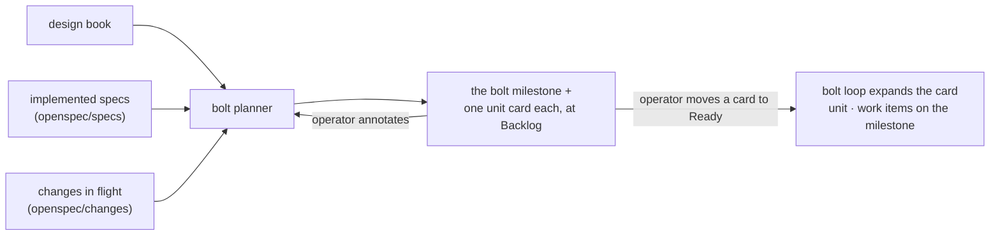

# Bolt planning

Construction work is derived, never groomed. There is no stored
backlog: no proposal placeholders, no ticket queue awaiting triage,
no list that goes stale while design moves. When the operator wants
to build, the bolt planner computes what is missing and puts the cuts
on the board.

## The planning run

The planner is an agent session. It reads three inputs and nothing
else:

1. **The design book, whole.** The destination, as every chapter
   states it. The planner synthesizes across chapters; a task in a
   plan may draw on several.
2. **The built repo's implemented specs.** `openspec/specs/` is the
   record of what the repo actually does, kept true by the OpenSpec
   archive step of every merged change.
3. **The changes in flight.** `openspec/changes/` names what is
   already being built, so a plan neither duplicates it nor
   contradicts its sequencing.

The difference between the first and the second, minus the third, is
the system's remaining work. The planner carves that difference into
a **bolt of units**: the bolt is the operator's delivery boundary —
one milestone, one branch, one landing to main, alive for days — and
the units are the batches built inside it, sequenced, each an ordered
set of buildable changes with a goal, the chapters it derives from,
and the reason it sits in this unit rather than a later one. One bolt
per run is the norm; a second bolt exists only for a genuinely
separate delivery, because many small bolts is the failure mode this
shape avoids.

A unit is a proposal to a system, written from the user's
perspective: it is named and opened as the capability a user of the
system gains, and the book's chapters justify it rather than shape
it. Its change rows are sized by implementation surface, never by
sentence count — several assertions that land as one coherent commit
in one repo share one row, because every row costs a full loop cycle
of sessions and gates. Rows split where the trees split: a system
whose book binds several built repos carries one row per repo the
unit touches, since each repo runs its own change through its own
gate, while a one-repo system's unit holds exactly as many rows as
its tree has separable commits.

## When the planner runs

The planner is a session the [server](server-and-fleet.md) charges,
the same way it nudges dispatch: no milestone, no batch, and its only
tracker write is the plan cards. Its work order names the book and
the built repo from the fleet manifest's book binding — the pairing
that also tells the server whose commits to watch. Three triggers
start it, each deterministic:

1. **Missing or stale cards, once the book settles.** Every card
   records the book and spec commits it derived from; the reconcile
   pass marks a card stale when either has moved. While chapters keep
   merging, markers are all that happens — a heavy design day charges
   nothing. When the book has been quiet for the settle window and
   the system's cards are missing or stale, the pass charges a
   planning run. A system with a book and no cards at all is the
   degenerate case: its first run is charged on the first
   quiet pass, so the board is never empty for want of an ask.
2. **A landing.** A landed bolt advances the implemented specs, so
   the standing cut is obsolete and the next one is newly decidable —
   immediately, since specs moving is not design in motion.
3. **The operator's ask**, optionally scoped. The only trigger while
   the machinery runs [held](observation.md).

The stale marker is information, not a lock — the operator approves a
stale card when they judge the plan still holds, and the settle-window
refresh replaces it otherwise. "The book moved" means chapters merged
to the book repo's main: an annotation round that settles a chapter
ends in that merge, and the merge commit is the only design event the
machinery can see.

A planning run replaces the unapproved cards — the old ones close
superseded — and approves nothing itself. The plan document is the
card's body while unapproved: mutable state on the tracker. Approval
freezes it, and expansion copies it verbatim into the record as the
unit's own artifact, `units/<slug>.md` on the bolt branch — durable
prose in git, one file per approved unit. The charter, `bolt.md`,
carries the bolt-level statement instead: the delivery, the unit
sequence and price, the merge criteria — born at scaffold from the
milestone's description.

## From plan to board

The planner is the card's computing author, not its only author: the
same artifact arrives from dispatch when the operator dictates work
exactly, and from the operator by hand. Whoever writes it, expansion
of the approved card is the only birth of work items — a queued item
on a bolt milestone is inert until an author folds it into a card.
The one exception is the landing's fix item
([construction loop](construction-loop.md)), bounded to a failing
merge criterion on a bolt the operator has already released.

The planner creates the `bolt/<slug>` milestone if it does not exist,
writes the bolt summary — the delivery in three sentences, the unit
sequence, the total price — as the milestone's description, and files
**one card per unit on that milestone** at board Backlog. Nothing
else: no work items, no state labels; a run proposing four units is
one milestone and four cards, and the board stays quiet until the
operator moves one.

Each unit document is written for an annotation round: the task table
with its chapter citations, the sequence line, one diagram, the
unit's price, and its type — the loop configuration its items run
under ([construction loop](construction-loop.md)). Ceremony is chosen
unit by unit: a spec-heavy unit runs the default path while a
born-ready unit in the same bolt runs quick. The operator reads it on the board or annotates it like
any chapter; annotations send the cut back to the planner, which
replaces the unapproved cards.

## Board approval and expansion

Moving a unit card to Ready is board approval — the same gesture
that approves any batch, doable from a phone, one unit at a time. On
its next pass the bolt loop expands the approved card: the card
becomes the unit, and one work item per task is filed beside it on
the milestone, each citing its chapters. From board approval to the
landing, the unit's document is driven as written.

The landing is the bolt's boundary, not a unit's: items merge to the
bolt branch as they finish, and the landing to main runs once — after
every merged item awaits it, no unit card on the milestone is still
open, and the operator closes the milestone. The close is the release
gesture: an unapproved unit holds it meaningless, so the operator
rules the last card — approving it or closing the cards they
decline — and then closes the milestone; the landing runs, and the
archive follows.

A unit names what it builds on, and expansion honors that as a defer
predicate: a card approved before its named predecessor merges waits,
and the run record says so. Approval order is the operator's; build
order is the plan's — deferral, never a refusal and never strict
serialization of the whole board.

The claim lives twice, by role: the unit document carries the
reason, and the planner mirrors the edge as a native blocked-by
relationship between the unit cards — visible on the board, and read
by the loops from the same snapshot field they already carry. Because
an approved card becomes the unit, the edge survives expansion
unmoved. Task-level order inside a unit stays in the document alone —
one loop drives those items and enforces the `after` column
directly.

A dependency is claimed on exactly three grounds, named in the plan:
derivation — the work's specs derive from specs another unit or task
advances at its merge; contention — two tasks would write deltas to
the same capability, so they chain or fold into one; or a runtime
precondition — the behavior needs an artifact the other work
produces. The claim carries its reason, and the annotation round
audits reasons. The failure modes are asymmetric: a false chain costs
only parallelism, and a missed one fails loudly before main — the
spec session cannot derive what its chapters demand, or the merge
gate goes red — never silently.

Everything short of board approval stays fluid. Successive planning
runs are allowed to disagree: a design iteration that suggested five
units may, after more design, suggest three different ones — the
planner replaces the unapproved cards and nothing was promised to the
old ones. The operator approves at their own pace, one card at a
time; an ask can scope a run ("a unit about the run record", "the
smallest useful cut"), but scoping changes which cards exist, never
the approval gesture.

Every task's chapter citation survives into the OpenSpec change the
spec session writes. A merged change traces to chapters; a chapter
never tracks which changes have been taken from it.

## What this replaces

Nothing in the pipeline stores intermediate direction. The book does
not carry a proposals chapter; the tracker does not carry
stored claims; the intent does not hand off work. The planner
reads the book directly, and the only stored object between
destination and construction is the plan behind an approved card.
