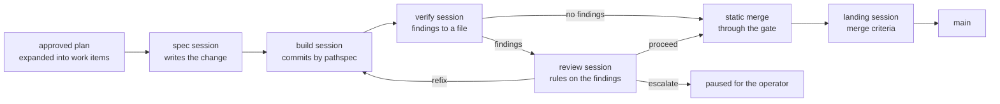

# The construction loop

The construction loop drives an approved bolt plan to merged code.
One loop process per bolt milestone; the process is stateless and
idempotent — killed and restarted, it re-reads the tracker and the
repo and continues from what it finds. A restart re-buys no proven
work: a stage whose boundary the world witnesses is done — spec by
the validating change, build by the commit on the branch, verify by
the clean verdict recorded on the item bound to the branch head,
spent by the next commit. Judgment is re-bought only where no record
of it survives.

Work sessions do work, the review judges, the loop does bookkeeping.
A build session receives a change id and the commit rules — no tracker
narrative, no escalation instructions. Judgment about findings
belongs to the review stage; every tracker write and every merge is
the loop's.

## Stages

The loop expands each approved unit card as it finds one: the card
becomes the unit, and one work item per task is filed beside it on
the milestone, each citing its chapters. Every later pass drives the
items through the stages, and the landing holds while any unit card
on the milestone is still open — the bolt lands once, when its units
are done.

Items run concurrently unless the plan chains them. Each item's
sessions work their own branch cut from the bolt branch — one writer
per branch — so independent items proceed in parallel and the merge
gate serializes only their integration, one merge-back at a time. The
plan's task order is the dependency statement: a task that builds on
an earlier one waits for that item's merge, because its spec derives
from specs that advance only at merge — the defer predicate between
bolts, one level down.

**Spec.** Writes the OpenSpec change from the plan task and the
chapters it cites, until `openspec validate <change> --strict` is
green. The bolt type sets the entry: fast-forward an existing change,
create then fast-forward, or create then continue.

**Build.** Applies the change on the bolt's `build/<slug>` branch.
The work order carries the change id and one rule — commit by
pathspec, never `-a`, never `add -A`; do not merge, do not push.

**Verify.** Runs the change's verification and writes findings to
`.flywheel/verify.md` — or the single word `NONE`. The verify session
fixes nothing. The loop reads the file; a missing file pauses the
bolt rather than guessing.

**Review.** Charged only when verify found something. The review
session is the operator's proxy: it reads the findings and writes a
ruling to `.flywheel/review.json` — `proceed`, `refix` with the prompt
to send, or `escalate` with the reason. An unreadable ruling
escalates. Escalation is for what the operator must decide before the
merge; a change the review judges merge-ready is a proceed, whatever
else the reviewer wants known — that goes in the reason. A `refix` prompt goes verbatim to the still-warm build
session; fix rounds are budgeted, and an exhausted budget pauses the
bolt.

**Merge.** A loop step, not a session: the loop runs the repo's merge
gate (`wt merge`) on the exact tree that lands. A red gate sends the
gate's own output back to the build session as a fix round; a merge
conflict pauses the bolt for the operator. A green merge closes the
item `closed:merged`, comments the merged commit, and archives the
change — implemented specs advance in the same motion, which is what
keeps the next planning run true. The landing upgrades the reason to
`closed:done` with its SHA.

**Landing.** The landing is the operator's: their milestone close
releases it. When every item is merged, every card ruled, and the
operator closes the `bolt/<slug>` milestone, a landing session runs
each merge criterion in the bolt's charter against the built tree and
refuses on any failure. The landing merge carries the bolt branch to
main through the same gate, and the archive follows it. Merged work
never reaches main on the machinery's own initiative.

A failing criterion births the landing's fix item — the one exception
to expansion as the only birth, and a bounded one: one item per
failing criterion, born `state:ready` on the bolt, deduplicated
against an open fix for the same criterion. A criterion failing again
after its fix merged stops the bolt for the operator instead of
birthing another. The exception exists because the failure is found
at the last boundary, with the operator's close already given —
waiting for a board tap would hold a released landing on the very
work it just demanded.

A long-lived bolt branch catches up with main by merge, never
rebase — a rebase destroys the merge-back evidence the landing
verifies.

## Unit types

The type is a unit's choice, named on its unit document's `Type:`
line — the plan template's structured field, chosen by the planner
and frozen by the operator's approval. The loop reads that line from
the unit card when it drives the unit's batches, so each batch runs
under its own unit's stage set; a unit naming no type runs the bolt's
bound type, and a type naming no known schema pauses the batch rather
than being downgraded. One bolt carries units of different types.

| Type | Shape |
|---|---|
| `bolt-default` | spec, build, verify, review — the standard path; the spec session creates each item's change |
| `bolt-quick` | verify without reviews; plan mode available |
| `bolt-adversarial` | adds independent adversarial review before merge |
| `bolt-direct` | build and merge only, the gate as the check; plan mode available |

The plan-only path is the bolt's choice, on the summary's `Mode:`
line: `Mode: plan` opens each build session in plan mode, and the
plan the operator approves in the pane stands as the spec — no spec
artifact, so the work never reaches `openspec/specs/`. The mode runs
only on a unit whose type offers it (`bolt-quick`, `bolt-direct`);
`Mode: plan` over a type without it pauses the batch, because the
type is the scrutiny the approval bought and no program downgrades
it.

## Pauses

The loop pauses — never guesses — when judgment runs out: an
escalated review, an exhausted fix budget, a merge conflict, a missing
report file. A paused bolt states its reason in the run record and
waits; the operator reads it in the [run report](observation.md). A
bolt under repair runs held, every pass waiting for approval; the
pause and the hold share one semantics — the loop stops, the operator
decides.
