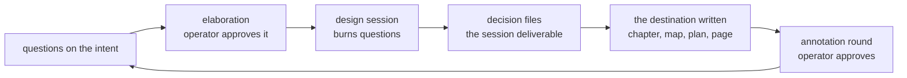

# The design loop

The design loop converts uncertainty into decisions and decisions into
the design book. It owns the book exclusively: a construction session
never edits a chapter.

## The objects

An **intent** is one design thread — `intent/relay-delivery`,
`intent/board-views-ux` — carried by two structures:

- a milestone on the tracker holding its open **questions** and
  scheduled writing work, batched into **elaborations**;
- a change directory in git — `openspec/changes/intent-<slug>/` in
  the blueprints repo, beside the books — holding its records:
  `intent.md` for the thread's charter, `questions/` for written-out
  question records, `sessions/<date>-<type>/` for each session's
  deliverables, and the decision files those sessions produce.

A question is where uncertainty enters, not the boundary of what a
session designs. A planning or prototype session routinely opens
ground no question named; the new decisions and chapters are
deliverables like any other, and uncertainty the session cannot
settle returns to the intent as new questions.

A **decision** resolves questions. The decision file is the session's
deliverable, not the archive of record: its content is synthesized
into the design book's chapters, and the file keeps only what a
chapter cannot carry — the options weighed and why the losers lost.
Once a chapter states the destination, the chapter is the reference.

## The cycle

Questions accumulate on the intent — from dispatch triage, from the
operator, from findings the operator promoted — and gather into the
one elaboration awaiting approval: a newcomer joins the batch already
waiting rather than starting a rival beside it, so each approved batch
is one numbered round of the thread. The operator approves an
elaboration on the board; the intent loop charges one design session
per type in the approved batch. The session burns its questions into
decisions, writes the destination, and puts the changed chapters in
front of the operator as an annotation round. The operator's
annotations either settle the chapter or become the next questions —
and when the batch's deliverables satisfy them, one
gesture finishes it: `stage:done` on the elaboration, and the loop
collects the set. The operator never finishes items one by one.

The book's repo and the fleet are independent. A fleet binds to its
tracker; the work order names the book by path, chapter merges go
through that repo's own gate under ordinary git credentials, and the
fleet's App identity never touches the book repo. What keeps two
fleets from tangling is homing: every book has one home fleet — the
one whose tracker carries its questions and whose planner cuts its
bolts — and a repo holding several books can serve several fleets,
its merge gate serializing them all.

## Session types

One type per elaboration; the type names the skill the session loads
and the shape of its deliverable:

| Type | Deliverable |
|---|---|
| planning | decisions and rewritten chapters for a batch of questions |
| research | a findings record grounding a future decision |
| prototype | decisions and rewritten chapters from a spike; the spike code is discarded |
| interactive | a page the operator works — comparisons, controls, diagrams |

## The close writes the destination

A session that settles something writes the settlement into its
destination as part of its own close, before it settles. Writing is
the last step of every type, not a type of its own, and it runs as
often as the session's decisions demand.

The destination is wherever a reader looks for the design: a book
chapter, a node on a context map, a plan, a page the operator works, a
research result. The list is open-ended and grows as the corpus does —
this book specifies the plumbing of the write, never the catalogue of
places a write can land. A settlement about the intent itself lands in
the intent's own records rather than in any book.

A chapter the session made stale is that session's to rewrite: in
full, in destination voice, through the session's worktree and the
book repo's merge gate, before the session settles. The book carries
no iteration history. Every design type launches with a
[worktree](sessions.md) so the write always has somewhere to land.

No session queues writing work for what it itself settled. Work is
queued only where the settlement obligates something past the writer's
own close — a chapter in a repo the session holds no worktree for, or
a contradiction the write reveals — and that returns to the intent as
an ordinary queued item.

## What the design loop does not do

It does not put construction in motion. Construction is approved on
the board: the [bolt planner](bolt-planning.md) derives its cards
from the book, and the operator's move to Ready does the rest — nothing
moves from an intent's items to a bolt. The design loop's output is
the book; the book is the planner's input; the loop and the planner
meet nowhere else.

It does not track construction findings. A finding the operator
promotes arrives as an ordinary question; everything else stays in
run reports.
