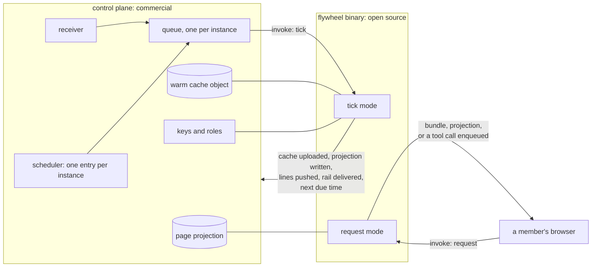

# The control plane and the hosted tiers

There are two products, and the line between them is public.

The **flywheel binary** is open source and permissive, and it is
everything a self-managed operator runs: the machines and the profiles,
the page bundle, the tool server and its endpoint, the adapters, runners
and routers, the definitions of permissions, roles, features, flags and
plans, and the command line. Nothing is held back from it to make a
hosted tier work (296).

The **control plane** is commercial, source-available to enterprise
customers for self-hosting, and it is everything that exists on the
service side: the receiver, the per-tier dispatcher with its roles and
tags, the queues, the scheduler, the warm cache and page projection
stores and their keys, the registry, the deployer, the identity
environment and its sync, plan and billing integration, pool image build
and provisioning, and the shared chat applications.

Neither reimplements the other. **The control plane evaluates no guard
and decides nothing.** It invokes the binary and holds what the binary
cannot hold between invocations.

## The invocation contract

The line between the products is the invocation contract, documented in
the open-source repository and versioned with the release set (297). It
has two modes.

In **tick**, the control plane provides the instance and its tier, a
role session tagged with that instance, the warm cache and page
projection objects, the instance's queue and the messages waiting on it,
the scheduler entry now standing, the identity environment's issuer, a
model credential or none, and a scratch directory with a stated budget.
The binary returns the cache uploaded, the projection written, the rail
delivered, the shared lines pushed by compare-and-swap, each message
acknowledged or left under its idempotent key, one next due time or a
deletion, the run record, and an exit with the scratch wiped and the
data key dropped.

In **request**, it provides the caller's identity token, the instance
named in the path, a role session tagged with that same instance, the
page projection object and the definitions version. The binary returns
the bundle or the projection, a tool call enqueued for a write, or a
refusal with its reason. **A request is never a tick** and never reads
the warm cache.

Five shapes in that environment are stated, and they are what a second
control plane must match: the queue message, the scheduler entry, the
cache object, the projection object, and the identity token's claims
(298). Anyone may build a control plane to that contract, and ours is
the reference implementation. A self-managed host and a hosted host run
the same binary bytes: nothing is compiled differently and nothing is
gated at build time, so a hosted host differs from a laptop only in what
its manifest binds (299).

## The tick is invoked, not looped

A long-lived process is one invoker among several. A clock, a
notification, an arriving capture and a chat event all produce the same
tick, and a run missed while nothing invoked it is caught up by the next
one under its idempotent key (270). Every invoker enqueues on the
instance's queue, and the queue admits one tick of an instance at a
time.

Scheduling is one named entry per instance. At the end of every tick the
machinery upserts a single one-shot entry carrying the due time the
machines computed, and the name is the instance's, so an interim tick
replaces it and at most one entry per instance ever exists (273). The
set of entries is a projection: it only shortens the wait, ticking
rebuilds it, and its loss costs a sweep and never a decision.

Notification is the primary way a host learns of new state and the poll
is the backstop (274). No unconditional poll is the floor, because a
poll costs the service for every instance whether or not anything
happened.

## The four tiers

Named by what exists on the service side (268):

| tier | what exists on the service side |
|---|---|
| 0, your computer | nothing. The binary on the operator's own machine, its own sign-in |
| 1, the cloud agent | a capture queue, a key, a role, a warm cache object and a scheduler entry. No pool, so the operator's own machines still build |
| 2, pools | tier 1 with hosts provisioned on demand from the instance's image |
| 3, your account | the stores, or the stores and the compute, in the customer's own cloud account, reached through a role the instance grants |

A tier is a binding named in the manifest and never a second machinery.

## What a shared host may hold

Everything a shared host keeps between ticks is encrypted at rest under
a key naming one instance (256). The key is unwrapped only for the
duration of a tick and only by the role that runs it, so the plaintext
data key exists in a process evaluating that instance's rail and at no
other time (257). A shared host assumes a role scoped to one instance
for the duration of that instance's tick, carried by a session tag
matched against the tag on every key and object it opens, so one
compromised credential reaches one flywheel and no role is added per
instance (259).

Two things never run on a shared host. Triage over raw material a
capture merely points at runs on the operator's own machine or on a pool
host (263). And code is never there at all: a built repository is cloned
only into a pool host serving one instance, and retiring that host
destroys its disk (264).

A key that is unreachable, deleted, or behind a role that no longer
trusts the service **fails closed** (260). No tick proceeds on state it
cannot open, every host of that instance shows one attention line naming
the key and since when, running work is not interrupted, and nothing is
kept unencrypted as a fallback. What the service holds and under which
key is a stated fact of the tier, rendered on the settings form (261).

## Plans

On a hosted tier an instance has a plan: a named set of entitlement
features with a few stated limits, held by the identity provider and
billed through the payment provider (279). The flywheel reads it only
from the identity token; it keeps no rail of its own and asks no billing
system a question at run time. A self-managed host has no rail at all
and every flag stands at its definition default.

**A plan hides and it meters; it never authorizes** (280). Permissions
come from roles and are checked on every tool call, and a surface a flag
hides is still guarded by its permission. Exceeding a limit is one
attention line and a refused add with the reason, never a stopped loop.
Work already running runs, and the machinery never halts a tick over a
rail.
