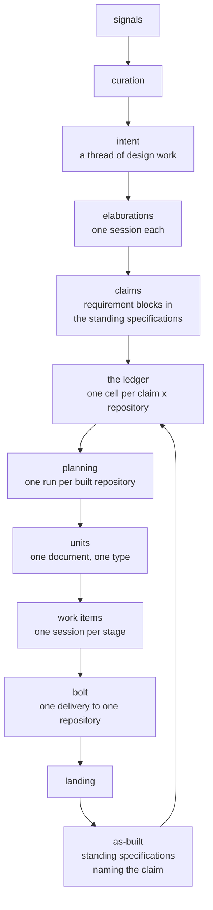

# Design and construction

Two halves, one shape. Design settles what to build and writes it down;
construction builds what was written and records that it was built. They
share the machinery, the session model, the rail and the git discipline;
they differ in what they produce.

## Intents and elaborations

Signals arrive from meetings, chat, logs, feedback and the operator's
own typing. Curation, not the elaboration machinery, decides which of
them become intents, and curation may be a person, an agent, or both
(20). An **intent** is one thread of design work about one subject,
pursued until the operator closes it.

An intent carries at most one elaboration awaiting approval at a time.
New material joins that standing proposal rather than raising a second
one (21), which is the rule that keeps the rail short when a subject is
noisy.

An **elaboration** is one unit of design work, worked by one
free-flowing session, and its **type** decides how it ends (24). A
self-closing elaboration finishes itself when its deliverable is
written. A standing one ignores `done`, restarts if its process dies,
and offers to finish after it has been idle a while; only the operator's
answer ends it. A with-operator session raises no decision at all: the
machinery never asks about it and ends it only on the operator's word.

The output of design is the book: prose, diagrams and samples the
operator can judge, and claims the machinery can address (23). Anything
else a session produces is a record, not a source of truth.

## Claims and the ledger

A **claim** is a requirement block in the blueprints' standing
specifications, with at least one scenario saying how one would know it
holds (97). Its version is the content hash of the block, so "the
version moves only when the text moves" needs no hook to enforce it: the
version *is* the text.

A claim's state is simply which tree holds it. In an intent's change
directory it is proposed; in the standing specifications on the shared
line it is standing; removed and archived, it is retired. The intent's
landing archives the delta, and that is what makes its claims standing.

The **ledger** holds one cell per standing claim per repository in
scope, with a verdict, the claim version it was judged against, the
repository revision, and the evidence (105). A cell goes stale when the
claim's version moves, when the cited evidence is gone from the
repository's head, or when a signal stands as a challenge against the
claim. Forty commits that leave the evidence in place move nothing
(I10).

A verdict is always an agent's judgment recorded with its inputs, never
the machinery's own arithmetic (100). Two of the inputs are mechanical
and the machinery reads them for the session: whether the repository's
standing specifications hold a requirement naming this claim, and
whether the version it names still matches. A matching requirement with
passing scenarios is strong evidence. It is not the verdict.

Scope is never chosen. A claim attaches to a context, an element, a
relationship or a link on the system context map, and its scope is the
set of repositories homing what it attaches to (200). Correcting a scope
is re-attaching the claim, one response through one tool.

## Planning

Planning is a session of its own, run for one built repository when that
repository's backlog changes: a claim in scope becomes standing, a
verdict is recorded or falls stale, or an ask names the repository (28).
It reads the backlog, the as-built and **every open bolt of the
repository**, and it proposes units.

Its output is one document: the bolts it proposes, new or open, and the
units in each, every unit with a type, its dependencies, its cited
claims and its target bolt. That document is the one decision the run
raises. On yes, every unit it names is approved at once, the new bolts
are created, and the items appear. A per-unit answer on the same
document reroutes a unit, renames a bolt, changes a type or drops one
unit while approving the rest.

A proposal is not work. Planning's next run supersedes a standing
proposal silently, and a proposed unit whose cited claim moved is
replaced the same way (35). Only once a unit is approved does a moved
claim become the operator's decision, and only once it has started does
it become the bolt's affair.

## Units, items and bolts

A **unit** is one approved piece of construction work, proposed as one
document the operator reads whole (36). Approval turns it into work
items; nothing before approval creates work items.

Every unit has a **type**, and the type is a machine: its stages in
order, the sessions each stage runs, where an item goes back to when a
stage judges it not done, whether it needs a change directory, and where
its work lands (37). Chore, fast and default are types; so is anything
the operator adds, because a type is a file, not code (85). A type file
is immutable once registered and a change is a new version, so work in
flight finishes under the version it was approved with.

A **bolt** is one delivery of construction work to one built repository.
It accumulates finished units and lands once, when the operator closes
it (33, 39). No order among bolts is stored and no bolt reads another,
so the bolts of one repository proceed independently. A bolt lives as
long as its work: an hour, or weeks while the operator tests against it.

Several items may be in flight at once, and merges into the bolt's line
happen one at a time in a fixed order (38). The bolt's close is proposed
when every unit is merged and no chore is outstanding. A landing that
fails is reported and leaves the bolt open (40); nothing is asked of any
session until the operator answers.

## Findings and chores

A session may offer a finding at any time, and offering never interrupts
it (58). A finding about the session's own thread becomes a proposal on
that thread's rail. A finding about anything else crosses as a signal
and goes through curation, which is the only way one thread reaches
another. A chore offer becomes a unit of the chore type.

The document a session writes lives in the change directory it is
working and is archived with the change. The record the machinery keeps
points at the document and never holds its text.

## What a session may not do

A session commits in its place, and the machinery does everything else
(I12). Hooks in the place refuse a branch, a merge, a push or a worktree
command, and a refusal is recorded and reported. Sessions never message
each other (197): a session speaks to the machinery through a small
fixed set of commands, each call carrying the identity token written
into its work order, and the machinery speaks to a session only through
its thread. A session in `working` is never interrupted (I5).
