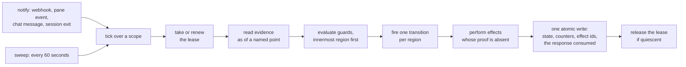

# The loop

There is one loop, and it is the same for every kind of object and every
kind of storage. A tick is one pass over one scope: list the objects,
read each one's evidence as of a named point, evaluate the guards of its
active states, fire at most one transition per region, and perform the
effects whose proof is absent. That is the whole of the engine's
behaviour (83, 86).

Nothing else drives the machinery. There is no queue of pending work, no
scheduler holding a plan, no process remembering what it was doing.
Every object's state is derivable from durable stores at any moment, and
nothing held only in a process's memory decides behaviour after that
process restarts (75). Read the same stores twice with nothing changed
and you get the same conclusion and no writes (78).

## Effects carry their proof

Every effect names the evidence that shows it was done: starting a
session is proven by the pane, merging a place by the merge, creating
items by the items existing. The engine performs an effect only when its
proof is absent, and each write carries an effect identity, so a repeat
changes nothing and is not counted twice (127). This is why a slow
action is safe. A session that takes ninety seconds to start leaves its
object in `starting`; the retry uses the same deterministic session name;
the multiplexer refuses a second pane by that name. Nothing runs twice
because nothing needs to be remembered to avoid it.

The write itself records why it happened: the reason, the evidence the
guard read, and the effect ids (79). Problems with the machinery are
reported through that record and never filed as work (81).

## Hosts and leases

A host is the binary with a name, a bound on how many sessions it runs
at once, and a **declaration**: the object kinds, repositories and unit
types it takes, and the sinks it presents (149). A host acts on an
object only when its declaration covers that object and it holds the
object's lease. Two would-be holders of one object cannot both hold it
(128).

That one rule does several jobs at once. It decides which host acts. It
lets a new instance run beside an old one against the same repositories,
because the two declare disjoint sets and neither can touch the other's
objects (96). And it makes silence impossible: an object no declaration
covers raises an attention decision rather than sitting unowned (149).

A lease goes stale at five minutes, which the status view shows, and the
holder may still renew and carry on. It expires at twenty-four hours, or
when the operator answers `takeover` on a host that has stopped
heartbeating. A laptop is *intermittent* by default: when it stops
heartbeating it is `away`, its leases standing and its sessions' idle
clocks paused, and it becomes `gone` only when numbered decisions or
approved work are waiting on it. A cloud host is not intermittent and
goes `gone` at thirty minutes.

A standing host process is one way to run the loop and not the rule. A
clock, a notification, an arriving capture and a chat message are all
invokers of the same tick.

## The rail

The rail is the operator's whole surface for deciding, and it is a pure
function of the active states plus a register of numbers (7). A state
with a decision attached *is* a decision while that state is active, and
nothing else is (9). So a decision cannot be missed, because nobody
writes it: if the state is active the decision exists, on every host, on
every tick, after every restart. And it cannot linger, because leaving
the state retracts it.

Every decision carries a short number, unique in the instance, given
once and never reused (15). The page and the chat show the same number
because both read the same register, and a response names that number.
No rendering of the rail is stored anywhere.

Decisions are grouped so that "yes to all" is meaningful on a simple
rail and any one of them can still be answered alone (11). Below the
count sits the tail: what reached done, landed, closed or dropped since
the last delivery to the sink you are reading (14). One delivery mark
per sink is the only recorded state behind it; the tail itself is
derived like the decisions.

The number matters more than it looks. A decision's identity includes
when its state was entered, so a decision that is retracted and raised
again is a new decision with a new number. An answer written yesterday
cannot land on a question that has since changed. A response arriving
after its decision is gone is handed back as unapplicable and shown
once, never silently dropped (6).

## One response is enough

After a response is applied, everything that follows without a further
judgment proceeds on its own: an approved unit becomes items, items
start sessions, exits advance stages, merges happen, the next stage
begins (13). The operator never nudges. A decision says what its yes
will start, and after the yes the only things that wait are a session's
work and the next decision that is genuinely theirs.

The operator may also act outside the rail. A dictation names an object
rather than a decision number and is applied directly (12). It may only
take a transition that undoes or defers work: drop, hold, release, send
back, retire, finish, close (4). There is no dictation that asserts work
was done, and a response claiming one is refused and reported.

## Bootstrapping

Starting is the same loop. An instance is an object with a machine of
its own, and `flywheel init` drives it: adopt or create the blueprints
repository from the template, create the state repository with the
profile's layout, record that the connection to the git host must be
installed, register the first host (204). Every step is an effect with a
proof, so running it again changes nothing, and the reconciler that
advances ordinary work advances a half-finished bootstrap just the same.

A host joins by one command and never by hand: it clones what it needs
under one root the manifest names, keeps one checkout of each shared
line for the machinery's own merges, and makes worktrees only for places
(205). A host that finds a hand-made layout refuses to start and says
what differs.
