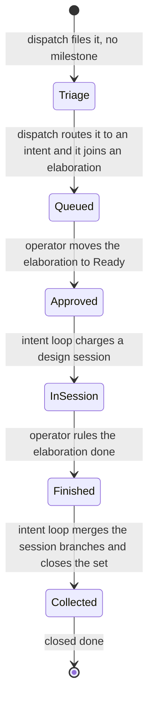
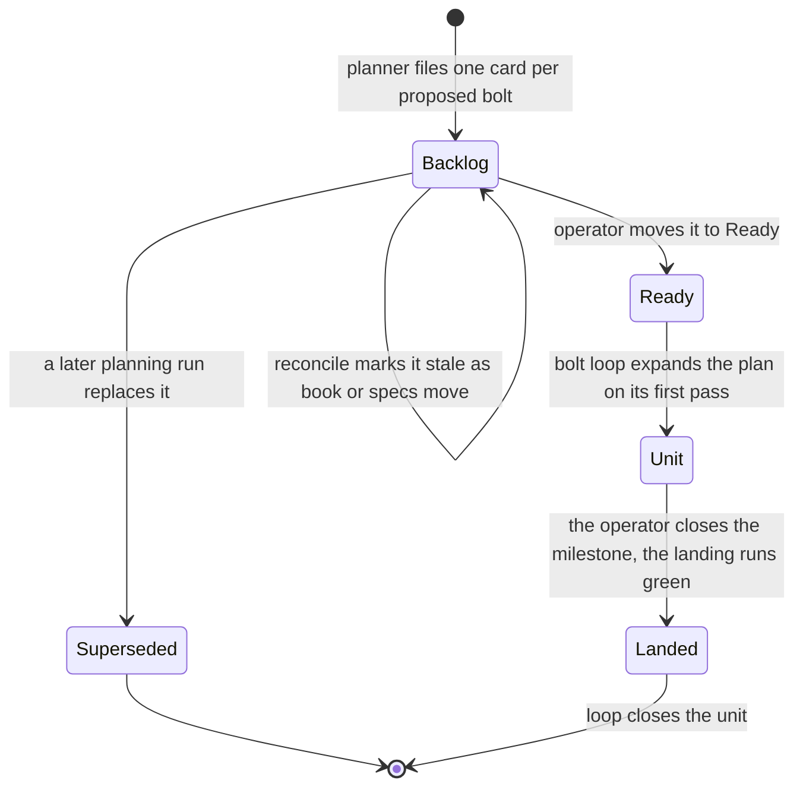

# Lifecycles

Every object the flywheel creates has one birth, one life, and one
end, with a named actor at each transition. This chapter walks each
of them — the tracker items, and the OpenSpec change directories the
loops keep. The [tracker protocol](tracker-protocol.md) defines what
each label means; this page says when an object wears it and who
moves it on.

## The question

Born from an idea, dies as a decision synthesized into the book.

At `Triage` the item sits unmilestoned and self-populates the Triage
view. Dispatch routes it; dispatch or the operator batches it into an
elaboration at `state:queued`. The operator's move to Ready approves
the batch; the intent loop relabels the sub-issues `state:ready`,
charges one session per type, and walks each item through
`state:in-progress` + `stage:in-session`. The operator rules once, on
the elaboration: deliverables that satisfy them earn `stage:done` on
the batch parent, and the loop collects the whole set — merges the
`sess/*` branches, sets `stage:collected`, closes each item
`closed:done`. The elaboration is the operator's whole surface on the
design side, as the unit card is on construction's: rule the batch in
at Ready, rule it out at done, close the milestone when the thread is
settled. The operator touches an item only to end one early —
`closed:declined`, `closed:superseded`, or `closed:parked`, always by
their word.

## The plan card and its bolt

The planning run creates the bolt milestone (its description is the
bolt summary) and files one plan card per unit onto it. A card is
born from a planning run, becomes its unit, and dies when the bolt
lands.

The card carries its unit's document as its body and sits on the
bolt milestone from birth. Expansion — the bolt loop's next pass
after approval — relabels the card `unit`, consumes its Ready
status, and files the work items beside it as its sub-issues. Each
unit's sub-issue progress bar is that unit's progress; the landing
runs once for the bolt — released by the operator's milestone close,
after every merged item awaits it and no unit card is still open —
and the loop closes the units `closed:done` after it.

## The work item

Born at expansion, merged by the loop, upgraded at the landing.

| State | Entered when | By |
|---|---|---|
| `state:ready` | expansion files it from a plan task | bolt loop |
| `state:in-progress` + `stage:planned` | its spec validates | bolt loop, after the spec session |
| `stage:built` | a commit lands on its branch | bolt loop, after the build session |
| `stage:verified` | verify comes back clean | bolt loop |
| `stage:merged`, then `closed:merged` | the merge gate passes | bolt loop — the merge is a loop step |
| `closed:done` + the landing commit | every criterion in the charter holds | bolt loop, after the landing session |

## The intent's change directory

`openspec/changes/intent-<slug>/` in the book's own repo, bound to the
`flywheel-intent` [schema](schemas.md). Where the book lives is the
org's choice — a dedicated blueprints repo that gathers the design
books, or the built repo itself — and the records follow the book,
never the other way: the loops' records live beside the books, and a
built repo that does not hold the book holds only its construction
changes and its implemented specs. The record's work rides branch
`intent/<slug>` in the book's repo, a worktrunk worktree like any
built repo's, and the operator's milestone close triggers the same
archive-and-merge sequence through that repo's gate that lands a bolt
in its built repo.

| Moment | What happens | By |
|---|---|---|
| the intent's first approved work | the directory is scaffolded (`opsx:new`) with `intent.md` | intent loop |
| each session | `sessions/<date>-<type>/` gains the session's deliverables; question records land in `questions/` | the design session |
| synthesis | decision content is written into the book's chapters; the decision file keeps only what a chapter cannot carry | the design session |
| the operator closes the milestone | one-shot archive files the change; the book already holds the destination | server |

## The bolt's changes

Two kinds, different homes:

| Change | Born | Dies |
|---|---|---|
| the bolt's record — `openspec/changes/bolt-<slug>/` beside the book: the charter `bolt.md` plus one `units/<slug>.md` per approved unit, bound to a `bolt-*` schema | the charter at scaffold, from the milestone's description; each unit artifact at its expansion, frozen by the approval | archived after the landing the close releases, merged through the book repo's gate |
| one spec-driven change per work item, in the built repo | written by the spec session from the plan task and its cited chapters | archived by the loop at the item's merge — `openspec/specs/` advances in the same motion |

Record directories mirror their milestones — `intent-<slug>`,
`bolt-<slug>` — and ride branches named like them, `intent/<slug>` and
`bolt/<slug>` in the book's repo. One operator gesture ends both
sides: the milestone close lands the built repo's bolt branch on its
main and triggers the record's archive and merge beside the book.

The per-item archive is what keeps the next planning run honest: specs
move at merge time, not at landing time, so a half-landed bolt already
shrinks the gap the planner reads.
