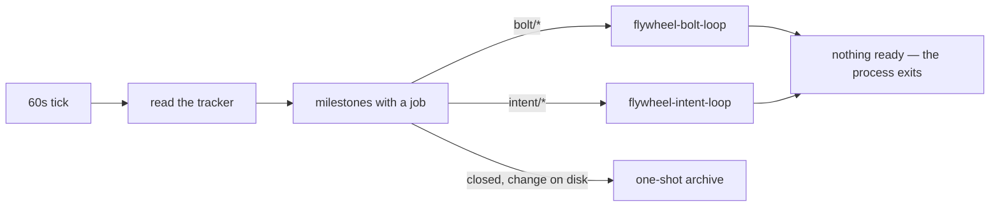

# The server and the fleet

`flywheel server` is the fleet's engine: a daemon the operator runs on
a host, reconciling every sixty seconds. Each pass reads the tracker,
computes which milestones have a job, and starts one loop process per
milestone with one — `flywheel-bolt-loop` for a `bolt/*` milestone,
`flywheel-intent-loop` for an `intent/*` one. The pass decides nothing
itself: the job list is a filter over the tracker, the arithmetic over
it is a pure function of manifest, tracker, and the live process
registry, and judgment lives in the sessions the loops launch.

## The reconcile pass

A milestone has a job when it is open and holds an open item at
`state:ready` or `state:in-progress`, when a batch on it sits at board
Status Ready, or when a bolt milestone holds a merged item still
awaiting its landing. Intent milestones come from the design loop;
bolt milestones and their items are born from an operator-approved
[bolt plan](bolt-planning.md). The server's filter may
over-approximate where a loop's filter must be exact: a false positive
costs one process start and a clean exit, a false negative costs work
that never happens.

The loops are stateless: a fresh process re-reads the tracker and the
change's records and continues from what it finds, so a killed loop
loses nothing and a restarted one needs no handover. No job means the
process stops on its own; the server stops nothing by force. A loop
that exits with the tracker unchanged is held on a doubling backoff —
one minute to fifteen — and released the moment the tracker moves.

A [held](observation.md) loop writes the tracker writes it intends
and acts only after `flywheel approve`. The server's interval is the
retry — a held loop that stopped waiting is started again on a later
pass and finds its approval on disk.

A closed bolt milestone is the operator's landing release: the loop
lands the bolt branch first, and only then does the close become the
archive signal. A closed milestone whose change still sits in
`openspec/changes/` triggers a one-shot archive: `openspec archive --yes --json`, then a
commit that reaches main through the same merge gate as any branch —
no actor writes main directly, the server included; the gate is the
only door. A blocked archive labels the milestone's open items
`needs-operator` with the reason; findings about the machinery itself
travel through [run reports](observation.md), never as tracker
issues.

Two more reconcile duties. A repo whose hook approvals are missing
holds its loops: the server refuses the start, says so in `status`
and the run record, and retries once the grant lands — never start
and fail late. And the pass reaps panes: a pane matching no live job
closes once the run report has recorded what it held; stall evidence
outlives its stall only until then.

The fleet converges its own machinery version. A session resolves the
plugin through the directory it launches from, and every checkout and
worktree is its own install scope with its own version pin — so a
fleet can silently run mixed machinery, a stale profile in one pane
and current loops in another. `flywheel up` verifies that every scope
the fleet launches from resolves the release the marketplace names,
repairs the pin or refuses the start on a mismatch, and says so —
the same refuse-early family as the hook-approval check.

Two prompts leave the server outside the loops. Dispatch — the one
standing agent, since triage and relay need a mind and a chat
channel — is nudged when unmilestoned items await triage or
`needs-operator` items await relay. The [bolt planner](bolt-planning.md)
is charged when a system's plan cards are missing or stale and its
book has settled, when a landing advances its specs, or when the
operator asks; between runs the pass only marks unapproved
plan cards stale as their input commits move. Both prompts land in
the run record like any other action.

## The fleet manifest

`fleet.yaml` lives at the org folder root — the directory above the
org's repos — and is machine-local, never checked in: placement is a
fact about one machine. Commands find it by walking up from the
working directory; `cwd:` and `loops_cwd:` entries are relative to the
manifest's directory. It names the tracker (`tracker: org/repo`), the
operator (`operator:`, their GitHub login), the checkout loop
processes run in (`loops_cwd:`), the hosts — keyed by real machine
name — and the standing actors. The server reads it once at start and
re-reads the tracker every pass; a manifest edit takes effect by
restarting the server, which keeps the tracker the only bus.

The manifest also carries the fleet's **book bindings** — one entry
per system the fleet homes, pairing the design book's checkout path
with the built repo it measures. The binding is the homing rule as a
fact on disk: the server watches the bound book's commits for the
settle-window trigger and staleness marking, and composes the
planner's work order from the pair. The book's path also rides into
every construction loop the server starts, and the loop names it in
each spec session's work order — chapter citations resolve under it,
and the spec derives from the chapters as they are at session time,
never from a card's summary of them. A system without a binding gets
no planning runs — the fleet drives its tracker items but computes no
backlog for it. A book in another organization's repo binds like any
other: the binding names a checkout path, and chapter merges go
through that repo's own gate. A binding needs no routing entry: its
cards default to the fleet's own address, and a `runs_on:` override
exists only for a system pinned to a specific machine. The book's
repo is also the records' home: the loops write their `intent-<slug>`
and `bolt-<slug>` records onto its main as the work happens, each
write a commit through its gate — a built repo's `openspec/` never
holds a loop's record.

## Multi-host

Multi-host operation is a server per host sharing one tracker, routed
by address. A Team value on the board is `<operator>@<host>` —
`afterthought@mac-studio` — so the value carries its own routing:
each server takes the work whose Team names its host and logs the
rest as running elsewhere, with no translation table anywhere.
`flywheel-setup` seeds one Team option per host in the manifest, and
adding a machine is one `hosts:` entry plus the option that appears
with it. Re-teaming a milestone moves its loop: the old host's server
stops the process, the new host's starts a fresh one that re-reads
everything. The operator half of the address keeps a shared tracker
legible — a card says whose machine owns it — and lets two operators
run hosts against one board without colliding.

## The CLI

| verb | does |
|---|---|
| `flywheel up` | converges the manifest's standing actors, then starts the server detached if none runs here |
| `flywheel status` | reports actors against the live roster, per-repo merge-gate readiness, the server, every milestone with a job, and what waits on the operator |
| `flywheel server` | the daemon itself, in the foreground; `--once --dry-run` prints one pass without starting anything |
| `flywheel down` | stops the server and every loop process for the org; dispatch and the herdr session stay |
| `flywheel approve` | releases one held scope's pending pass — `bolt/<slug>`, `intent/<slug>`, or `dispatch` |

## Identities

Machinery writes to the tracker as the GitHub App, its token resolved
through `flywheel-token`; the operator writes as themselves. Every
tracker write names its author, so reading who wrote is reading
whether machinery or judgment acted.

Tracker writes fail closed. A machinery write that cannot mint the
App identity fails and lands in the run record — it never falls
through to an ambient credential and posts as the operator. The token
path is a wrapper every machinery write goes through, not a
convention each caller remembers. The same wrapper carries the API
discipline: a rate-limited or transiently failing call retries with
backoff, honoring the server's stated wait, and only a still-failing
call surfaces — one seam, so no caller reimplements patience.

## The state directory

The server keeps its state under `~/.local/state/flywheel/<org>/`
(`XDG_STATE_HOME` respected): `server.log` and `server.pid`;
`state.json`, the per-pass snapshot `flywheel status` reads for
run-versus-held; `loops/<kind>-<slug>.log`, one log per loop process;
and `observations/<scope>/` — one scope per milestone plus one for
dispatch — the run records that [run reports](observation.md)
render.
