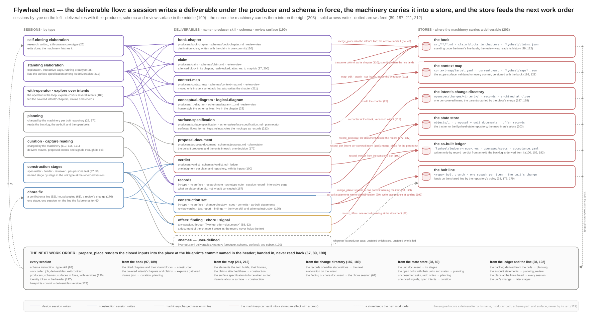

# Machines and context

The machine registry as it stands and as it should be divided; the
context every kind of session is handed, one table per session type, so
the operator can review and rule on it; the flow by which a deliverable
a session writes reaches a store and feeds the next session; and the
requirements that would fix each of these. Written to be shown true or
false of the model in `machines/`, `profiles/` and `model.md`; every
statement cites the requirement it rests on by number, and where the
model is silent the word is **unstated**, so the operator can rule.

Companion artifacts: `diagrams/machines/index.md` (one rendered
statechart per machine, from `machines/render.py`) and
`../../diagrams/flywheel-next-deliverables-flow.svg` (the flow of
section 3).

## 1. The registry

### 1.1 As it is

**Where a machine is found.** A machine is one YAML file under
`machines/`, in the directory itself or in `engine/`, `unit-types/` or
`elaboration-types/`; `check.py` and `render.py` read every `*.yaml`
under `machines/` recursively except `atoms.yaml`, and `schema.json`
beside them is what each file validates against. Thirty-two files today:
sixteen `kind: object`, eleven `kind: template`, five `kind: engine`
(`diagrams/machines/index.md` lists them with kind, version, object and
`satisfies`).

**What identifies one.** The `machine:` field, not the file name.
`check.py` keys its table by `machine:`; a file name is a convention
that happens to match. `kind:` is `object` (governs one object kind the
control plane lists; carries `object:`, `parent:`, `owns:`,
`singleton:`), `template` (instantiated inside another machine's state
with `params:`) or `engine` (shipped with the engine, names no domain
object). `version:` is an integer from 1. `satisfies:` names the
requirements. `record:` names the fields the object's record carries
beside its state. `doc:` is free text; the file's leading comment is the
description `render.py` shows.

**How a machine references another.** Only through `machine:` on a
state, in three forms:

| form | example | resolved by |
|---|---|---|
| a bare name | `machine: place` in `work-item.place`, `machine: line` in `bolt.line`, `machine: session` in every worker state, `machine: stage` in every unit type, `machine: with-operator` in `operator-session.open` | `check.py`: the name must be a loaded machine; the engine: the template at the version shipped with it |
| a record parameter | `machine: $type` in `elaboration.working` | the elaboration record's `type` at its `type_version` (27, 57); `check.py` accepts any `$` reference unchecked |
| a record parameter with a version | `machine: $unit.type@$unit.type_version` in `work-item.in-type` | the unit type file at the version the unit recorded when its items were created (`create_items`, 57); unchecked by `check.py` |

A template's `params:` are supplied by the referencing state's `params:`
(`{line: bolt-line, inputs: work-order, keep: false}`, `{agents:
[builder], join: all, on_fail: build, max_send_backs: 3, deliverables:
[...]}`); a stage passes `$each`, `$each.kind` and `$deliverables` on to
the sessions it runs. Nothing checks that the parameters supplied match
the parameters declared. A parent sees a submachine only through
`{final: <state>}`, and `check.py` checks the named state against every
template's states, not against the referenced machine's.

**Where the operator's copies live.** The files under
`machines/unit-types/` and `machines/elaboration-types/` are what an
organization's own type files look like (`model.md` 1.3, 10.6): the
engine loads `flywheel/types/units/<type>.yaml` and
`flywheel/types/elaborations/<type>.yaml` from the books repository, at
the version the object recorded (57), and `persona-test.yaml` is the S26
example, added with no code change. The rest — every object machine,
the engine machines, `line`, `place`, `session`, `stage`, `atoms.yaml`,
`schema.json` — is embedded in the binary (`model.md` 13,
`flywheel-domain`) and is not read from any books repository.

**How profiles bind them.** A profile binds atoms, never machines: every
`ev` and `do` name in `atoms.yaml` has one `read:` or `do:` line in
`profiles/`, and `check.py` refuses a complete profile that leaves one
unbound (140). Machines reach the profiles' world only through those
names. Three bindings do name type files: `item.retry_max` reads "the
unit type file at `get(unit).type_version`", `set_type` and
`create_items` write "the type file's version in force", and
`sessions.yaml` `models:` gives a kind and model per role that "a unit
type, a stage or an elaboration type may override with its own `kind:`
and `model:`" (173) — though no type file in `machines/` carries such a
field and `schema.json` would refuse one. The deliverables binding
(`profiles/deliverables.yaml`) is what a type file's `deliverables:`
entries resolve against: `default` is the shipped entry or the
manifest's override, `by-type` the stage's own skill and schema (190).

**What `check.py` validates.** Every file against `schema.json`; every
guard and effect name against `atoms.yaml`; every transition target a
state of its region; every `enter:` and `final:` a state of some
template; every bare `machine:` a loaded machine; every decision
complete; every diagram's `data-state`, `data-decision` and
`data-effect` (83); every complete profile bound; every conformance
scenario; the requirement trace both ways.

**What it does not.** These are the registry's gaps as it stands:

- a `$` reference is accepted without resolution, so nothing checks that
  every unit type exposes the finals `work-item.in-type` waits for
  (`passed`, `stopped`) or that every elaboration type exposes `done`;
- the parameters a state supplies are not checked against the
  template's `params:`;
- `version:` is compared with nothing: no history of versions, no rule
  for when it moves, no record of which version an object of a core
  machine runs under (objects record only `type_version`);
- two files with the same `machine:` silently replace one another;
- nothing ties a file's directory to its kind, and nothing marks which
  files an organization may edit;
- `check.py` runs over `machines/`, never over a books repository, so an
  organization's type files are validated by nothing until the engine
  loads them;
- the elaboration site writes `$type` without a version while the
  work-item site writes `$unit.type@$unit.type_version`; the version is
  in the record either way, but the reference grammar differs;
- `model.md` 8.2 names a review deliverable `verdicts-for-named-claims`
  while every type file names it `verdict`.

### 1.2 Core and extensible — the proposal

**The division.** A machine is **core** when it is `kind: object`,
`kind: engine`, or one of the four structural templates `line`,
`place`, `session` and `stage`: every object machine instantiates them
and they name the effects only the machinery may perform (42, 43, I12).
Core machines ship with the release, compiled into the binary, and no
organization edits one. A machine is **extensible** when it is a file an
organization adds or overrides under `flywheel/` in its books (203,
208): a unit type or an elaboration type. Beside the machines, the same
line divides the other data the engine reads: atoms and the schema are
core (a new atom needs a binding, and a binding is a release, 57, 140);
deliverables, vocabularies, instructions, schemas and skills are
extensible (119, 190, 198).

| file | machine | kind | class | at an organization |
|---|---|---|---|---|
| `bolt.yaml`, `capture.yaml`, `claim.yaml`, `curation.yaml`, `elaboration.yaml`, `intent.yaml`, `ledger-cell.yaml`, `operator-session.yaml`, `organization.yaml`, `planning.yaml`, `proposal.yaml`, `repository.yaml`, `service.yaml`, `signal.yaml`, `unit.yaml`, `work-item.yaml` | the sixteen object machines | object | core | in the binary; never in the books |
| `engine/host.yaml`, `engine/lease.yaml`, `engine/plan.yaml`, `engine/response.yaml`, `engine/sink.yaml` | the five engine machines | engine | core | in the binary; their windows (5m, 30m, 24h, 7d) are "the operator's to change" (`model.md` 2.5) — **unstated** through what: no manifest key names them |
| `line.yaml`, `place.yaml`, `session.yaml`, `stage.yaml` | the structural templates | template | core | in the binary |
| `atoms.yaml`, `schema.json` | the atoms and the machine schema | — | core | in the binary; `flywheel-atoms` generates the name registries from them |
| `unit-types/chore.yaml`, `unit-types/default.yaml`, `unit-types/fast.yaml` | the shipped unit types | template | extensible, shipped | `flywheel/types/units/<type>.yaml`, placed by the books template (208), overridden by editing the file (a chore, 123) |
| `unit-types/persona-test.yaml` | an organization's own unit type (S26) | template | extensible, an organization's | `flywheel/types/units/persona-test.yaml`, added by a commit; not in the shipped set |
| `elaboration-types/self-closing.yaml`, `elaboration-types/standing.yaml`, `elaboration-types/with-operator.yaml` | the shipped elaboration types | template | extensible, shipped | `flywheel/types/elaborations/<type>.yaml`; `with-operator` is also the operator's own session's type (69), so a core machine names it by bare name: it may be overridden, never removed, and its `done` final is part of the contract |
| `profiles/deliverables.yaml` `shipped:` | the deliverables binding | — | extensible, shipped | producers, schemas and surfaces under `flywheel/`, overridden per name in `flywheel.yaml` `deliverables.<name>` (190) |
| `profiles/host.yaml`, `sessions.yaml`, `books.yaml`, `record-derived.yaml`, `surfaces.yaml`, `tracker.yaml`, `git-only.yaml` | the bindings | — | core | in the binary; a third profile is a release (168) |
| `flywheel/map-vocabulary.yaml`, `flywheel/instructions/*.md`, `flywheel/schemas/*.md`, `flywheel/skills/**/SKILL.md` | not machines | — | extensible | the organization's, under the prefix (198, 119, 88) |

**Marking it.** `schema.json` gains a required field `tier: core |
extensible`. A file's directory mirrors it — `machines/` and
`machines/engine/` are core, `machines/unit-types/` and
`machines/elaboration-types/` extensible — and `check.py` fails a
mismatch, a core machine that names an extensible one by bare name
(except the shipped `with-operator`, listed as an exception in the
release manifest), and an extensible machine that is not `kind:
template`.

**Versioning.** Every file keeps its `version:`. The release carries a
**set version** (208, `flywheel templates version`), which names the
version of every core machine, the atoms, the schema, the shipped
deliverables binding (`profiles/deliverables.yaml` `version:`) and the
shipped extensible files. An extensible file in a books repository
carries, beside `version:`, the set it was written against — `set:
flywheel-types/N`, as the map vocabulary carries `extends:
flywheel-map/N` — and a file whose N the installed binary does not read
fails the check; moving N is a chore (123). An object records the
version of the extensible machine it runs under (`unit.type_version`,
`elaboration.type_version`, as today, 57) and, new, the set version it
was created under, so a release can tell the objects that predate it.

**Registration.** Two manifests, validated as one:

- the release ships `machines/manifest.yaml`: the set version; every
  core machine with its version and content hash; every shipped
  extensible file with its version; the exceptions (a core machine's
  bare reference to a shipped type);
- the organization's additions are its files under `flywheel/types/`,
  and the machinery renders `flywheel/registry.json` under its prefix
  (203), as it renders `flywheel/claims.json`: for every type name, the
  versions seen, the books commit each version first appeared at, its
  hash, and whether it is shipped, overridden or added.

`flywheel types check` — the binary's counterpart of `check.py` — runs
in the books' pre-commit hook and on every host at every fetch, over the
union of the release manifest and the books' files: every file
validates against the schema at the set's N; every atom it names exists
in the binary; every `machine:` it names is a structural template or a
registered type; every `{final: X}` a parent waits for is a final of the
machine it references; every parameter a state supplies is declared by
the template; every deliverable named `default` resolves through the
binding or the manifest; and, on a host, every version a live object
records is present — a version is retired only when no live object
records it, and a type file that removes a stage a live item is in is
refused at load and reported (79), never applied to the item (57).

**What a change means.**

| change | is | reaches hosts by | objects in flight |
|---|---|---|---|
| a core machine, an atom, the schema, a binding | a flywheel release: a new set version, the conformance suite green (92–95), the rendered graphs regenerated and reviewed (section 4, 225), release notes naming every state added, renamed or removed | the operator installing the binary (208: never a side effect for the books) | keep their state names; an object in a state its new machine lacks is reported under attention and never moved by the machinery (4, 81) |
| an extensible file (a type, a producer, an instruction, a schema, a vocabulary) | a chore on the books (91, 123): the version bumped, the check green | the shared line at the next fetch (91) | keep the version they recorded (57); a session started before the commit carries the older commit in its header (123) |
| the shipped extensible set in a new release | a chore the operator accepts to upgrade `flywheel/types/` (208) | as any chore | as above |

## 2. Context passing

**The closed set.** A session's inputs are enumerable and closed (89):
`prepare_place` writes them into the place before `start_session` runs,
and nothing else reaches the session. Every place has the same shape
(`profiles/host.yaml` `prepare_place`): a worktree at its line's head;
hooks that refuse a line operation and the agent program's own deny
list (43, 173); an untracked `.flywheel/` holding `work-order.md`, the
handoff and a short-lived installation token scoped to the place's
repository (207); and the work order rendered from the closed inputs,
whose header names the books commit every input was read at, the
deliverables binding's version (123, 190) and the session's identity
token (197). The work order proper is the job, the deliverables table
(name, producer, schema, surface, each with its version; recorded as
`session.expected`, 190) and the exit contract (65, 67). The session
reports only through `flywheel exit | offer | note`, and `flywheel
service` in a bolt's place (48); the machinery speaks to it only through
its thread (`deliver_answer`, `tell_moved`, 197). `flywheel render-order
<scenario>` renders the exact text with no session (90, 124).

Two facts shape every table below. A **design** session's place is a
worktree of the books repository at the intent's line, so the whole
book, every claim block, both maps, the vocabulary, the instructions and
the intent's change directory are on its disk; the work order points
into that tree. A **construction** or **planning** session's place is a
worktree of a built repository, so nothing of the books is on its disk,
and whatever it needs from the books — chapters, claim blocks, the map
section, the surface specification — must be copied into the place by
`prepare_place`. `host.yaml` states the map section and the surface
specification are; the chapters and claims it lists as inputs without
saying how they cross — **unstated**, and the first ruling the tables
need, since the place's settings deny reads outside it (89) and the
host's own books checkout is outside it.

Every table has the same rows; a row reads "carried: what" or
"unstated: what would need ruling". A column per stage where the type
has stages.

### 2.1 Curation (`curation.running`, agent `curator`, machinery session)

| input | carried |
|---|---|
| schema instruction | the exit schema in force (65); a schema for the delivered moves and proposed intents and gatherings: **unstated** (no `flywheel/schemas/move.md` or `intent-proposal.md` is named) |
| type skill | the curator's skill: `flywheel/skills/<session type>/SKILL.md` per `model.md` 10.6, keyed by **unstated** (the agent name `curator`, or a type name) |
| work order fields | the unmoved signals (records with excerpt, kind, subject tags, `argues_with`), `flywheel/claims.json`, the open intents (`model.md` 9); the threshold and cadence are not its business. For a gathering (188): the elaboration types it may propose — **unstated** whether the type catalogue is handed in. For a route offer (116): the repository a chore lands on — **unstated** whether the manifest's repository list is handed in |
| artifacts of the change | none: the place is off the books' shared line (`inputs: work-order, keep: false`) and commits nothing to a line (`model.md` 7.1); it delivers everything through its exit |
| book chapters and claims | the claims index is in the work order; the chapters are on disk (a books worktree) but the work order names none — **unstated** whether the curator is told to read chapters behind the claims a signal argues with |
| map elements, homes, attachments | on disk; not in the work order — **unstated** whether subject tags are matched against map elements |
| surface specification | no |
| deliverables and producers in force | the machine names no `deliverables:`, so `session.expected` is empty and its exit's moves, intents and gatherings are compared with nothing (80) — **unstated**; the binding has no entry for a move or a proposed intent |
| identity | the token in the header; `flywheel exit`, `flywheel offer chore | signal` (116), `flywheel note`; the read-only query tools (`in-scope-for`, `attachments-of`, `changed-since`, `unhomed`, `map-check`) as "a session charged to plan or curate reads records and calls tools like any other" (197) |
| never receives | the raw material behind a signal (111; the capture cites it — **unstated** whether the curator may follow the pointer); a tool that opens an intent (110) or writes a move (the exit does, through `record_moves`); another session's thread (197); a line operation (43) |

### 2.2 Planning (`planning.running`, agent `planner`, machinery session)

| input | carried |
|---|---|
| schema instruction | `flywheel/schemas/proposal.md` and `flywheel/schemas/verdict.md` (through the deliverables binding); the exit schema |
| type skill | the planner's own skill (path **unstated**) and, through the binding, `producers/proposal-document` and `producers/verdict` |
| work order fields | the backlog: every cell in scope not `satisfied` or `not-applicable`, with claim version and freshness (102); the as-built statements; every open bolt of the repository with its units, their states, their cited claim versions and citation choices (`needs_amend`, 29, 103, 172); unconsumed asks naming the repository; redo notes (`model.md` 6). The challenge signals a stale cell rests on, which the proposal must cite (101): in the fingerprint, **unstated** in the work order. The unit types a proposed unit may name: **unstated**. The repository's derived kinds and capabilities (199; "read by skills when they choose a template or deliverable", `books.yaml`): **unstated** whether written into the work order |
| artifacts of the change | the built repository at its shared line (`built-shared-line`): the code, `openspec/specs` (the as-built), `flywheel/services.yaml`; no line of its own |
| book chapters and claims | the standing claims in scope with versions and scenarios are what a verdict judges (100) and what a unit cites — they live in the books, and the place is a built repository: **unstated** how the claim blocks and their chapters reach the place |
| map elements, homes, attachments | the fingerprint hashes the homed elements and the attachments (199, 200); `host.yaml` writes a map section "for a construction session" only — **unstated** for planning |
| surface specification | no |
| deliverables and producers in force | `planning.yaml` passes no `deliverables:` to its session, so `session.expected` is empty although the binding has `proposal-document` and `verdict` — **unstated**, a gap in the machine; the proposal (172) and the verdicts (100) are read from the exit by `record_proposal`, `propose_units`, `record_verdict` |
| identity | the token; `flywheel exit done` carrying verdicts and the proposal; the query tools (197) |
| never receives | a tool that creates a bolt or a unit (5; `propose_units` does, from the exit); the ledger as a writable file (`record_verdict` writes it); the operator's places; other repositories' backlogs (one machine per repository) |

### 2.3 Capture reading (`capture.reading`, agent `capture-reader`, machinery session)

Triage of raw ideas by the organization's dispatch agent (C.1, the
capture endpoint) is outside `machines/`: dispatch writes captures and
signals through the books binding and the data plane reads them through
curation. Its own context is ruled by the dispatch model, not here.

| input | carried |
|---|---|
| schema instruction | the signal record format, versioned and stable (113, 114) — its path under `flywheel/schemas/`: **unstated**; the exit schema |
| type skill | the reader's skill (path **unstated**) |
| work order fields | the capture record: source, event key, event time, who captured it, the pointer to the raw material (111) |
| artifacts of the change | none; the place is off the books' shared line and is removed on exit |
| book chapters and claims | a signal names the claims it argues with (113), so the reader needs the claims index — **unstated** whether `flywheel/claims.json` is in the work order; on disk in any case |
| map elements, homes, attachments | no; the map view's one-gesture capture arrives as a forwarded-message capture and needs no reader (201, `ensure_signal`) |
| surface specification | no |
| deliverables and producers in force | none named; the signals are offered through `flywheel offer signal` and written once by `record_offers` — **unstated** as an entry of the binding; the subject-tag vocabulary a signal uses: **unstated** |
| identity | the token; `flywheel exit`, `flywheel offer signal` |
| never receives | the raw material inside the place (it stays outside every repository, 111; the reader follows the pointer — **unstated** whether the machinery copies it into `.flywheel/`); a move (curation's, 107); other captures |

### 2.4 The conflict fix (three shapes)

| input | a take conflict on a line (52, `seed_take_conflict`) | a rebase conflict in a place (52, `seed_conflict_job`) | a review's requested change (176, `seed_request_finding`) |
|---|---|---|---|
| what runs | a chore unit in `approved` on the line, parent the bolt or the intent; its item's `fix` stage, agent `chore-fixer` | no new session: the job is appended to the place's own session's thread and sent through the multiplexer when the session is idle (71) | a chore unit in `proposed` on the bolt, `batch` the bolt id; on the yes, its `fix` stage |
| schema instruction | the chore type's own (`by-type`) | the session's existing work order | the chore type's own |
| type skill | `chore-fixer` (path **unstated**) | as the session has | `chore-fixer` |
| work order fields | "names the conflict as the job": the line, the parent head the take tried (`take`), the approval (the cadence or the response, I1) | the job entry: the heads and the conflicted paths | `document` = the review's or check's URL, `source` = the review id — **unstated** whether the review's text is copied in or the session is expected to reach the git host |
| artifacts of the change | the place off the line with `git merge <parent>` left conflicted in it | its own place, `git rebase` left conflicted | a place off the bolt's line; no change directory (60) |
| book chapters and claims | none named — **unstated** whether the units whose work conflicts, and the claims they serve, are described | as the session has | none named; the unit's `claims` is empty |
| map · surface specification | no | as the session has | no |
| deliverables | `commits` (by-type) and `verdict` (default) — a `verdict` for a conflict chore that names no claim: **unstated** what it judges | its existing table | `commits`, `verdict` (64) |
| identity | the token; a place-scoped installation token | as issued | the token |
| never receives | the take itself (the machinery retries it when the chore merges, 52); a line operation | a rebase command (`rebase_place` retries on its `done`) | a push to the request (the line follows the merge, 176) |

### 2.5 Findings routing

Requirement 171 names it among the sessions the machinery charges. No
machine in `machines/` charges one: `record_offers` routes every offer
by rule — a finding about the session's own intent to an elaboration in
`proposed`, about its own bolt to a `fast` unit in `proposed`, anything
else to a signal (58, 62) — and what a signal becomes is curation's
move (116) or planning's route (182). A findings-routing session
therefore has **no context to state**; if the operator wants one (the
routing of a bolt's whole findings queue in one round, as the current
flywheel does), its inputs would be the queue's documents, the open
bolts and the source intents, and the machine and its atoms are absent.

### 2.6 Self-closing elaboration (`elaboration.working` → `self-closing`)

| input | carried |
|---|---|
| schema instruction | the schemas of its deliverables (`flywheel/schemas/book-chapter.md`, `claim.md`, `context-map.md`, `diagram-conceptual.md`, `diagram-logical.md`) and the default instruction `flywheel/instructions/design-conclusion.md` (120: chapter and claim in one commit, the map updated); the exit schema |
| type skill | `agent: by-type` — the agent definition a self-closing elaboration starts is **unstated** (the machine names the type, not an agent; `model.md` 10.6 keys skills by session type) |
| work order fields | the job from the elaboration's `document` (the finding, or curation's proposal text) and `sources`; the intent's subject, its attached signals (116) and challenges; `covers` (188); the deliverables table with the five defaults, narrowed by the proposal if it did (190) |
| artifacts of the change | the intent's change directory `openspec/changes/<intent>/` on the intent's line — the records of every earlier elaboration are on disk (187) |
| book chapters and claims | the whole book is on disk (a books worktree); the work order names "the cited chapters" (`model.md` 10.6) — **unstated** how they are chosen (the proposal's citations, the signals' `argues_with`, or the intent's subject) |
| map elements, homes, attachments | both maps and the vocabulary on disk; the session may add or amend an entry only inside a writeback that also writes the chapter, through `flywheel map edit --ref` (211); it never re-attaches a claim or moves a home for its own work (211) — **unstated** how a direct commit of `context-map/target.yaml` from the place is told from a tool call, since the pre-commit hook checks shape, not caller |
| surface specification | not among its defaults; a proposal may only narrow the list (190) — **unstated** whether a writing elaboration may add it |
| deliverables and producers in force | `book-chapter`, `claim`, `context-map`, `conceptual-diagram`, `logical-diagram`, each with producer, schema and review surface (`review-view`) resolved at the header's books commit; their names recorded as expected (190) |
| identity | the token; `flywheel exit done --deliverables`, `flywheel offer finding | chore | signal`, `flywheel note`; the map tools inside the writeback; the query tools |
| never receives | a line operation (43); the state store; another session's thread (197); a built repository (its place is the books); a decision about itself (it exits; the machinery finishes it, 25) |

### 2.7 Standing elaboration (`elaboration.working` → `standing`)

As 2.6, with these differences.

| input | carried |
|---|---|
| work order fields | as 2.6; the session is told it stands: idle is offered as finish or keep, only the operator ends it (25, 26); its process is brought back if lost, in the kept place (`keep: by-type`) |
| deliverables and producers in force | the six defaults: 2.6's five plus `surface-specification` (producer `producers/surface-specification`, schema `schemas/surface-specification.md`, surface plannotator, 212) |
| artifacts of the change | as 2.6; the interactive page, the running prototype and the exploration's notes are records in the change directory (187); a surface specification cites the mockups it was drawn from as those records (212) |
| never receives | an end on idle (26); a rebase while working or while the operator types (I16) |

### 2.8 With-operator elaboration, and the operator's own session (`with-operator`; 25, 69)

| input | an elaboration of the with-operator type | the operator's own session (`operator-session`, agent `operator-console`) |
|---|---|---|
| schema instruction | as 2.6 for its three deliverables | none named |
| type skill | `agent: by-type` — **unstated** | `operator-console` (path **unstated**) |
| work order fields | as 2.6; presence is a keystroke within the binding's window (30 min) and gates only a rebase (25) | `inputs: operator-order`: "the machinery's read tools and the tool surface" (`model.md` 10.5) — the full tool catalogue of `surfaces.yaml`, so this session is the one that may dictate; what else it is told: **unstated** |
| artifacts of the change | the intent's change directory | none; a place off the books' or a named repository's shared line (69), kept until `end` unless held |
| book chapters and claims | on disk; cited as 2.6 | on disk when off the books |
| map · surface specification | as 2.6 · no | on disk · no |
| deliverables and producers in force | `book-chapter`, `claim`, `context-map` | none: no exit is expected; nothing is compared (80) |
| identity | the token; the same commands as 2.6 | the token; every tool the operator has (193), under the operator's identity — **unstated** whether calls from this pane carry the session's token or the operator's |
| never receives | a decision about itself (25); an end other than the dictation `end` | a thread, an intent, a decision (69) |

### 2.9 Explore over intents, and a gathered elaboration (189, 188)

| input | carried |
|---|---|
| what runs | `explore {intents, type}` writes an elaboration in `approved` covering the selected intents, type with-operator or standing (189, 193); curation's gathering writes one in `proposed` covering several (188). Either way one session, one place off the parent intent's line |
| schema instruction · type skill | as the type (2.7 or 2.8) |
| work order fields | as the type, plus `covers` (the parent first); it is fed "the covered intents' chapters, claims and the records of their earlier elaborations" (189) |
| artifacts of the change | the parent's change directory on disk; the other covered intents' change directories are on their own lines, not in the place — **unstated** whether `prepare_place` copies their records in or merges their lines' `openspec/changes/<id>/` into the place; the session writes its records for each under `openspec/changes/<that intent>/` in its place, and `record_per_intent` carries them out (188) |
| book chapters and claims | the covered intents' chapters and claims (189) — the chapters of an intent are wherever its earlier elaborations wrote them, on that intent's line until it lands: **unstated** how a chapter on another intent's unlanded line reaches the place |
| map · surface specification | as the type |
| deliverables and producers in force | as the type; the book is written once (188) |
| identity · never receives | as the type; it leaves the earlier elaborations unchanged (189) |

### 2.10 Unit type `default` (spec, build, review; 37, 41)

The item's one place is a worktree of the built repository off the
bolt's line (`work-item.place`); every stage's sessions run in it, so a
later stage sees the earlier stage's commits on disk.

| input | spec (`spec-writer`) | build (`builder`) | review (`reviewer`) |
|---|---|---|---|
| schema instruction | `by-type`: the type's own schema instruction (path **unstated**); `flywheel/instructions/construction.md` (120: every as-built statement names its claim) | the same | the same, and `flywheel/schemas/verdict.md` for the `verdict` deliverable |
| type skill | `by-type`: keyed by the stage or by the agent name `spec-writer` — **unstated** which | `builder` | `reviewer`, and `producers/verdict` |
| work order fields | the unit document (the proposal, from the state store, copied into `.flywheel/`), the unit's `claims` (name@version), `depends_on`, the target bolt, the item's ordinal and task; the type version in force (57) — **unstated** whether written in the header | the same; a `moved` entry after any rebase (51); an answer to a block at the top of a fresh session's order (70) | the same, plus what the verdict must judge: the named claims at their versions (99, 100); the send-back rule the stage applies to a not-done verdict (41) — **unstated** whether the session is told the bound |
| artifacts of the change | the built repository at the item's place; the change directory it writes (`needs_change_directory: true`, `openspec/changes/<unit>/`) | the change directory and the spec from the spec stage, on disk | the change directory, the spec, the commits, the as-built statements, on disk |
| book chapters and claims | the cited chapters and their claim blocks (97: "what a construction session reads to know what the claim means") — **unstated** how they cross from the books into a built repository's place | the same | the same, with the claims' scenarios for the verdict |
| map elements, homes, attachments | the map section `prepare_place` writes from `flywheel/map/target.json`: the elements the unit builds — the ids its claims attach to, and those homed in the repository that the chapters name — each with context, kind and effective home, and the claims attached to each with versions (211) | the same | the same |
| surface specification | the chapter in force at the header's books commit "when a claim the unit cites is about a surface" (212) — **unstated** how "about a surface" is decided (an attachment to an element of a surface kind, a chapter under the specification's section, or a claim field) | the same | the same |
| deliverables and producers in force | `change-directory`, `spec` (by-type, no surface) | `commits`, `as-built-statements-naming-claims` (by-type) | `review-verdict` (by-type), `verdict` (default: producer, schema, surface `ledger`) — `model.md` 8.2 calls this `verdicts-for-named-claims`; one name should hold |
| identity | the token in the header; the place-scoped installation token in `.flywheel/token` (207); `flywheel exit | offer | note`, `flywheel service start | stop` (48); the multiplexer session `flywheel-<org>-bolts` (174), model per the construction role (173) | the same | the same |
| never receives | `git branch | merge | push | worktree`, `wt`, `herdr` (7.8, 43); the books repository as a tree; the state store; the bolt's operator place (44); sibling items' places; another session's thread (197). A push of its own place's branch: `host.yaml` gives the place token for it (207) and the `pre-push` hook refuses line operations (43) — **unstated** whether a session pushes its place branch or only commits | the same | the same |

### 2.11 Unit type `fast` (build, review)

As 2.10 without the spec stage. `needs_change_directory: true`, yet no
stage of the type names `change-directory` among its deliverables —
**unstated** who writes the fast unit's change directory (the build
stage, or the machinery at `create_items`). The review stage names
`review-verdict` only, no `verdict`: a fast unit produces no ledger
verdict (100), which is consistent with S28's routed finding but
**unstated** as a rule.

### 2.12 Unit type `chore` (fix; 60–64)

| input | fix (`chore-fixer`) |
|---|---|
| schema instruction · type skill | `by-type`; `chore-fixer` (path **unstated**) |
| work order fields | the chore document (the offer's document, 62), `about`, `scope` (`bolt-line`, `intent-line` or `shared-line`), the approval; "no change directory: the type records it and the work order says so" (`model.md` S3); the one session gathers every accepted chore of the same bolt (`gather: sibling-chores`, 63) — the other chores' documents: carried, since the batch is the bolt |
| artifacts of the change | the place off the line the fix belongs on: a bolt's line, an intent's line (a books worktree) or a repository's shared line; the chore's document lives in the change directory of the change it arose in, which may be another repository's — **unstated** whether the document is copied into a place of a different repository |
| book chapters and claims | none named; a chore "may satisfy a claim and produce a verdict" (64) — then the claim's block and scenarios are needed: **unstated** |
| map · surface specification | no · no |
| deliverables and producers in force | `commits` (by-type), `verdict` (default) |
| identity · never receives | as 2.10; never a bolt of its own (60, I8); never a change directory |

### 2.13 Unit type `persona-test` (build, test, review; S26, 56)

| input | build (`builder`) | test (one session per `personas/*.md`) | review (`reviewer`) |
|---|---|---|---|
| schema instruction · type skill | as 2.10 build | `by-type`; "each with its own instruction and persona" (56): the persona definition is the agent — **unstated** how a `personas/<name>.md` in the repository becomes the agent definition the kind's start command takes (`claude --agent <agent>`) | as 2.10 review |
| work order fields | as 2.10 | as 2.10, plus the persona; the session set found by the rule is recorded on the item (56) | as 2.10 |
| artifacts · chapters · map · surface specification | as 2.10 | as 2.10, and the persona files on disk | as 2.10 |
| deliverables and producers in force | `commits`, `as-built-statements-naming-claims` | `test-report`, `findings` (by-type) | `review-verdict`, `verdict` |
| identity · never receives | as 2.10 | as 2.10; the join is `all`, so one persona's block holds only itself (S30) | as 2.10 |

## 3. The deliverable mechanism

**One path, four steps.** A deliverable is a name in a type file's
`deliverables:` list (190). At `prepare_place` the name is resolved to
a producer skill, a schema and a review surface — `default` through the
manifest's `deliverables.<name>` else the shipped entry, `by-type`
through the stage's own skill and schema, an explicit path as written
— at the books commit in the header, and the resolved table is written
into the work order; the names are recorded as `session.expected`
(89, 190). The session writes the file in its place under the producer
and the schema and names it in `flywheel exit done --deliverables`;
`record_exit` records expected beside delivered and the difference is
the first thing a report shows (80). The machinery then carries the file
into a store by an effect with a proof, and the store feeds the next
work order through `prepare_place` again. The engine knows the name,
the producer's path, the schema's path and the surface, never the text
(119).

**Who writes what, and where it lands.**

| deliverable | producer | written by | carried into | by |
|---|---|---|---|---|
| book chapter, with its diagrams | `producers/book-chapter`, `producers/*-diagram` | every elaboration type | the book `src/`, on the intent's line, then the shared line at the archive | `merge_place` into the intent's line (54); `archive_intent` and the line's landing (49) |
| claim | `producers/claim` | every elaboration type | the chapter, as a fenced block with `attaches:`; rendered into `flywheel/claims.json` | the same commit as the chapter (120); `proposed` until the landing makes it `standing` (49, 98) |
| context map | `producers/context-map` | an elaboration in its writeback; the landing construction session's writeback for the current map | `context-map/target.yaml` (or `current.yaml`); rendered into `flywheel/map/*.json` | `map_edit`, `attach_claim`, `set_home`, only inside a writeback that writes the chapter (211) |
| surface specification | `producers/surface-specification` | a standing elaboration (an exploration, an interactive page) | the book, as a chapter citing the mockups as records (212) | as a chapter |
| records: research note, prototype note, session record, interactive page | by-type | every elaboration type | the intent's change directory `openspec/changes/<intent>/`, one per covered intent; archived with the change | `record_per_intent` for the covered intents beyond the parent (188); `merge_place` for the parent's (54) |
| proposal document | `producers/proposal-document` | planning | the state store, beside the proposal record (187) | `record_proposal` (172) |
| verdict | `producers/verdict` | planning; a review or fix stage that names `verdict` | `flywheel/ledger/<repository>.rec` in the books | `record_verdict` from the exit (100); the ledger is the backlog's source (102) |
| change directory, spec, commits, as-built statements, review verdict, test report, findings | by-type | construction stages | the bolt's line, one squash commit per item naming it (38, 179); the as-built under `openspec/specs` names `claim@version` (99); at landing `openspec/acceptance.yaml` beside it (192) | `merge_place`; `write_acceptance` |
| an offer: finding, chore, signal | by-type (`flywheel offer <document>`) | any session | the document stays in the change it arose in; one record in the state store points at it (62) | `record_offers`: an elaboration, a unit or a signal in `proposed` |
| a user-defined `<name>` | the manifest's `deliverables.<name>.producer` | whichever type names it | wherever its producer tells the session to write it; the machinery carries it only as part of the place's merge | `merge_place` — **unstated**: no entry says which store a user-defined deliverable reaches, and nothing feeds it onward |

**How a store feeds the next session.** `prepare_place` reads the
stores and writes the work order; nothing is fed any other way (89).

| store | feeds | with | by requirement |
|---|---|---|---|
| the book and its claims index | a construction stage | the cited chapters and their claim blocks; the claims' scenarios for a verdict | 97, 99, 100 |
| | an explore or gathered elaboration | the covered intents' chapters and claims | 189 |
| | curation, planning, capture reading | `flywheel/claims.json` | 108 |
| the context map | a construction stage | the elements the unit builds, their homes, the claims attached there | 211 |
| | a construction stage whose cited claim is about a surface | the surface specification in force | 212 |
| the intent's change directory | the next elaboration on the intent, and an explore over it | the records of earlier elaborations, unchanged by it | 187, 189 |
| | a chore session | the finding or chore document the offer named | 62 |
| the state store | a construction stage | the unit document | 36, 89 |
| | planning | the open bolts with their units and states, unconsumed asks, redo notes | 28, 35 |
| | curation | the open intents | 108 |
| the as-built ledger and the built repository | planning | the backlog derived from the cells, the as-built statements | 28, 102 |
| | a review stage | the as-built statements to name in the verdict | 99 |
| the bolt's line | every session of the bolt | the place at the line's head, refreshed by rebase while idle | 44, 51 |

The gap the diagram draws dashed: a deliverable an organization adds
(a diagram of its own kind, a decision record, a data sample) is
produced and recorded as expected, lands wherever the place's merge
carries it, and is fed to no later session unless it happens to be a
chapter or a record of the change. Requirement 227 closes it.

## 4. Proposed requirements

Numbered from 223; 213–222 are reserved. Each in the form of section 4
of `requirements.md`, to be placed under A.10 (223–225) and A.11
(226–227).

223. The machines are of two tiers, and the tier is marked in the
    definition. A **core** machine — every object machine, every engine
    machine, and the structural templates for a line, a place, a
    session and a stage — ships with the release and is never edited by
    an organization; the atoms, the schema and the bindings are core
    with it. An **extensible** machine — a unit type or an elaboration
    type — is a file an organization adds or overrides under the
    prefix in its books (203), and so are the deliverables, the
    vocabularies, the instructions, the schemas and the skills (119,
    190, 198). A core machine may name an extensible one only when the
    release ships that file and lists the reference as an exception; an
    extensible machine composes only templates and atoms that exist
    (57, 87). Changing a core machine is a flywheel release with a new
    set version (208) and the conformance suite green (92–95); changing
    an extensible file is a chore (123). The machinery never moves an
    object because its machine changed: an object in a state its
    machine no longer has is reported under attention (81).

224. Every machine file carries a version, and the release carries a
    set version that names the version of every core machine and every
    shipped extensible file (208). An extensible file names the set it
    was written against, and a set the installed flywheel does not read
    is refused (123). An object records the version of the extensible
    machine it runs under (57) and the set version it was created
    under. The registry is a manifest in two parts, validated as one:
    the release's manifest of what it ships, and the organization's
    additions, rendered under the prefix as a registration that lists
    every type name, every version seen, the books commit each first
    appeared at, and whether it is shipped, overridden or added. The
    check runs on every books commit and on every host at every fetch,
    over the union: every reference resolves, every parameter supplied
    is declared, every final a parent waits for exists in the machine
    it names, every deliverable name resolves (190), and every version a
    live object records is present; a version is retired only when no
    live object records it, and a change that would move an object in
    flight is refused and reported (57, 79).

225. Every machine is rendered as a statechart by the build, from its
    definition and nothing else: regions, states, decision kinds,
    finals, submachines, transitions with guard, effects and enter
    commands. The rendering is a build output beside the definition,
    listed with the machine's kind, version, object and the
    requirements it satisfies, and it is what the operator reviews at
    every change to a machine (83); a rendering drawn by hand is not a
    rendering of the machine.

226. The context every kind of session is handed is data, not prose:
    for every session type — each machinery-charged session, each
    elaboration type, each stage of each unit type — one enumeration of
    what its work order carries: the schema instruction, the type
    skill, the work order fields, the artifacts of the change, the
    chapters and claims, the map elements with their homes and
    attachments (211), the surface specification when its work is about
    a surface (212), the deliverables with their producers, schemas and
    surfaces in force (190), the identity (197), and what it must never
    receive (89). The engine renders every work order from that data
    and from nothing else, a test renders it for a given session type,
    instruction version and scenario without starting a session (90,
    124), and a test asserts that what a work order carries is exactly
    the enumeration and that what it must never receive is absent. A
    session type whose enumeration is incomplete is not a session type
    the machinery may charge.

227. Every deliverable entry, shipped or added by an organization, names
    the store the machinery carries it into and the session types that
    are fed it, beside its producer, schema and surface (190). The
    machinery carries a deliverable into its named store by an effect
    with a proof and feeds it to a session only through that session's
    work order (89); a deliverable whose entry names no store is
    refused when the type file is loaded, and the refusal is reported
    (79).

## 5. The rulings the operator is asked for

Every **unstated** above, gathered, so a response on this file can
settle each.

1. How chapters and claim blocks from the books reach a place that is a
   worktree of a built repository, for planning, construction and chore
   sessions (2.2, 2.10, 2.12; 89 denies reads outside the place).
2. How "a claim about a surface" is decided for 212: by an attachment
   to an element of a surface kind, by the chapter's place under the
   specification, or by a field on the claim (2.10).
3. Which agent definition and skill path each session type starts
   (`by-type` for elaboration types; the stage or the agent name for a
   stage; `curator`, `planner`, `capture-reader`, `chore-fixer`,
   `operator-console`) (2.1–2.13).
4. Whether the type catalogue, the manifest's repository list and the
   target map are in curation's work order (2.1).
5. Whether planning's work order carries the challenge signals its
   proposal must cite (101), the unit types it may name, the
   repository's derived kinds and capabilities (199), and the map
   section `host.yaml` writes only for construction (2.2).
6. That `planning.yaml` passes no `deliverables:` to its session, so
   nothing is recorded as expected for the proposal and the verdicts
   (80, 2.2); likewise curation and capture reading, whose moves,
   intents and signals have no entry in the binding.
7. Where the signal record schema and the subject-tag vocabulary live,
   and whether the capture reader may follow, or is handed, the raw
   material (2.3).
8. Whether a conflict chore is told the units whose work conflicts, and
   what its `verdict` deliverable judges (2.4).
9. Whether a request-review chore receives the review's text or only
   its URL (2.4).
10. Whether the machinery charges a findings-routing session at all
    (171 names one; no machine does) (2.5).
11. How the cited chapters of an elaboration's work order are chosen
    (2.6).
12. How a commit of `context-map/target.yaml` made in a place is told
    from a `flywheel map edit` call, given 211 (2.6).
13. Whether an elaboration's proposal may widen the deliverables list
    (a self-closing writing session producing a surface specification)
    or only narrow it (2.6, 190).
14. What the operator's own session is told beyond the tool surface,
    and whose identity its tool calls carry (2.8).
15. How the other covered intents' change directories and unlanded
    chapters reach an explore or gathered session's place (2.9).
16. Whether the type version in force is written into a construction
    work order's header, and whether a review session is told the
    stage's send-back bound (2.10).
17. Whether a session pushes its place's branch with the place token
    (207) or only commits, given the `pre-push` hook (43) (2.10).
18. Who writes a `fast` unit's change directory, and that a fast review
    produces no ledger verdict (2.11).
19. Whether a chore's document is copied into a place of a different
    repository, and what a chore that satisfies a claim (64) is told
    about the claim (2.12).
20. How a persona definition in the repository becomes the agent a
    test session starts as (2.13).
21. Which store a user-defined deliverable reaches and whom it feeds
    (3; 227).
22. Through what an operator changes an engine machine's windows
    (`model.md` 2.5) (1.2).
23. One name for the review stage's verdict deliverable: `verdict` (the
    type files) or `verdicts-for-named-claims` (`model.md` 8.2) (1.1).
24. Whether construction sessions may call the read-only query tools
    that 197 grants to sessions charged to plan or curate (2.1).
