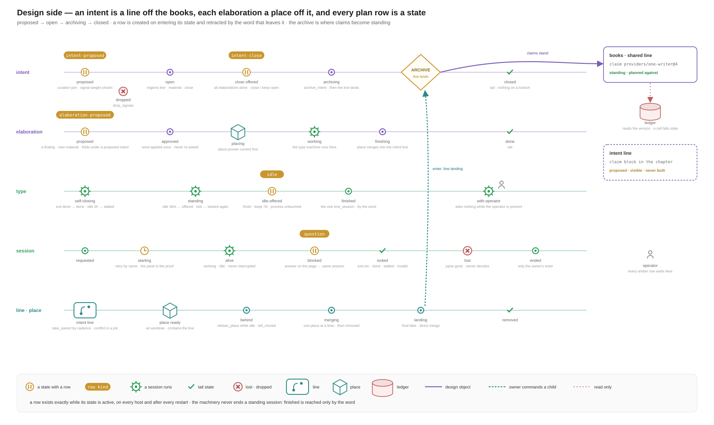
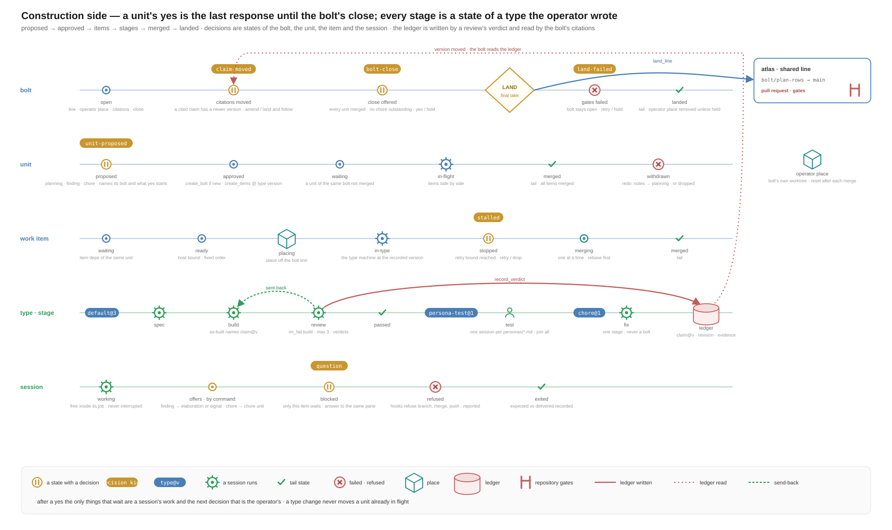
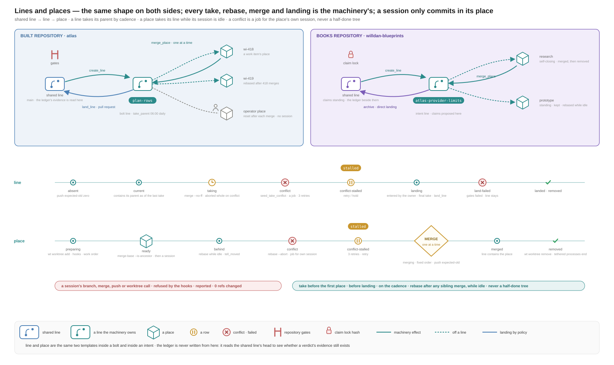
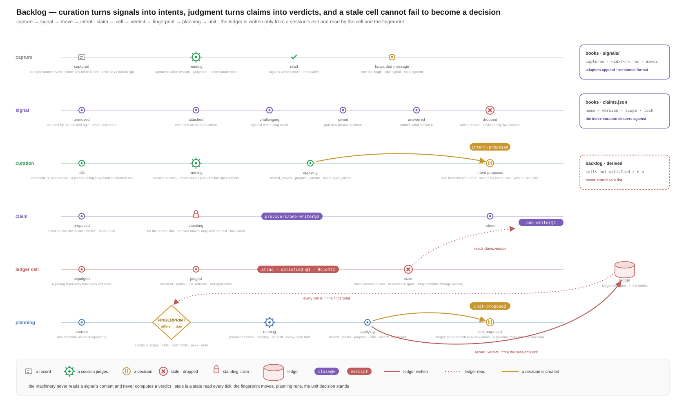
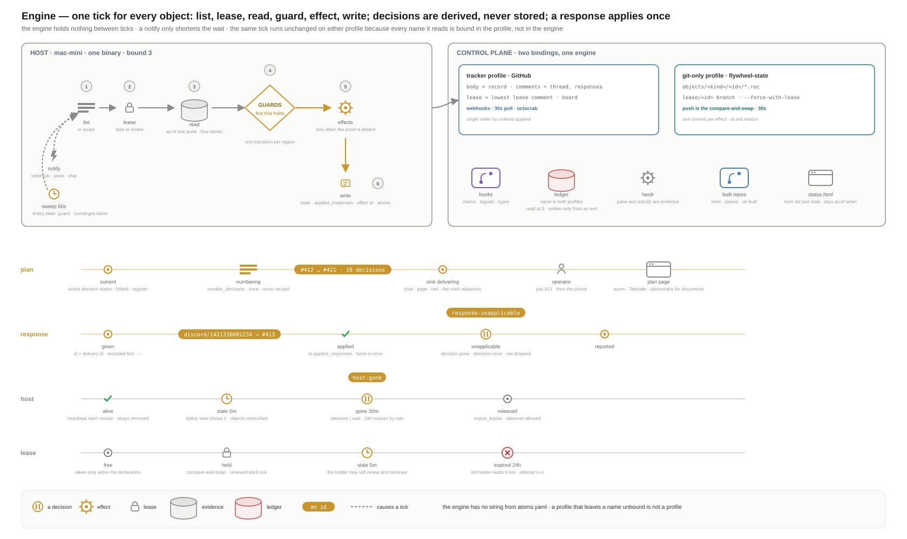

# Flywheel next — the statechart model

Every object with a lifecycle is a hierarchical state machine defined as
data. The engine is a reconciler: on every tick it lists objects, reads
evidence, evaluates guards, and performs effects whose proof is absent.
Plan decisions are states. Unit types and elaboration types are machine
definitions the operator adds. This document is the written model; the
machines themselves are in `machines/`, the profile bindings in
`profiles/`, the conformance suite in `conformance/`, the diagrams in
`diagrams/`, and what the model could not satisfy in `gaps.md`.

Requirements are cited by their number in `requirements.md` (1–190);
scenarios as S1–S34 and invariants as I1–I16.

Reading order: section 1 says what is a machine and what is not; 2 says
how the engine runs them; 3 names every store; 4 binds each profile; 5
derives the plan; 6 to 11 cover planning, lines, the ledger, signals,
sessions and hosts; 12 answers section 10 of the requirements one
heading at a time; 13 gives the crate boundary; 14 walks S1 to S34; 15
checks the invariants; 16 describes the diagrams; 17 covers the agent
kinds, the pull-request landing, operation, intents as changes with
gathered elaborations, and deliverables with their producers (A.17 to
A.21).

`machines/check.py` validates every machine against `machines/schema.json`,
every guard and effect name against `machines/atoms.yaml`, every profile
for completeness, every diagram's `data-state`, `data-decision` and
`data-effect` attributes against the machines so the pictures cannot
drift from the runtime (83), and the requirement trace: every machine,
decision kind, effect and conformance scenario carries `satisfies:
[numbers]`, and the check fails when a number names no requirement or a
requirement is cited nowhere (section 12 of the requirements):

```bash
uv run --with pyyaml --with jsonschema python3 machines/check.py
```

## 1. Objects and their machines

### 1.1 What carries a machine

An object carries a machine when it has a lifecycle the machinery must
remember between runs and share between hosts (75), or when it is a
place a plan decision can stand. Everything else is a record attribute
of some object, or a file the machinery reads as evidence.

| machine | kind | governs | parent · owns | file |
|---|---|---|---|---|
| `intent` | object | one thread of design work; its line is a region of its own | — · elaboration, unit (take-conflict chores only) | `machines/intent.yaml` |
| `elaboration` | object | one unit of design work; its type machine runs inside `working` | intent · — | `machines/elaboration.yaml` |
| `bolt` | object | one delivery to a built repository; its `line`, the operator's `place` and its `services` are regions of its own | — · unit, service | `machines/bolt.yaml` |
| `service` | object | one declared process in a bolt's place: stopped, starting, running, failed; the operator's `start` and `stop` and a session's command are one record (47, 48) | bolt · — | `machines/service.yaml` |
| `unit` | object | one approved piece of construction; chores are units of the chore type | bolt or intent · work-item | `machines/unit.yaml` |
| `work-item` | object | one task of a unit; the unit type's machine runs inside `in-type` | unit · — | `machines/work-item.yaml` |
| `operator-session` | object | the operator's own session (69): with-operator, no thread, ends by dictation | — | `machines/operator-session.yaml` |
| `claim` | object | one statement in the book; proposed or standing by where its text is | — | `machines/claim.yaml` |
| `ledger-cell` | object | one standing claim × one repository in scope; fresh or stale | — | `machines/ledger-cell.yaml` |
| `capture` | object | one source event; read into signals once | — · signal | `machines/capture.yaml` |
| `signal` | object | one raw input; exactly one standing move | capture · — | `machines/signal.yaml` |
| `curation` | object, singleton per organization | the curation run | — | `machines/curation.yaml` |
| `planning` | object, singleton per built repository | the planning run | — · proposal | `machines/planning.yaml` |
| `proposal` | object | one planning run's document: the bolts it proposes and the units in each; the one decision the run raises (172) | planning · — | `machines/proposal.yaml` |
| `session` | template | one agent process in one place | instantiated by a type, a stage, curation, planning, capture, the operator session | `machines/session.yaml` |
| `stage` | template | one stage of a unit type: its session set and join rule | instantiated by a unit type | `machines/stage.yaml` |
| `line` | template | a branch the machinery owns | instantiated by bolt and intent | `machines/line.yaml` |
| `place` | template | a worktree off a line; removed, held or kept under its owner's command | instantiated by work-item, elaboration, bolt, operator-session, curation, planning, capture | `machines/place.yaml` |
| `self-closing`, `standing`, `with-operator` | template | elaboration types | instantiated by `elaboration.working` and `operator-session.open` | `machines/elaboration-types/` |
| `chore`, `fast`, `default`, `persona-test` | template | unit types; their states are the stages | instantiated by `work-item.in-type` | `machines/unit-types/` |
| `host`, `lease`, `response`, `plan`, `sink` | engine | a host, an object's ownership, one operator response, the plan's decision register, one delivery sink | — | `machines/engine/` |

### 1.2 What is an attribute, not a machine

- **verdict** — the record of a `ledger-cell` (`verdict`, `claim_version`,
  `revision`, `evidence`, `judged_at`). It has no life of its own; the
  cell's `freshness` region says whether it is reused or stale.
- **move** — the record of a `signal` (`target`, `reason`, `at`). The
  signal's `move` region is the move's state.
- **finding, chore offer** — documents a session writes in the change
  directory it works, at the moment it judges them, archived with the
  change (62). The session announces each with `flywheel offer`, which
  appends one entry to the session's thread through the control plane;
  `record_offers` turns that entry into one record that points at the
  document: a chore into a `unit` of the chore type in `proposed`, a
  finding on the session's own thread into an `elaboration` (design
  side) or a `fast` unit (construction side) in `proposed`, anything
  else into a `signal`. The record never holds the text.
- **as-built statement** — a file in the built repository naming
  `claim@version`; evidence for `cell.evidence_present`, never state.
- **scope, name, dependencies, type version, retry counts, blocks,
  approval, endpoints, held_at, citation choices** — record fields of the
  object they belong to; counters bump on transitions and never define a
  state.
- **ask** — the operator's dictation naming a repository ("do this in
  atlas"). A record in the state store (`asks/<id>`) with `repository`,
  `text`, `by`, `at`, `consumed_by`. It has no machine: planning's
  fingerprint includes every unconsumed ask, so it is planning's input,
  and `propose_units` sets `consumed_by`.
- **decision** — a state of its object (section 5), never a record of
  its own. What is recorded about it is one line in the plan's
  register: its id, its number, and when it was numbered.
- **delivery mark** — the `delivered_at` field of a `sink` record: the
  one recorded piece of state behind the tail (14).
- **work order, instruction, skill, schema** — versioned files in the
  books repository (section 10), rendered into a place by
  `prepare_place`. Handed in, never read back.

### 1.3 How the machines relate

Three relations, and only three:

1. **Nesting** — a state runs a submachine: `elaboration.working`
   runs the type named by the record (`machine: $type`),
   `work-item.in-type` runs `$unit.type@$unit.type_version`, a stage
   runs one `session` per agent, `bolt` and `intent` run a `line` and
   `bolt` the operator's `place` as top-level regions, and every worker
   state runs a `place`. A submachine, once instantiated, lives in the
   object's record for the life of the object; leaving the state that
   instantiated it does not end it. The parent sees a submachine only
   through `{final: <name>}` guards (`<region>.<name>` when the state
   has more than one submachine, as `bolt.landing` has `line` and
   `place`) and commands it only through `enter: {child: state}` — the
   one way an owner moves a child: `place: merging`, `place: removing`,
   `line: landing`, `line: removing`, `session: ended`. `enter` reaches a
   submachine at any depth (an item's `session: ended` reaches the
   session inside its stage).
2. **Orthogonal regions** — independent concerns of one object run side
   by side: `intent` has `life` and `line`; `bolt` has `life`, `line`,
   `place` and `services`; `work-item` and `elaboration` have `life` and
   `place`; `intent.open` has `material` and `close`; `bolt.open` has
   `citations` and `close`; `session.alive` has `activity` and
   `presence`; `plan` has `register` and `status`. One transition per
   region per tick. A region reads a sibling through `{region: {name,
   in}}`, and the name may be a dotted path into a submachine run beside
   it (`place.place.life`), never a path into another object.
3. **Ownership** — `parent`/`owns`. Owned objects are listed through
   their parent; a parent's guard may read its children's states
   (`children: {kind: unit, none: [proposed, ...]}`) and a child may
   read its parent's (`parent: {in: [open, dropped]}`). Nothing else
   crosses objects. A finding on another thread crosses as a signal,
   through curation, never as a guard.

Types are templates with parameters, so an operator-added type is a
file that names existing atoms and existing templates (`stage`,
`session`). `persona-test.yaml` is the S26 type: it changes no code.

## 2. The engine

### 2.1 The tick

A tick is one pass over one scope of objects. It is the only thing the
engine does, and it is the same for every object kind and every profile.

```
tick(scope):
  for each object in list(scope), in creation order:
    if no transition of its active configuration could fire on any
       evidence, skip                          # cheap: static analysis of the machine
    if this host's declaration does not cover the object, skip (149)
    take or renew the lease; on losing it, skip
    ev  = read(object)                          # as of one named point
    cfg = ev.state                              # the active configuration
    for each active region, innermost first:
      t = first transition of the region's active state whose guard holds
      if t: fire(t)                             # at most one per region
    release the lease if the object is quiescent on this host
```

`fire(t)`: run the source state's `exit` effects, the transition's
`effects`, then the target's `entry` effects, each **only when its
proof evidence is absent**; then write one atomic record: new state,
`entered_at`, bumped counters, any `enter:` commands to child regions,
and the id of the response the guard consumed appended to
`applied_responses`. The write carries the effect ids, the transition's
`note`, and the evidence values the guard read (79). A guard that holds
but whose target equals the source and whose effects are all proven is
not written: reading twice with nothing changed writes nothing (78).

Ticks are caused by: a **notify** for one object (a webhook, a
multiplexer event, a chat message, a session's `flywheel exit`), which
ticks that object and its parent chain; and a **sweep** every 60 seconds
over every scope the host has a lease or a candidate on, which is what
makes every `older:` guard fire and what makes a never-notified host
converge (130).

### 2.2 Guards

The guard algebra is the whole of the engine's vocabulary
(`schema.json`, `$defs/guard`): `all`, `any`, `not`; `ev` with `is`,
`in`, `exists`, `gt/gte/lt/lte`, `older`, and `eq_ev/ne_ev/...` against
another evidence value; `response`; `final`; `children`; `parent`;
`region`; `always`. Every `ev` name is an atom the profile binds. The
engine never interprets a value; it compares.

`{response: X}` holds when an op-response record exists that concerns
this object, whose answer matches `X` (a bare word, or `word <arg>` /
`word: <text>` binding `$response`), and whose id is not in the object's
`applied_responses`. A response concerns the object in one of two ways:
as an **answer**, it names a decision number that the plan's register
resolves to this object's active decision state; as a **dictation**, it
names the object outright (12). A dictation may name only a transition
that undoes or defers work — `drop`, `hold`, `release`, `send back`,
`retire`, `takeover`, `finish`, `close`, `end` — never one that asserts
work was done (4); a dictation with any other answer is `unapplicable` and reported. The one pair outside that list is `start`
and `stop` on a service, which 47 gives the operator outright; a
session's `flywheel service start|stop` writes the same op-response
record, so the service machine sees one `{response: start}` whoever
asked (48). Firing appends the id in the same write as the state
change, so the response is applied exactly once whatever is delivered
twice or restarted in between (137).

`{final: X}` holds when the state's submachine has a region in a
`final: true` state named `X`; `{final: line.removed}` names the
`line` region's submachine when a state has more than one.
`{children: {kind, all|any|none|count_gte}}` reads the listed children's
`state`. `{region: {name, in}}` reads a sibling region of the same
object; `name` may be a dotted path `<region>.<state>.<region>` into a
submachine run in a sibling region (`place.place.life` is the `life`
region of the place machine in the `place` region's `place` state), and
never crosses objects.

### 2.3 Effects and proofs

Every effect in `atoms.yaml` names its **proof**: the evidence that
shows it was done (`start_session` is proven by `session.pane`;
`merge_place` by `place.merged`; `create_items` by `unit.items_exist`;
`remove_place` by `place.absent`). The engine performs an effect only
when its proof is absent, and the control plane's `write_effect` carries
an effect id (`<object>/<transition>/<proof evidence>/<evidence hash>`),
so a repeat is recognised and not counted (127). This is what makes
every action safe to repeat (73) and what makes S6 hold: a slow
`start_session` leaves `starting` until the pane is present, the retry
is by the same deterministic session name, and the multiplexer refuses
a second pane by that name.

### 2.4 Decisions and the tail

A state with a `decision:` is a plan decision while it is active, and
nothing else is (9). A state with a `tail:` is reported once in a
sink's tail when entered after that sink's delivery mark. Section 5
derives the plan from this.

### 2.5 The engine/domain line

The engine knows: machine files, the guard algebra, `$param`
substitution, submachine instantiation, region semantics, proofs and
effect ids, leases, the tick, decision derivation, the register and
numbering, the scenario runner. It contains no string from `atoms.yaml`
and no name from section 3 of the requirements (86); `machines/check.py`
will grep the engine crate for both once it exists, and the crate's
tests run the engine over a toy machine (`lamp: off → on`) that shares
no atom with the flywheel.

The domain is `atoms.yaml` plus every file under `machines/` except
`engine/` (87). The five engine machines (`host`, `lease`, `response`,
`plan`, `sink`) are shipped with the engine because they name no domain
object; they are still data, so their windows (5m stale, 30m gone, 24h
expiry, 30 days of register retention) are the operator's to change.

A new need goes to the domain side when it names something in the
world: a file, a pane, a branch, a claim, a verdict, a type of session.
It goes to the engine, as a change to `schema.json` and to this
document, only when it is a new way of **combining** evidence (a new
comparison, a new quantifier over children). No such change has been
needed to walk S1 to S34.

## 3. Stores

### 3.1 The minimal set

| store | holds | real system | profile |
|---|---|---|---|
| **state store** | every object's record: state per region, `entered_at`, `seq`, record fields, `applied_responses`; the thread on the object (questions, answers, notes, exits, offers, refusals, moves); op-responses; leases; host heartbeats; the plan's register; the sinks' marks; asks; the run record | tracker profile: GitHub issues, milestones and a Projects v2 board in the organization's `flywheel-state` repository. git-only profile: the `flywheel-state` git repository, branch `main` | differs |
| **books repository** | chapters with fenced claim blocks; the system context map; OpenSpec change directories (one per intent) and their archive; the manifest `flywheel.yaml`; instructions, schemas and skills; captures, signals and moves; the ledger; unit and elaboration type definitions | git repository, mdBook, OpenSpec, recutils files parsed by the binary | same in every profile |
| **built repositories** | the shared line, bolt lines, places; as-built statements; OpenSpec change directories for units, holding the finding and chore documents; persona definitions; the service declarations `.flywheel/services.yaml` (47), read at the head of the bolt's place and changed only by a chore (48) | git repositories with their own merge gates | same |
| **the multiplexer** | pane existence, activity and the last keystroke per session | herdr, read through `herdr agent status` | same; evidence only, never durable state |

Nothing else. A host's memory holds only what it read this tick. The
place's disk is not a store (67): what a session leaves there is its
work, and the work order handed into it is an input. A session reports
its exit, its offers and its notes with the `flywheel` command, which
writes an entry on the session's thread through the control plane;
nothing on disk is read back as state. Evidence a host observes about
the world each tick — a pane's state, a head, a gate's result, a
worktree's presence — is not state and is re-observed after a restart
(I14).

### 3.2 One source of truth per state

| state of | proven by | projections (never read as truth) |
|---|---|---|
| intent, elaboration, bolt, unit, work-item, operator-session, curation, planning | the object's record in the state store | board column, labels, milestone open/closed, the decision issue (tracker), the status page, the chat delivery |
| session `requested/starting/alive/exited/lost/ended` | the record in the state store for the durable part; `session.pane`, `session.activity` and the last keystroke from the multiplexer for `alive`'s regions | the status page's "running" column |
| session exit, offers, refusals | the entries the session's command wrote on its thread, then the session record after `record_exit`, `record_offers`, `record_refusals` | — |
| line `absent/current/taking/conflict/landing/landed/removing/removed` | git: the ref and `merge-base --is-ancestor` between heads; `landing` by the pull request's checks | the record's `head` field |
| place `absent/preparing/ready/behind/conflict/merging/merged/removing/held/removed` | git and `wt worktree list` on the host that owns it, plus the record for the retry counters, the endpoints and the hold | the record's `head` |
| service `stopped/starting/running/failed/gone` | the service's record for the intended state (moved only by a response); `wt tether status` and the readiness check for whether the process is present and serves | the page's service line beside the bolt, with its endpoint and controls |
| claim `proposed/standing` | which line of the books repository holds the fenced block | the ledger's `claim_version` copy |
| ledger-cell | the ledger record in the books repository | the backlog (derived, never stored) |
| capture, signal, move | the recutils files in the books repository | the status view's unmoved counts |
| host, lease | the heartbeat and lease records in the state store | the status view's "alive/stale" |
| response | the op-response record in the state store | the ✅ reaction on the chat message |
| plan decisions | derived every tick from every object's active states | the chat message, the page, the decision issue |
| decision numbers | the plan's register in the state store | the number shown on every surface |
| the tail | derived from the objects' `entered_at` after a sink's mark | the chat message, the page |

### 3.3 Drift

A projection that disagrees with its source is rewritten from the
source on the next tick of the object, and the rewrite is reported to
the run record with both values (77). The engine never reads a
projection; the profile binding lists what it reads, and every entry
is a source. The one deliberate two-store state is a line or a place,
where git is the truth and the record holds counters, endpoints and the
hold; if the record says `merging` and git says the place head is
already contained by the line, git wins: the guard `place.merged` fires
and the record follows.

### 3.4 What one record looks like

Every object record has the same envelope; the profile decides where
it lives (section 4). Shown in recutils, the git-only form; the tracker
form is the same block in the issue body.

```
%rec: object
id: unit/atlas/status-writer
kind: unit
parent: bolt/atlas/plan-rows
state: life=proposed
entered_at: 2026-09-04T07:12:04Z
seq: 3
applied_responses:
type: default
type_version: 3
document: openspec/changes/status-writer/proposal.md
target: bolt/atlas/plan-rows
depends_on:
claims: providers/one-writer@3
batch:
approval:
```

A lease and a heartbeat:

```
%rec: lease
object: work-item/atlas/status-writer/2
holder: mac-mini
taken_at: 2026-09-04T09:01:10Z
renewed_at: 2026-09-04T09:14:10Z

%rec: host
id: mac-mini
bound: 3
declares: kinds=all repositories=atlas,switchboard unit_types=default,fast,chore presents=page
last_seen: 2026-09-04T09:14:10Z
```

A response, the plan's register, and a sink:

```
%rec: op-response
id: discord/1421330001234
kind: answer
decision: 413
object: unit/atlas/status-writer
answer: yes
args:
given_by: chuck
given_at: 2026-09-04T07:41:12Z
delivery: discord message 1421330001234 in #flywheel

%rec: object
id: plan/willdan
kind: plan
state: register=current status=current
next_number: 422
register: 412 intent/atlas-provider-limits/intent-proposed/2026-09-04T06:10:00Z since=2026-09-04T06:10:04Z
register: 413 unit/atlas/status-writer/unit-proposed/2026-09-04T07:12:04Z since=2026-09-04T07:12:09Z
register: 414 unit/atlas/retry-jitter/unit-proposed/2026-09-04T07:12:04Z since=2026-09-04T07:12:09Z
register: 415 unit/atlas/chores-plan-rows/unit-proposed/2026-09-04T07:12:04Z since=2026-09-04T07:12:09Z
register: 416 bolt/switchboard/plan-rows/bolt-close/2026-09-03T18:40:11Z since=2026-09-03T18:40:15Z
register: 417 unit/new-repo/baseline-1/unit-proposed/2026-09-04T07:30:00Z since=2026-09-04T07:30:02Z
register: 418 intent/loop-granularity/intent-close/2026-09-03T22:01:40Z since=2026-09-03T22:01:44Z
register: 419 elaboration/atlas-provider-limits/prototype/idle/2026-09-04T06:31:00Z since=2026-09-04T06:31:03Z
register: 420 bolt/atlas/plan-rows/claim-moved/2026-09-04T07:33:12Z since=2026-09-04T07:33:15Z
register: 421 session/wi-418/build/1/question/2026-09-04T07:38:50Z since=2026-09-04T07:38:52Z

%rec: object
id: sink/chat
kind: sink
state: delivery=idle
sink_kind: chat
surface: #flywheel
routes: approve decide answer attention
cadence: 0 7,12,17 * * *
pinned_to: dispatcher
delivered_at: 2026-09-04T07:40:00Z
delivery: discord message 1421329990000
```

The thread on an object (the tracker's comment thread, or
`thread.rec` beside the record in git); the first two entries were
written by the session's own command:

```
%rec: thread
object: work-item/atlas/wi-418
at: 2026-09-04T10:02:00Z
kind: exit
by: session wi-418/build/1
exit: blocked
question: should Ready imply Backlog cleared?

%rec: thread
object: work-item/atlas/wi-418
at: 2026-09-04T10:02:00Z
kind: offer
by: session wi-418/build/1
offer: chore
document: openspec/changes/status-writer/chores/agents-md.md
about: AGENTS.md cites a removed section
scope: bolt-line

%rec: thread
object: work-item/atlas/wi-418
at: 2026-09-04T11:40:00Z
kind: answer
by: chuck
response: page/8f1c
text: yes; Ready is a superset
```

A ledger cell (`ledger/<repository>.rec` in the books repository):

```
%rec: cell
claim: providers/one-writer
repository: atlas
verdict: satisfied
claim_version: 3
revision: 9c1e4f2
evidence: src/providers/writer.rs#L12-L80
evidence: openspec/specs/providers/spec.md#one-writer
judged_at: 2026-09-01T16:20:00Z
judged_by: work-item/atlas/wi-402/review/1
```

A capture, a signal and its move (`signals/captures/<key>.rec`,
`signals/<capture key>/<n>.rec`, `signals/moves/<signal id>.rec`):

```
%rec: capture
key: meeting/2026-09-02/willdan-weekly
source: meeting
event_at: 2026-09-02T15:00:00Z
captured_by: chuck
raw: file:///Volumes/captures/2026-09-02-willdan-weekly.vtt

%rec: signal
id: meeting/2026-09-02/willdan-weekly/7
kind: ask
asserted_by: Dana
subject: providers, retries
assertion: retries hammer the provider when it is already degraded
excerpt: "...every retry goes straight back, no jitter, and the provider rate-limits us harder..."
position: 00:41:12
argues_with: providers/one-writer

%rec: move
signal: meeting/2026-09-02/willdan-weekly/7
target: challenge providers/one-writer@3
reason: the claim assumes one writer never retries; this says it does
at: 2026-09-03T06:10:00Z
by: curation/2026-09-03T06:00
```

A fenced claim block, in the chapter that explains it
(`src/providers/one-writer.md` of the books):

````
```claim
name: providers/one-writer
version: 3
scope: capability:provider-client
lock: sha256:4b2d…e1
scenario: two hosts each hold a client; only the lease holder writes; the other reads its refusal
scenario: a write from a host whose lease expired is rejected by the provider adapter
```
One process writes to a provider at a time. The lease is …
````

The manifest (`flywheel.yaml` at the root of the books repository):

```yaml
format: flywheel-manifest/1
organization: willdan
profile: tracker             # or git-only
books: willdan/blueprints
state: willdan/flywheel-state
repositories:
  - name: atlas
    repo: willdan/atlas
    kind: service
    capabilities: [provider-client]
    landing: pull-request
    take_cadence: "0 6 * * *"
    personas: "personas/*.md"
  - name: switchboard
    repo: willdan/switchboard
    kind: service
    landing: direct
    take_cadence: "0 6 * * *"
hosts:                       # what each host takes (149); a host takes leases only within this
  - {name: mac-mini, bound: 3, kinds: [all], repositories: [atlas, switchboard], unit_types: [default, fast, chore, persona-test], presents: [page, bell]}
  - {name: studio, bound: 2, kinds: [all], repositories: [atlas], unit_types: [default, fast, chore], presents: []}
  - {name: dispatcher, bound: 0, kinds: [], presents: [chat]}    # runs outside every host; presents only
sinks:                       # where decisions and the tail go (82); one presenter each (148)
  chat: {discord: {guild: 118..., channel: flywheel}, routes: [approve, decide, answer, attention], cadence: "0 7,12,17 * * *", presenter: dispatcher}
  page: {url: https://flywheel.tail1234.ts.net/plan, routes: [approve, decide, answer, attention]}
  bell: {surface: "herdr:operator-desk", routes: [answer, attention, land-failed]}
curation: {threshold: 12, cadence: "0 6 * * 1-5"}
```

## 4. The control plane binding

The binding is data in `profiles/`. Eight files: six are partial and
shared, two are the profiles.

| file | binds | same in every profile? |
|---|---|---|
| `profiles/host.yaml` | the world the machinery acts on: git, worktrunk `wt` (worktrees and tethered processes), portless, OpenSpec, claim blocks, the manifest's declarations, the repositories' service declarations | yes |
| `profiles/sessions.yaml` | the session binding: herdr panes, Claude Code, and the `flywheel exit\|offer\|note\|refuse` command sessions report through (67) | yes |
| `profiles/sessions-stand-in.yaml` | the same names bound to a scripted player, swapped in by `flywheel scenario run` (93); never loaded by a host | test only |
| `profiles/books.yaml` | the books repository as a store: ledger, captures, signals, moves, curation and planning inputs | yes |
| `profiles/record-derived.yaml` | every evidence and effect that is a function of the object record and its thread, stated over six record operations (`get`, `put`, `append`, `list`, `responses`, `leases`) | yes |
| `profiles/surfaces.yaml` | the sinks (chat, page, bell) and the review surfaces (plannotator for documents, lavish for rich pages) | yes |
| `profiles/tracker.yaml` | the six operations, the eight contract operations of B.1 and the five guarantees of B.2 on GitHub issues, milestones and a Projects board; the decision issues | tracker |
| `profiles/git-only.yaml` | the same on the `flywheel-state` git repository, with the layout of section 3.4 | git-only |

`check.py` refuses a profile marked `complete: true` that leaves any
atom unbound, and a binding that names an atom no machine has (140).
The machines do not change between the two (139); the diff between
`tracker.yaml` and `git-only.yaml` is the whole difference between
running on a tracker and running on git, and it is now only the record
operations and the contract: everything about sessions, surfaces and
the world is shared.

### 4.1 The tracker profile, in short

- **Object** = an issue in `<org>/flywheel-state`, body = one fenced
  record block, for every object with a plan-facing lifecycle (157).
  Milestone per bolt and per intent. Board columns are projections.
- **Decision** = one issue per numbered decision, labelled
  `kind:decision`, titled `#<number> <kind> <object>`, opened by the
  presenter when the register gains the entry and closed when it drops
  it. A projection of the object's state (158); answering on it is the
  response (159).
- **Lease** = lease by ordered append: a `lease:` comment; the lowest
  comment id after the last `release:` holds; renewal edits the
  comment; a loser deletes its own and reads again. A host attempts a
  lease only within its declaration (149). Expiry 24h, or the host
  decision answered `takeover`.
- **Response** = an `op-response:` comment on the object's issue, id =
  the Discord message id, page submission id, plannotator annotation
  id, or the timeline event id of a direct action (close, move on the
  board, tick a checklist item on the decision issue). Written before
  anything follows; the bot reacts ✅ when the comment exists.
- **Notify** = GitHub App webhooks over a Tailscale Funnel, else a
  30-second `since=` poll. Bound 30s.
- **Status** = the Projects board, written from the bodies; plus
  `status.html` committed and served.
- **Real tools**: `octocrab` (GitHub App token per organization),
  `serenity` (Discord), `axum` (pages), Tailscale, plannotator, lavish.

### 4.2 The git-only profile, in short

- **Layout**: one repository `<org>/flywheel-state`, branch `main` the
  shared line; `objects/<kind>/<id>/object.rec` and `thread.rec`;
  `responses/`, `asks/`, `runs/`, `status.html`. The plan's register
  and the sinks' marks are the `plan` and `sink` objects' records. No
  plan page is committed (15). Leases and heartbeats are single-commit
  branches `lease/<id>` and `host/<id>`, replaced with
  `--force-with-lease`, so months of renewals add nothing to `main`'s
  history.
- **Write** = one commit per effect, message = effect id, reason,
  evidence; push with expected-old; rejection → fetch, rebase, retry
  (no content conflict while the lease holds), three rejections →
  report and re-read. A session's `flywheel exit|offer|note|refuse`
  appends to its own thread by the same path.
- **Lease** = the push is the compare-and-swap on the lease branch.
  Loser fetches and reads again (I15). A sink's presenter lease is
  `lease/sink/<name>`; a sink the manifest pins is taken only by the
  pinned presenter.
- **Response** = the presenter that received it commits
  `responses/<delivery id>.rec`; ✅ when the push lands. The operator's
  own commit to an object file is the response `commit/<sha>` (S19).
- **Notify** = push webhook over a Funnel, else `git ls-remote` every
  30s; a fetch names the changed object files, so a host re-reads only
  those.
- **Status** = `status.html` committed on `main`, served by any host,
  readable as a file of the branch when none runs, stating its as-of
  commit (S20).
- **Disconnected**: keep ticking owned objects (up to the 24h expiry),
  commit locally, take no lease, start nothing new, deliver to no sink;
  on reconnect push renewals first (a rejection = lost, end own panes,
  discard), then rebase and push.

### 4.3 The status view

Served by the page sink's presenter at `/status` (axum, Tailscale) and
written as `status.html` by `render_status`. Derived from `list` and
`get` alone: every intent, elaboration, bolt, unit, work-item,
operator-session and session grouped by the decision-free leaf of its
state (queued: `waiting`, `ready`, `approved`; in progress: `in-flight`,
`working`, `alive`; waiting on the operator: any state with a
`decision:`; done: any `tail:` state), with the lease holder, the host
running the session, and that host's `alive/stale/gone`. Per object,
its thread in order and its state history (each `put` is a commit or a
body edit with a date). Per repository, what landed in a period
(`bolt.landed` entries). Per bolt, its units by state, what waits, and
the endpoints its place serves (46). Per host, its running sessions,
its bound and its declaration. Unmoved signals by source with age. The
page says the as-of point of the read it was built from (145). It is
never written by hand.

## 5. The plan

### 5.1 Derivation

The plan is a pure function of the active states of every listed
object, plus the register that numbers them:

```
decisions(objects, register) =
  for each object, for each active state with a `decision:`:
    one decision { id = object/kind/entered_at, kind, group, object, answers, shows, document }
  fold decisions whose `batch` field is equal into one (chores of a
    bolt; a baseline)
  drop decisions whose fold guard says they are shown with their parent
    (an elaboration proposed under a proposed intent)
  attach each decision's number from the register; a decision with no
    entry is unnumbered, and the plan machine numbers it this tick
  order: group (approve, decide, answer, attention), then number
```

A decision cannot be missed because it is not a record anyone writes:
if the state is active the decision exists, on every host, on every
tick, after every restart (7, I7). A decision cannot linger because
leaving the state retracts it (I3). Every decision kind has exactly one
creating state; the table below is generated by `check.py` from the
machines.

### 5.2 Numbers

Every decision carries a short number, unique in the organization,
given once and never reused (15). The `plan` machine (one per
organization) holds the register: `next_number`, which only grows, and
one entry per numbered decision (`decision id → number, since`). On a
tick where a standing decision has no entry, `number_decisions` writes
the entries and the bumped counter in one atomic write of the plan
record; the plan's lease makes it single-writer. A decision's id
includes the `entered_at` of its state, so a decision state that is
left and re-entered (a bolt's close offered, withdrawn by new work, and
offered again; a deferred unit re-proposed after a week) is a new
decision with a new number: the operator's earlier reply cannot land on
a question that has changed. Entries are pruned thirty days after
their decision is retracted, so a late reply still resolves and is
reported as unapplicable; the counter never goes back. The page and
the chat both read the register, so they show the same number (18).

### 5.3 Decision catalogue

| kind | group | created by entering | retracted by leaving on | answers |
|---|---|---|---|---|
| `intent-proposed` | approve | `intent.proposed` (curation's join, or a session's finding that fits no intent) | yes → open; drop; split | yes · drop · split |
| `elaboration-proposed` | approve | `elaboration.proposed` (a finding on the thread; new material on an open intent; curation's gathering over several intents; dictation never) — folded into the intent's decision while the intent is proposed; its document is reviewed on the review surface; shows every intent it covers (188) | yes → approved; drop; `type <name>`, `pick <intents>` and `<intent>: drop` keep it | yes · drop · type · pick · `<intent>: drop` |
| `proposal` | approve | `proposal.proposed`: planning's one document per run, the bolts it proposes and the units in each (172); reviewed on the review surface and an annotation there is the response (17) | yes → approved, and every unit in `in-proposal` follows; redo → withdrawn; later → deferred; planning's next run → superseded, silently (35); a per-unit answer (`<unit>: bolt`, `new bolt`, `rename`, `type`, `drop`) is forwarded to the unit and keeps it | yes · redo: · later · `<unit>: bolt` · `<unit>: new bolt` · `<unit>: rename` · `<unit>: type` · `<unit>: drop` |
| `unit-proposed` | approve | `unit.proposed` (a finding routed to a bolt, a chore offer); chores fold by bolt; its document is reviewed on the review surface and an annotation there is the response (17) | yes → approved (creates the bolt if new, then the items); drop; redo → withdrawn; later → deferred; a moved claim → superseded, silently (35); bolt/new bolt/rename/type/pick keep it | yes · drop · redo: · bolt · new bolt · rename · type · pick · later |
| `unit-claim-moved` | decide | `unit.claim-moved`: an approved, unstarted unit whose cited claim moved (35) | redo → withdrawn; keep → approved with the version pinned | redo · keep |
| `bolt-close` | approve | `bolt.open[close].offered` when every unit is merged, no chore outstanding, no hold since the last merge | yes → landing; hold → held; new work → not-offered | yes · hold |
| `intent-close` | decide | `intent.open[close].offered` when every elaboration is done | close → archiving; keep open → declined; new work → not-offered | close · keep open |
| `idle` | decide | `standing.idle-offered` (idle 30m, or kept 7d ago); never for with-operator (25) | finish → ended; keep → session; activity → session | finish · keep |
| `claim-moved` | decide | `bolt.open[citations].moved` when a started unit's cited claim moved (103) | amend bolt / land and follow → current | amend bolt · land and follow |
| `land-failed` | decide | `bolt.land-failed`, `intent.archive-failed` | retry → landing; hold → open | retry · hold |
| `stalled` | decide | `work-item.stopped` (retry bound), `self-closing.stalled`, `line.conflict-stalled`, `place.conflict-stalled` | retry; drop / hold | retry · drop / hold |
| `question` | answer | `session.alive[activity].blocked` | the text → working, delivered to the same or a fresh session | `<text>` on the page or in chat |
| `host-gone` | attention | `host.gone` (no heartbeat 30m) | takeover → released; the host returns → alive | takeover · wait |
| `uncovered` | attention | `lease.uncovered`: no host's declaration covers the object (149) | a declaration covers it → free; ok → acknowledged | ok |
| `response-unapplicable` | attention | `response.unapplicable` (the decision was gone, or a dictation asserted work done) | reported once → reported | ok |

The mockup's ten decisions are, in order: `intent-proposed`,
`unit-proposed` ×3 (the third folded chores), `bolt-close`,
`unit-proposed` (baseline batch), `intent-close`, `idle`, `claim-moved`,
`question`; its attention lines are `host-gone`, `uncovered` and
`response-unapplicable`.

### 5.4 What a decision shows

`shows:` names the evidence rendered under the decision: signal weight
(count, sources, span by event date) on an intent; type, target bolt,
dependencies and cited claims on a unit; idle time on a session. "What
a yes starts" on a unit decision is derived from the type file at its
version: the stage names in order, times the item count (`spec →
build ×2 → review → merge`). A decision with a `document:` (a unit or
elaboration proposal) carries a link that opens the document on the
review surface — plannotator for a document, lavish for a rich page —
and the operator's annotations there come back as the response on it
(17, 129).

### 5.5 Sinks, delivery and the tail

A `sink` machine exists per sink the manifest names: the chat, the
page, a bell on a named multiplexer surface. Each carries the decision
kinds routed to it (82), a cadence, and its **delivery mark**. It is
`due` when a decision routed to it was numbered after its mark, when
its cadence fired, or when the operator asked (`plan` in chat, a
reload). `deliver_plan` delivers the numbered decisions routed to the
sink and the tail since its mark, then advances the mark in the same
write. The chat carries one line per decision with its number and a
link to the page (18); the page shows the same numbers with the answers
as controls; the bell rings the named surface with the numbers. No
rendering is stored: the mark per sink is the only state (15), and the
tail — every object that entered a `tail:` state after the mark, from
the objects' own `entered_at` — is derived like the decisions (14,
S31). A construction host is silent because it is no sink; nothing the
machinery notices is visible only on the host that noticed it (82).

Exactly one presenter delivers to each sink: the holder of the sink's
lease, or the host the manifest pins (`presenter:`). A dispatcher
running outside every host — a process whose declaration takes no
object kinds and presents the chat — may be that presenter (148).

### 5.6 Responses

A response is an op-response record: an answer names a decision number
(`yes 413`, a button, a page choice, a plannotator annotation) and the
register resolves it to the object and the decision state; a dictation
names an object. The response is stored before anything follows (153);
the ✅ reaction, or the page's acknowledgement, is the operator's proof
(154). The reply grammar of the mockup is the union of the `answers`
lists. `yes all` is expanded by the presenter into one response per
approve decision it delivered, each with its own id (`<message
id>/<number>`). A response that arrives after its decision is gone is
handed back as `unapplicable` and shown once under attention, never
dropped (6, 129).

### 5.7 Dictation

Dictation skips the plan (12): "add this idea" writes an intent in
`open` (with its first elaboration in `approved`) and the dictation id
as the approval that can be pointed to (I1); "do this in bolt X" writes
a unit in `approved` on that bolt with the dictation as its `approval`;
"do this chore" writes a chore unit in `approved`; "revive signal N"
clears the move; an ask that names a repository without a bolt is an
`asks/` record for planning; "session: <text>" opens the operator's own
session (69). The operator may also invoke by dictation any transition
that undoes or defers work on any object — `drop <object>`, `hold
place <object>` and `release place <object>`, `send back <item>`,
`retire <item|planning|curation|capture>`, `takeover <host>` (on a
stale host, before the 30-minute bound), `finish <elaboration>` (a
standing session, without waiting for the idle decision), `end
<session>`, `close` — and, on a bolt's declared service, `start
<bolt>/<service>` and `stop <bolt>/<service>` (47, section 7.7) — and
the machinery performs it with its effects
and records it: the same transition the decision would have taken,
with the same `enter:` commands to sessions and places; a dictation that would assert work was done (`done`,
`pass`, `yes` on nothing) is unapplicable and reported (4). The bot's
grammar is `idea: <text>`, `unit <bolt>: <text>`, `chore: <text>`, `ask
<repo>: <text>`, `revive <signal>`, `session: <text>`, `explore
<intents...>` (an elaboration in `approved` covering the named intents,
its parent the first named, typed `with-operator` or, with `standing`
after the list, standing; 189), `start|stop <bolt>/<service>`, and the
undo verbs above.

## 6. Planning

Planning is one machine per built repository (`machines/planning.yaml`,
`singleton: repository`). It is due when the repository's backlog
fingerprint differs from the one last planned against, or a unit came
back with notes. The fingerprint is a hash over: every standing claim
in scope with its version; every ledger cell of the repository; every
open bolt of the repository with its units' cited claim versions and
citation choices; every unconsumed ask naming the repository; pending
redo notes. So a claim becoming standing, a verdict recorded or fallen
stale, an ask, a redo, a moved claim or a claim-moved choice each move
the fingerprint and make planning due, and nothing else does (S11:
forty commits with no claim change move nothing).

The run: a place off the repository's shared line, one `planner`
session with a work order that lists the backlog (derived from the
ledger: every cell in scope not `satisfied` or `not-applicable`), the
as-built statements, and **every open bolt of the repository with its
units and their states**. The session delivers, through `flywheel exit
done`: verdicts (including `not-applicable`, each with the evidence it
was judged from), and one **proposal**: a document showing the bolts it
proposes, new or open, and the units in each, every unit with a type,
dependencies, cited claims, and its target bolt (172). `applying`
writes the verdicts to the ledger, the units in `in-proposal`, the
proposal in `proposed`, and the fingerprint, then returns to `current`.
The proposal is the one decision the run raises (`machines/proposal.yaml`);
a unit in `in-proposal` raises none and reads the proposal's state
through `unit.proposal`. On the proposal's yes every unit it names goes
to `approved`, creating its bolt when the target is still new — several
units naming the same new bolt make one — and its items. A per-unit
answer on the proposal (`<unit>: bolt <name>`, `new bolt`, `rename`,
`type`, `drop`) is forwarded to the unit as a response of its own
(`forward_answer`), so the unit's guards apply it exactly as they would
a finding's or a chore's, which are still proposed on their own as
`unit-proposed` (58, 60).

On a repository's first planning (`planning.ledger_empty`) every cell
in scope is judged once and the proposal is the baseline: one decision
by construction (S10). Chores may be among its units (64). A stale
cell is planned against once per fingerprint: a proposal already
standing for the same cell is cited by the session (the work order
lists open units) and not proposed again.

Planning's next run supersedes the standing proposal, and the units it
named with it, with no response and no tail entry: a proposal is not
work (35, 172). A unit proposed on its own whose cited claim moved goes
to `superseded` the same way.

The operator's answer on the proposal can rename a proposed bolt, route
a unit to another open bolt, or give it a new bolt; `create_bolt` runs
only on yes, and only when the target is still `new` (29, S27). No
order among bolts is stored: a bolt record has no predecessor field
and no guard reads another bolt (30).

## 7. Lines and places

### 7.1 Shape

`line` and `place` are templates run inside the objects that own them,
so both sides have the same shape (49):

| owner | line off | places off the line |
|---|---|---|
| bolt | the built repository's shared line | one per work item; the operator's own place, kept and refreshed |
| intent | the books' shared line | one per elaboration; the place of the intent's own change directory |

Curation, planning, capture reading and the operator's own session run
a place directly off a shared line, with no line of their own: they
commit nothing to a line. Their deliverables are records written by the
machinery.

### 7.2 Keeping a line current

`line.take_due` holds: before the first place is made off the line
(the line's `current` state is entered by `create_line`, and `place`
guards on `line.contains_parent`); when the line is `landing`; when the
manifest's `take_cadence` cron for the repository has fired since
`last_take` (default `0 6 * * *`, S33); and when a dictation `take
<line>` stands. The take is `git merge --no-ff <parent>` in the owner's
own place, pushed with expected-old. A take that conflicts is aborted
whole; `seed_take_conflict` creates a **chore unit in `approved` on the
line** — parent the bolt or the intent, scope `bolt-line` or
`intent-line`, `approval` the cadence that fired the take or the
response that ordered it (52, I1) — and prepares its item's place off
the line with the conflicted take applied; its `chore-fixer` session
resolves it and the chore merges like any other; `line.conflict_job_done`
retries the take, three times, then `conflict-stalled` is a decision.

### 7.3 Keeping a place current

A place is proven current before its session starts: `place.ready`
requires `place.contains_line` (`git merge-base --is-ancestor <line
head> <place head>`), and `session.requested` is entered only from
`place.ready` (I16). After any sibling merges into the line the place
is `behind`; it is rebased only when `session.activity` is not
`working` and no one has typed in the pane within the presence window
(the guard's first transition holds `behind` otherwise); `tell_moved`
appends a `moved` entry to the session's thread and sends one message
before the session continues (S32). A rebase that conflicts is aborted
whole, seeded as a job on the thread and in the place, and the place's
own session resolves it; the rebase retries on its `done` exit; three
retries then a decision.

A work item's and an elaboration's place is a region beside `life`
(`work-item.place`, `elaboration.place`), entered when `life` reaches
`placing` and read back through `{region: {name: place.place.life, in:
[ready]}}`. It is not nested inside `placing`: a region nested in a
state ends when the state is left, and the owner must command the place
(`place: merging`, `place: removing`) from `merging`, `stopped` and the
dictation transitions long after `placing` is gone. The bolt's operator
place is a region for the same reason.

### 7.4 Merging and landing

`merge_place` runs one place at a time in the fixed order (unit
approval time, then item ordinal), via `place.merge_slot`. A place
whose line moved under it while it waited goes back to `behind` first.
An item's merge is a squash to one commit that names the item, unless
the manifest's `item_merge` for the repository says `merge`; a take is
always a merge commit; nothing on an open line is ever rewritten (179).
After the merge the bolt's operator place is reset to the new head
(44). Landing: `bolt.open → landing` on the operator's yes enters the
line's `landing`, which takes the parent once more and then branches
on `line.policy` (175). Direct: `land_line`, one merge commit into the
shared line pushed with expected-old. Pull-request: `open_request`
opens the request from the line and the line waits in `request-open`,
the bolt staying in `landing`, until `line.request` is `merged` or
`closed`; the repository's own merge setting lands it and the machinery
sets none (179). A failed gate or a closed request is `land-failed`, a
decision, and nothing is asked of any session until the response (40,
S33). A landed line goes to `removing` and is removed; the bolt's
`landed` transition enters the operator's place in `removing` as well.

### 7.5 Endpoints

A process started in a place, by a session or by the operator, belongs
to the place: `wt tether` ends it when the place is removed, and its
ports are hashed from the worktree by portless so two places on one
host never collide (45). The place machine's `ready` state records the
endpoints portless serves for the place into the owner record
(`record_endpoints`), and the page shows them beside the bolt as links
(46); publishing beyond the private network is never the machinery's.

### 7.6 Removal, holds and strays

A place is removed by the machinery when the work it served is merged,
dropped or retired (55): `merged → removing` inside the place machine;
an owner's `enter: {place: removing}` when its work is dropped or
retired, or when the bolt lands or is dropped. `removing` runs
`remove_place` (`wt worktree remove`; tethered processes end with it)
until `place.absent`, and every removal is an effect with its own id,
reason and evidence. The operator may hold a place by dictation (`hold
place <owner>`); `removing` goes to `held` while `place.held` and back
when released. A place on a host that belongs to no live object — a
worktree left by a crash between the state write and the removal — is
found by the host machine's reconciliation (`host.stray_places`, from
`wt worktree list` against the listed objects) and removed by
`remove_stray_places`, one recorded effect per worktree, never while
the owner is held.

### 7.7 Services

A built repository declares its services — a dev server, a worker,
anything that listens — as data in `.flywheel/services.yaml`: a name,
the command that starts it in a place, what it serves, and an optional
readiness command (47; the file is named and shown in
`profiles/host.yaml`). The bolt's `services` region reads the file at
the head of the operator's place the first time that place is `ready`
and runs `declare_services`: one `service` object per record, owned by
the bolt, in `stopped`; the region re-runs the effect whenever the
place's head gains a record, which is how a chore that adds a service
reaches the page (48). A session cannot declare a service: the file
changes only through a chore merged into the bolt's line.

A service's record is its intended state and the tethered process is
evidence. `stopped` means nothing under that name runs in the place: a
process found by the tether name is stopped, never adopted. `start`
enters `starting` and runs `start_service` — `wt tether` in the bolt's
place, bound to the worktree, with the port portless derives from the
place (45) — until the process is present; it is `running` once it
also serves, and `running` records the endpoint portless routes into
the service record so the page shows it beside the bolt as a link, with
its state and its start and stop controls (46). A process that exits,
or one that never serves within five minutes, is `failed`: a decision
under attention whose answers are `start` and `stop`. `stop` from any
live state runs `stop_service` and returns to `stopped`.

`start` and `stop` are the operator's dictations on a service — the one
pair 4's undo-or-defer rule does not cover, granted by 47. A session
starts or stops a service only through `flywheel service start|stop
<name>` in its place; the command resolves the place's line to its bolt
and writes an op-response naming `service/<bolt>/<name>` with the
session as `by`, the very record the dictation produces, so the
machine has one `{response: start}` guard and the record's `moved_by`
says who asked (48). The bolt's services are the bolt's place's: a
session that wants a server in its own place starts one under the
place's rule (45) and it is its own — tethered to that place, never
shown, gone with it. When the bolt's place is removed the tether ends
every service's process with the worktree (55) and each service goes
to `gone` on `service.place_present` false; a held place keeps its
services as they were.

### 7.8 What a session may not do

`prepare_place` installs `pre-push`, `reference-transaction` and
`pre-merge-commit` hooks that refuse and run `flywheel refuse`, and
Claude Code settings that deny `git branch|merge|push|worktree` and
`wt`. A refusal is a thread entry read as `session.refusals_pending`,
copied to the run record and reported to attention (S15). The session
commits in its place; the machinery does everything else (I12).

## 8. Claims, the ledger and as-built

### 8.1 Claims are fenced blocks with a hash lock

A claim is a fenced ```` ```claim ```` block inside the chapter that
explains it (`src/**/*.md` of the books), carrying `name`, `version`,
`scope`, `scenario` lines and `lock: sha256:<hash of the block text
without the lock line>`. The books' pre-commit hook `flywheel claims
check` refuses a commit where a block's text changed and its version
did not, or where the lock does not match, so "version moves only when
its text moves" is enforced where the text lives (97). The mdBook
preprocessor `mdbook-flywheel-claims` renders the block as a callout
with its name, version and scope, and writes `claims.json` beside the
book: the index curation clusters against (108) and planning reads.

The claim's state is where its block is: on an intent's line only,
`proposed`; on the books' shared line, `standing`; gone from the
shared line, `retired`. The `claim` machine writes nothing.

OpenSpec keeps the intent's change directory (`openspec/changes/<intent
id>/`: proposal, design, tasks, findings, chores) and its archive; the
archive of the change is the commit before the intent's line lands, and
the landing is what makes the claims standing (49, S34). OpenSpec
requirement blocks are not the claims: they would put the claim in a
spec file and its explanation in a chapter, two sources.

### 8.2 The ledger

The ledger is `ledger/<repository>.rec` in the books repository, one
record per cell, in every profile (section 3.4, 157). It lives with the
claims because a verdict names a claim version, which is the books'
history, and because a claim in scope for two repositories has one
cell per repository side by side (105). A `ledger-cell` object
exists for every (standing claim, repository in scope) pair; `list`
derives the pairs from `claims.json` and the manifest, so a cell needs
no record until it is judged (a joining repository has every cell
`unjudged` with no file, 104).

A verdict is written only by `record_verdict`, from a session's exit:
the planning session (every cell in scope on a first planning, stale
cells afterwards), a review or test stage whose deliverables include
`verdicts-for-named-claims` (the default type's review, the chore
type's fix), never by the machinery's own judgment (100). The record
holds the claim version, the repository revision, the evidence paths,
the date and the session (`judged_by`).

### 8.3 Stale, and the decision that cannot be missed

`judged → stale` when `cell.verdict_claim_version ≠ cell.claim_version`
or the cited evidence is gone from the repository's shared head (101).
Forty commits that leave the evidence in place change nothing (S11,
I10). A stale cell is in the backlog, the backlog is in planning's
fingerprint, planning becomes due, its session proposes, and
`unit.proposed` is a decision. Three transitions, each a state read on
every tick, none a message that can be lost.

A moved claim reaches the operator in three ways, by how far the citing
unit got (35, 103): a proposed unit is `superseded` silently and
planning's next proposal replaces it; an approved unit that has not
started enters `unit.claim-moved`, the `unit-claim-moved` decision
(`redo` withdraws it to planning, `keep` records a citation choice
pinning the version); a started unit is the bolt's affair:
`bolt.open[citations].moved`, the `claim-moved` decision (S9). Its
answer is recorded as a citation choice on the bolt; `amend` marks the
citing units `needs_amend`, which is in the fingerprint, so planning
proposes the amendment on the same bolt; `land and follow` leaves the
bolt on its version and the cell stale, so planning follows after the
landing. The machinery never rewrites construction (103).

### 8.4 As-built

As-built statements are files in the built repository
(`openspec/specs/**/spec.md` blocks carrying `serves: <claim>@<v>`),
written by build sessions under the default instruction (120).
`cell.evidence_present` reads them. A statement naming no standing
claim fails the repository's own `flywheel asbuilt check` gate (I9).

## 9. Signals and curation

Adapters write captures and signals as recutils files in the books
repository under `signals/` (section 3.4): `flywheel capture meeting
<file>`, `flywheel capture discord <channel> <day>`, a folder watcher
on `~/captures`, and the Discord bot's `capture:` command for a
forwarded message. The capture key is the source event's identity
(`meeting/<date>/<name>`, `discord/<channel>/<day>`, `message/<id>`),
so a second import of the same transcript is the same file and writes
nothing (S22). The raw material stays outside git; the capture cites
it (111). Enumerating and writing captures is arithmetic and runs
unattended; reading a capture into signals is a `capture-reader`
session's judgment (`capture.reading`), except a forwarded single
message, whose one signal `ensure_signal` writes with no judgment
(S21, 115).

Curation is one machine per organization. It runs a `curator` session
when the unmoved count crosses the manifest's threshold or the cadence
fires; the work order lists the unmoved signals, `claims.json`, and
the open intents. The session delivers one move per signal (attach,
challenge, join, answered, drop, each with a reason) and one proposed
intent per join cluster, with its proposed elaborations and typed by
the material. Where one run proposes elaborations of one type on
several intents it may deliver them gathered, and `applying` writes
one proposed elaboration on the first intent named, its `covers`
naming all of them (`gather_elaborations`, 188); the other covered
intents read it through `intent.covered_by`. `applying` writes the
moves and the intents; the intents are decisions. A signal with a move is never re-judged; only the
operator's `revive <signal>` clears it (S24). Dropping a proposed intent
gives each cited signal a `drop <intent>` move (S23). A person writing
the same files by hand is curation too: the machine then finds nothing
unmoved. Weight is by event date from the signal records; the status
view counts unmoved signals by source and age (118).

The flywheel never batches signals: the threshold and cadence are the
manifest's, the batching is the session's job, and the machinery's
only reads of a signal are the count and the move.

## 10. Sessions, instructions and the work order

### 10.1 The session machine

`session` is a template run by every type, stage, curation, planning,
capture reading and the operator's own session. Its life is `requested
→ starting → alive → exited | lost | ended`. `starting` retries
`start_session` by the same deterministic name (`<owner id>/<stage or
type>/<attempt>`) until the pane is present; herdr refuses a second
pane by that name, so a slow start is slow and never doubled (S6).
`alive` has two regions: `activity` (`working`, `idle`, `blocked`,
`exited`) read from `herdr agent status` and the exit entry the
session's command wrote; `presence` (`unknown`, `gone`) read from the
pane. The machinery never sends anything to a session in `working`
(I5): the only writes toward a session are `deliver_answer` from
`blocked`, `tell_moved` from a place in `behind` whose session is idle,
and `end_session` from `ended`, which only the operator's response, a
type's rule or the retirement of the work reaches (I6, 74). A pane the
operator kills by hand is `lost`, never a response (4).

### 10.2 Free reasoning and the fixed exits

Inside `alive.working` the agent is free. What reaches the machinery
is what the session reports through the command the machinery provides
(67): `flywheel exit done|blocked|stalled` with deliverables, a
question or a note; `flywheel offer finding|chore|signal <document>
--about <object>`; `flywheel note <text>`; and `flywheel refuse`, run by
the hooks. Each appends one entry to the session's thread through the
control plane and does nothing else; the machinery decides what the
entry means (66). The exit entry is validated against the schema in
force; one that fails it is `invalid` and read as `stalled` with the
raw text recorded, so the set of exits the machinery can see is closed
by construction (65). A session is told, in its work order, that its
deliverables are files in its place, its documents live in the change
directory, and its reports go through the command; it is given no tool
that moves state. Offers are recorded the moment they appear and never
interrupt the session (58, 71).

### 10.3 Blocked

`blocked` is a `question` decision on the item, answerable on the page
or in chat; the operator need never open the pane (68). Only that
session stops; the item's siblings, the unit, the bolt and every other
object continue (S30). The answer is written to the item's thread, then
delivered to the same session if its pane is present, else a fresh
attempt starts with the answer at the top of its work order. `blocks`
bumps on the session record; the status view sums it by type and stage
(70).

### 10.4 Elaboration types and presence

`self-closing` finishes on `done` and stalls after two idle hours.
`standing` ignores `done`, restarts a lost process in the kept place,
and offers `idle` after thirty minutes (or seven days after a `keep`);
only the operator's `finish` ends it (26, S2). `with-operator` raises no
decision at all: the machinery never asks about it, restarts it if
lost, and ends it only on the dictation `end` (25). Present means a
human keystroke in the pane within the window the session binding
states — thirty minutes — and the machinery infers nothing more from
it: presence only holds a rebase off (7.3) and shows on the status
view.

### 10.5 The operator's own session

`session: <text>` by dictation creates an `operator-session`: a place
off the books' (or a named repository's) shared line with the
machinery's read tools and dictation in its work order, running the
`with-operator` type with the `operator-console` agent. It has no
intent, no thread and no decision; it ends on `end <session>`, its
place going with it unless held (69).

### 10.6 Instructions as data

Everything a session is given lives in the books repository and is
versioned by it: `flywheel/schemas/<artifact>.md`,
`flywheel/instructions/<artifact>.md`, `flywheel/skills/<session
type>/SKILL.md`, `flywheel/types/units/<type>.yaml` and
`flywheel/types/elaborations/<type>.yaml` (the machine files of
`machines/unit-types/` and `machines/elaboration-types/` are what the
operator's files look like; the engine loads them from the books at
the version the object recorded), and the manifest. `prepare_place`
renders `.flywheel/work-order.md` from the closed inputs: the schema
instruction, the type skill, the work order proper (job, deliverables,
exit contract), the producer skill, schema and review surface in force
for each deliverable the type names (`profiles/deliverables.yaml`, its
version in the header; 190), and the artifacts of the change (the unit
document or the intent's change directory, the cited chapters, the
open bolts for planning). Nothing else is written into the place, and the place's
Claude Code settings deny reads outside it (89). Every input is named
with its version (the books commit) in the work order's header.
`flywheel render-order <scenario>` renders the exact prompt with no
session (90, 124). Changing any of these is a chore on the books
repository; hosts read the books' shared line, so a change reaches
every host at its next fetch, and a session started before it carries
the older commit in its header (91, 123).

The default instructions ship in the books repository template:
`instructions/design-conclusion.md` (write the chapter and the claim in
one commit; update the context map), `instructions/construction.md`
(name the claim the work serves in every as-built statement). The
context map is `src/context-map.md` plus `context-map.json`, versioned
with the book; the review view is `flywheel review` served at
`/review`: the chapters and map nodes changed since the operator's
last `reviewed` mark (a response on the plan object), with the previous
version beside each (S25, 122).

## 11. Hosts and leases

A host is one static binary (`flywheel host`) with a name, a bound and
a **declaration** from the manifest: the object kinds, repositories and
unit types it takes, and the sinks it presents (149). It heartbeats
every minute. The `host` machine reads the heartbeat: `alive`, `stale`
at 5 minutes, `gone` at 30 minutes (the `host-gone` attention
decision), `released` when the operator answers `takeover` or 24 hours
pass. While `alive` it reconciles its own disk: a stray place is
removed and recorded (7.6). The `lease` machine on each object reads
the holder and renewal: `held`, `stale` at 5 minutes (shown on the
status view; the holder may still renew and continue, S13), `expired`
at 24 hours or on the host's release, `free` when released, and
`uncovered` — an attention decision — when no host's declaration covers
the object, so nothing waits silently (149).

Which host acts on an object: the one holding its lease. A host takes
a lease only on an object its declaration covers, with a transition
that could fire and no holder, or an expired holder, by the profile's
compare-and-swap. It renews on every tick it acts and releases when the
object is quiescent (no transition could fire on any evidence and no
session of it runs here). Sessions run on the host holding their
owner's lease, within that host's bound; `item.slot_free` orders ready
items by ordinal across the host (S29). Nothing runs twice: the session
name is deterministic and the multiplexer refuses a duplicate; a
takeover starts attempt `n+1`, and the old host, on return, reads that
its lease was replaced, ends its own pane for that object, and reports
(S13). The takeover rule names the operator's response for work that
has a session behind it: a lease behind a live pane expires by the
`takeover` answer or the 24-hour bound, never by racing (150).

Sinks are objects like any other: their lease is the presenter's, and a
manifest pin restricts who may take it. A dispatcher is a host whose
declaration takes no object kind and presents the chat; it runs the
sink ticks and nothing else, outside every construction host (148).

A restart of the machinery reads everything again and reaches the same
configuration; a running session is evidence (`session.pane` present),
not memory, so it is still `alive` after the restart (S5, I7).

## 12. Answers to section 10

### 12.1 Which objects carry a machine, and how do the machines relate?

Twelve object kinds carry a machine (section 1.1): intent, elaboration,
bolt, unit, work-item, operator-session, claim, ledger-cell, capture,
signal, curation and planning; five engine objects (host, lease,
response, plan, sink); and seven templates (session, stage, line, place,
and the type families). Verdicts, moves, offers, as-built statements,
asks, decision numbers, delivery marks and instructions are attributes
or files (1.2). The machines relate by nesting (a state runs a
submachine, which lives on in the record and is commanded by `enter`),
orthogonal regions, and ownership (`parent`/`owns`, with `children` and
`parent` guards). Nothing else crosses objects (1.3).

### 12.2 Where does event-driven behavior meet reconciliation?

Nowhere inside the engine: the engine only reconciles. A session's life
is event-driven in the world (herdr starts, idles, exits; the session
runs `flywheel exit`), and the `session` machine reads that life as
evidence on every tick (`session.pane`, `session.activity`,
`session.exit`). Events drive reconciliation only by causing ticks
sooner: a herdr pane hook, a webhook, a Discord message, the exit
command each notify one object. A host that never receives an event
converges by the 60-second sweep (130). So the answer to "how does one
drive the other" is: events shorten the wait; evidence decides.

### 12.3 Where does an agent's free reasoning sit?

Inside `session.alive[activity].working`, in a place with a closed set
of inputs and no tool that moves state. Its exits are kept to the fixed
set by reading only the schema-validated entries its command wrote on
its thread; an invalid entry is `stalled` with the raw text; a refused
git operation is a logged refusal; anything else the agent does is
invisible to the machinery (10.2). The owner decides what an exit
means (`self-closing` finishes on done; `standing` and `with-operator`
ignore done; a stage judges by its join rule).

### 12.4 How is the plan derived, and what makes a decision impossible to miss?

Decisions are states with a `decision:` attribute; the plan is the fold
of every listed object's active decision states, numbered from the
register (5.1). A decision exists on every host on every tick while
the state is active and vanishes when it is left, so there is no
decision record to forget, duplicate or lose; a restart re-derives the
same decisions (I7). The register records only numbers, so a reply can
be attributed; the sinks record only marks, so the tail can be derived;
no rendering is stored (15).

### 12.5 What is the minimal set of stores?

Four (3.1): the state store (tracker or state repository), the books
repository, the built repositories, and the multiplexer (evidence
only). The place's disk is not a store: a session reports through the
command. Section 3.2 names one source of truth per state and lists the
projections.

### 12.6 How does curation connect without the flywheel batching signals?

Adapters write signal files at any rate; the `curation` machine reads
two numbers (unmoved count, cadence) and runs one session whose job is
the batching; the session's exit delivers moves and proposed intents;
the machinery writes them (section 9). The flywheel never reads a
signal's content; a person writing the same files is curation too.

### 12.7 Where does the ledger live, who writes a verdict, and how does a stale verdict become a decision?

`ledger/<repository>.rec` in the books repository in every profile
(8.2). A verdict is written by `record_verdict` from a planning, review
or test session's exit, never computed. Stale is a state of the cell
read every tick from the claim's version and the evidence's presence;
it moves planning's fingerprint; planning proposes; `unit.proposed` is
a decision (8.3). A moved citation is `superseded` on a proposal,
`unit-claim-moved` on an unstarted unit, and `claim-moved` on the bolt
once work started.

### 12.8 Which profile is built first, and what test proves a second conforms?

The git-only profile first: its control plane is `gix` plus the `git`
binary, which the host binding already needs for lines and places, so
the first build has one external service (the git host) and the
conformance suite runs against a local bare repository with no network.
The tracker profile follows as a second implementation of the same
`ControlPlane` trait. The proof of conformance is `conformance/`: one
set of scenario files run by `flywheel scenario run --profile <name>`
with the session binding replaced by `sessions-stand-in.yaml` (93) —
against the stand-in control plane, then against each real profile in
a sandbox (a temporary bare repository; a throwaway GitHub repository),
with the machine files byte-identical (`check.py` hashes them into the
run record). A profile is admitted when every scenario passes and
`check.py` finds its binding complete (`contract/binding.yaml`).

### 12.9 Where is the line between an engine primitive and a domain atom?

Section 2.5. Engine: the guard algebra, region and submachine semantics,
proofs and effect ids, leases, ticks, decision derivation, the register,
the scenario runner. Domain: every `ev` and `do` name. A need that names
anything in the world is an atom; a need for a new way of combining
evidence is an engine change to `schema.json`. The engine crate has no
string from `atoms.yaml`, checked by grep.

### 12.10 Where does planning sit?

A machine per built repository, singleton (section 6). It is told the
backlog changed by its fingerprint over standing claims, ledger cells,
open bolts and their citations and choices, asks and redo notes; it sees
the open bolts because the fingerprint and the work order both list
them.

### 12.11 What is the cadence rule for a take, and what proves a place is current?

`line.take_due` = before the first place off the line, before landing,
the manifest's `take_cadence` cron per repository, and a dictated take
(7.2). A place is current when `git merge-base --is-ancestor <line
head> <place head>` holds; `place.ready` requires it, and a session is
requested only from `place.ready` (7.3, I16).

### 12.12 Are claims OpenSpec requirement blocks or fenced claim blocks?

Fenced claim blocks with a hash lock, in the chapter that explains them,
checked by the books' pre-commit hook and rendered by an mdBook
preprocessor (8.1). OpenSpec keeps the intent's change directory and
its archive, and holds the finding and chore documents.

### 12.13 What is the layout of state in git, and what does a race look like?

One state repository per organization, one shared branch `main`, one
directory per object with `object.rec` and `thread.rec`, one commit per
state change; leases and heartbeats as single-commit branches replaced
with `--force-with-lease` (4.2). A race: two hosts commit on `main` from
the same base and push; the git host rejects the second as stale; the
loser fetches, rebases its one-file commit, and pushes again. Content
never conflicts while leases hold; a lease race is two pushes to
`lease/<id>` with expected-old zero, of which one is rejected, and the
loser reads the winner (S17, I15).

### 12.14 How does the phone reply become a commit, and how is the status page served without a central process?

The presenter of the sink the reply came through — the dispatcher for
the chat, the page sink's lease holder for the page — commits
`responses/<delivery id>.rec` and pushes; the ✅ reaction follows the
push (4.2). The status page is `status.html`, rebuilt by
`render_status` whenever state moved and committed; any host serves it
and, with none running, it is read as a file of the branch and says its
as-of commit (S20).

### 12.15 How is history kept from growing without bound?

Leases and heartbeats never touch `main` (single-commit branches,
unreachable old commits collected by the git host). The register is
pruned thirty days after a decision is retracted; the counter alone
grows. Verdicts are rewritten only when a claim's version moves. `main`
grows by one small commit per state change, on the order of a few
hundred a day, which git carries for years; history is the audit record
and is never rewritten (167). In the tracker profile the lease comment
is edited, not re-posted, and a decision issue is closed, not deleted.

### 12.16 What replaces the tracker's comment thread in git-only?

`objects/<kind>/<id>/thread.rec`, append-only, holding questions,
answers, notes, exits, offers, refusals, moved entries and responses.
A session leaves a note with `flywheel note`, which appends to its
thread through the same commit path; the status view shows the thread
under the object (144).

## 13. The Rust crate boundary

The boundary falls out of the model's three kinds of thing: the engine
(schema and tick), the atoms (names a profile binds), and the profiles
(bindings to real systems).

| crate | holds | depends on |
|---|---|---|
| `flywheel-engine` | the machine loader (`schema.json` as `serde` types), the guard evaluator, regions and submachines, the tick planner (`plan_tick(defs, snapshot) -> Vec<Transition>` — pure, no IO), decision derivation and the register, proofs and effect ids, the five engine machines | `serde`, `serde_yaml`, nothing else; no string from `atoms.yaml` |
| `flywheel-atoms` | the `Evidence` and `Effect` name registries generated from `atoms.yaml` at build time; the `ControlPlane` trait (`list`, `read`, `write_effect`, `lease`, `present`, `receive`, `notify`, `status`); the `World` trait (one method per host effect); the `Sessions` trait (one method per session effect, one per session evidence); the scenario file types | `flywheel-engine` |
| `flywheel-domain` | the machine files embedded with `include_dir`, the type catalogue loader (from the books), the work order renderer, the claim block parser and lock, the recutils reader and writer, the fingerprint | `flywheel-atoms` |
| `flywheel-world-host` | `World` over worktrunk (`wt`), portless, `git` and `gix`, OpenSpec; `profiles/host.yaml` is its specification | `flywheel-atoms` |
| `flywheel-sessions` | `Sessions` over herdr (`herdr agent`) and Claude Code, plus the `flywheel exit\|offer\|note\|refuse` subcommands that write through `ControlPlane::append`; `profiles/sessions.yaml` | `flywheel-atoms` |
| `flywheel-cp-git` | `ControlPlane` over the state repository (`gix`, `git push --force-with-lease`); `profiles/git-only.yaml` | `flywheel-atoms` |
| `flywheel-cp-tracker` | `ControlPlane` over GitHub (`octocrab`); `profiles/tracker.yaml` | `flywheel-atoms` |
| `flywheel-surface` | the sinks: the Discord bot (`serenity`), the pages (`axum`), the bell (`herdr`), the reply grammar, the review-surface launchers (plannotator, lavish); `profiles/surfaces.yaml`; profile-neutral because it writes responses through `ControlPlane::receive` | `flywheel-atoms` |
| `flywheel-scenario` | the stand-in control plane (in-memory `ControlPlane` and `World`), the scripted `Sessions` stand-in (`profiles/sessions-stand-in.yaml`), the conformance runner, the trace renderer | `flywheel-engine`, `flywheel-atoms`, `flywheel-domain` |
| `flywheel` | the binary: `host`, `dispatch`, `scenario`, `capture`, `claims check`, `render-order`, `review`, `exit`, `offer`, `note`, `refuse` | all |

Nothing in a machine file, a scenario or a profile binding names Rust:
the same files would drive any engine that implements `schema.json`.
The one static binary per host is `flywheel` with both control planes
compiled in and chosen by the manifest's `profile`; `flywheel dispatch`
is the same binary run with a declaration that presents and takes
nothing.

## 14. The scenarios, walked

Each walk names the states entered, the effects performed (by atom
name) and the decisions created (+) and retracted (−). Every walk is
also a scenario file in `conformance/scenarios/`; the added scenarios
X1–X8 and T1 there walk the requirements the numbered scenarios do not
reach (the operator's session, the three claim-moved paths, a take
conflict, presenters, uncovered objects, strays and holds, notification
routing, dictated undoing, the tracker's direct action).

**S1 — approve an elaboration from the phone.** `elaboration.proposed`
(+`elaboration-proposed`, numbered #n by the plan). Discord reply `yes
n` → response `discord/<id>` resolved through the register to
`elaboration/<id>/elaboration-proposed`; `{response: yes}` fires
`proposed → approved`, `applied_responses += id` (−decision). Next tick
`approved → placing` (`parent in open`), `place: absent → preparing`
(`prepare_place`) `→ ready`; `placing → working`;
`self-closing.session: requested → starting` (`start_session`) `→
alive`. A second delivery of the same reply has the same id and is in
`applied_responses`; no guard matches; nothing re-asks (I2). A restart
re-derives `working` from the record and the pane.

**S2 — a standing prototype goes idle.** `elaboration.working` runs
`standing`; `session.alive[activity]: working → idle`; after 30m
`standing.session → idle-offered` (+`idle`). No effect touched the pane:
the prototype keeps running under `wt tether`. Next morning the
decision stands with the same number; the operator opens the place and
the process is there (I6). `keep` → `session` with `kept_at`; `finish`
→ `finished` (`enter: session: ended`, `end_session`) → `done` →
`elaboration.writing-back` (`record_per_intent`, nothing to do for one
intent) → `finishing` (`merge_place`, `removing`, `remove_place`) →
`done` (tail).

**S3 — a chore.** A build session writes
`openspec/changes/status-writer/chores/agents-md.md` in its place and
runs `flywheel offer chore <path> --about AGENTS.md --scope bolt-line`,
which appends an offer entry to its thread; `session.working`
self-transition `record_offers` → `unit` of type `chore` in `proposed`
pointing at the document, `batch` = the bolt id (+`unit-proposed`,
folded with the bolt's other chores). The record holds the path, never
the text (62). The session finishes its own job. `yes n` → `approved`
with `approval` = the response id; `create_bolt` is proven absent by
the type (I8); `create_items` makes one item; `work-item: waiting →
ready → placing` (place off the bolt's line) `→ in-type` (`chore.fix`
stage, one `chore-fixer` session) `→ merging` (`merge_place`) `→
merged` (tail). No change directory: the type records
`needs_change_directory: false`, and the work order says so.

**S4 — a finding dropped.** `flywheel offer finding <path> --about
<intent>` → `record_offers` → `elaboration.proposed` on that intent
pointing at the finding document (+`elaboration-proposed`, "finding
from wi-418"). `drop` → `dropped` (−decision, tail). No place, no
session, no line was created: no effect ran before `approved` (5).

**S5 — restart mid-day.** The engine holds nothing. On start it lists,
reads and derives: every session in `alive` is proven by
`session.pane`; every place by git; every decision by the states; every
number by the register. Nothing is unnumbered and no sink is due, so
nothing is written (78, I7).

**S6 — a slow host.** `session.requested → starting` runs
`start_session` (`herdr agent start --name <id>`); each tick in
`starting` finds `session.pane` absent and repeats the effect by the
same name; herdr refuses a duplicate name, which is not an error. At
two minutes the pane is present → `alive`. One session; no report.

**S7 — close an intent.** Last elaboration `done` → `intent.open[close]:
not-offered → offered` (+`intent-close`). `close` → `open → archiving`
(`enter: line: landing`): `archive_intent` (`openspec archive`),
`line.landing`: `take_parent`, `land_line` (direct) → `landed` →
`removing` (`remove_line`) → `removed`; `archiving → closed` (tail).
Nothing else moved: no other object has a guard on the intent's close
except its claims, which read the shared line and become `standing`.

**S8 — twenty signals.** `flywheel capture meeting` writes one capture;
`capture.captured → reading` (place, `capture-reader` session) `→ read`
(`record_offers` writes 20 signal files). `curation.idle → running`
(count ≥ threshold) `→ applying`: `record_moves` (6 attach, 9 drop, 5
join), `propose_intents` (2 intents in `proposed`, one with
`challenges: [providers/one-writer@3]`). +2 `intent-proposed`
decisions showing weight; 0 per signal. Every signal has a move file.

**S9 — a claim's boundary is wrong.** Build session offers a finding on
its intent → `elaboration.proposed` → yes → a self-closing session
amends the chapter and the claim block (version 3 → 4) → intent close →
archive lands, claim `standing` at 4. The bolt's started unit cites
`@3`: `bolt.open[citations]: current → moved` (+`claim-moved`, one
decision with two answers). `amend bolt` → `record_citation_choice
(amend)` sets `needs_amend`; planning's fingerprint moves →
`planning.due → running → applying` proposes the amendment unit on the
same bolt (+`unit-proposed`). `land and follow` → the bolt lands on
`@3`; the cell is `stale`; planning proposes the follow-up. Nothing was
rebuilt without the response.

**S10 — a repository joins.** The manifest gains the repository; `list`
derives a `ledger-cell` per standing claim in scope, all `unjudged`;
`planning.fingerprint` differs from `none` → `running`; the session
judges every cell (`record_verdict` for each, including
`not-applicable`) and delivers the unsatisfied set as units with one
`batch` → one folded `unit-proposed` decision (mockup decision 6).
Cells in `judged.not-applicable` are never in the backlog again (I10).

**S11 — forty commits, no claim changed.** `cell.evidence_present` still
true, `cell.claim_version` unchanged → every cell stays `judged`; the
fingerprint is unchanged → planning stays `current`; no decision moved;
no sink is due.

**S12 — the status view from the phone.** Tracker: the Projects board
and `status.html`; git-only: `status.html` on `main`. Both list every
bolt, unit, session by state group with the lease holder and its
`alive/stale/gone`, as of the last write.

**S13 — two hosts, one loses power.** Host A holds the lease on
`work-item/x` and runs its session. Its heartbeat stops: `host: alive →
stale` (5m) `→ gone` (30m, +`host-gone` attention, routed to the chat
and the page). `lease: held → stale`. Host B's tick skips the object
(lease not free). The status view shows the build and A as stale. A
returns within 24h: heartbeat → `alive`, its lease renews → `held`, the
session is still `alive` by the pane; the build resumes on A. Or the
operator answers `takeover` — the response the takeover rule names for
session-backed work (150) → `expire_leases` → `lease.expired` → B takes
it by compare-and-swap and starts attempt 2; A on return reads it lost,
`end_session` on its own pane, reports. Never twice: B's attempt 2 is a
different session name, and A's attempt 1 is ended before A acts again.

**S14 — two send-backs then pass.** `work-item.in-type` runs `default`:
`review` stage `sessions → sent-back` (verdict not-done, `send_backs`
0 < 3) → `build` (bump 1) → `review → sent-back` (1 < 3) → `build`
(bump 2) → `review → passed` → `default.passed` → `work-item.merging`
(`merge_place`) → `merged`; `bolt.close: not-offered → offered` → yes →
`landing → landed` (`enter: place: removing`; the operator's place is
removed). The item's record has `send_backs: 2`, the thread has both
exits, and `item.retry_max` was 3.

**S15 — a session tries to create a line.** The `pre-push` and
`reference-transaction` hooks in the place refuse and run `flywheel
refuse`; `session.refusals_pending` → `record_refusals` + `report`
(attention line). The place was prepared by `prepare_place`, the
session committed in it, `merge_place` moved its commits to the line.
No ref of the repository was changed by the session.

**S16 — a dictated scenario.** `flywheel scenario dictate "<sentence>"`
starts a self-closing session with the scenario schema that writes
`conformance/scenarios/<name>.yaml`, including the `script` the
stand-in sessions play; `flywheel scenario run` executes it against
the stand-in control plane with `sessions-stand-in.yaml` and writes
`<name>.trace.md`: the ticks, the guards read, the transitions, the
effects with ids, the decisions and numbers after each tick.

**S17 — two hosts take one unit.** Both push `lease/unit-x` with
expected-old zero; the git host accepts one. The loser's push is
rejected; it fetches, reads the holder, skips the object. One
`create_items`, one session.

**S18 — an hour offline.** The host's ticks continue on the objects it
holds; effects on the multiplexer and the place proceed; state writes
are local commits. It takes no lease, starts nothing new, delivers to
no sink. On reconnect: lease renewals pushed (accepted: still under
24h), then `main` commits rebased onto the fetched head (other hosts'
commits touched other objects) and pushed; the status page rebuilt.

**S19 — the operator edits a file by hand.** A commit on `main`
changes `objects/intent/x/object.rec` state to `closed`. Every host's
next fetch lists that file as changed and derives the response
`commit/<sha>` for the object. When the intent's active decision was
`intent-close`, the response is `close` and the machine runs its own
path (`archiving`, then `closed`). When no decision stood, the written
state is honoured as given: the engine reconciles the rest from it (an
intent written `closed` with a live line has its line's `landing` run
to completion) and reports the direct write once under attention. No
process had to be told: the fetch is the notify. A direct write that
asserts work done on an item is refused the same way a dictation is
(4).

**S20 — the page six hours after the last host stopped.** `status.html`
on `main` at the git host, headed "as of <commit> at <time>".

**S21 — a forwarded message.** Discord `capture: <forward>` → the bot
writes `signals/captures/message-<id>.rec` with `raw` = the message
link; `capture.captured` self-transition `ensure_signal` writes one
signal; the capture stays `captured` until `signals_present` → `read`.
Nothing else: curation runs only on count or cadence.

**S22 — the same transcript twice.** Same capture key → same file →
the second import writes nothing; the capture is already `read`.

**S23 — drop a proposed intent.** `intent.proposed` → `drop` →
`drop_signals` writes `drop <intent>` moves for its five signals →
`dropped`. Next curation lists unmoved signals: none of the five.

**S24 — revive a signal.** Dictation `revive <signal>` removes the move
file; `signal: dropped → unmoved`; the count moves; the next run
clusters it.

**S25 — a claim amended in one commit.** The default instruction makes
the session change the chapter, the claim block and the context map in
one commit; the pre-commit hook checks the lock and the version bump.
`flywheel review` diffs `src/` and `context-map.json` from the last
`reviewed` response to the intent's landing and serves the changed
chapter and node with the previous version beside it.

**S26 — an operator-added type.** The operator commits
`flywheel/types/units/persona-test.yaml` (the file in
`machines/unit-types/persona-test.yaml`). A new unit of that type
records `type_version: 1`; its item's `test` stage `resolving` reads
`stage.agents` by globbing `personas/*.md` in the place: three matches,
three `session` submachines by name `<item>/test/1/<persona>`; join
`all`; each exit's offers recorded; the set recorded on the item. In a
five-persona repository, five. A unit in flight under `default@3` reads
its own `type_version` and is untouched (57).

**S27 — one intent, two repositories.** The archive makes two claims
`standing`, in scope for `atlas` and `switchboard`; both planning
fingerprints move; two runs. `atlas`: two units, target `new:
atlas-retry-behaviour`; `switchboard`: one unit, target the open bolt
`plan-rows`. Responses: `rename retry` on #n → `rename_bolt` on the
proposal; `new bolt other` on #m → `route_unit`. `yes` on each — one
from chat, one as a plannotator annotation on the reviewed document
(17) → `create_bolt` where the target is new. No bolt record names
another.

**S28 — a three-week bolt.** The operator runs the system in the bolt's
place (`bolt[place]`, reset after each merge); the place's endpoints
are recorded and shown beside the bolt on the page (46). Dictation
`unit plan-rows: <bug>` → a unit in `approved` with the dictation as
its `approval` → items → sessions. Next day a finding from a session on
another bolt is recorded as a signal (another thread), curation moves
it `answered`/`attach`, or planning routes it: an ask naming the
repository → planning proposes a unit targeting `plan-rows`
(+`unit-proposed`) → yes. Both units carry `depends_on`. The bolt's
close is offered when both are merged; the operator closes it.

**S29 — three items, bound two.** Items 1 and 2 `waiting → ready →
placing` (slots free); item 3 `waiting` (`item.deps_merged` false).
Items 1 and 2 merge in ordinal order; item 3 `ready`; `item.slot_free`
(running 0 < 2) → `placing`. A restart in between finds items 1 and 2
`alive` by their panes and item 3 by its record; the deterministic
session name refuses a duplicate.

**S30 — blocked.** Build session runs `flywheel exit blocked
--question "<text>"`, which appends the exit entry to its thread
through the control plane → `session.working → blocked` (bump `blocks`,
`record_exit`, +`question` decision on the item, routed to the chat,
the page and the bell). The item's `stage` stays in `sessions`; its
siblings merge. The page answer → response → `blocked → working`,
`deliver_answer` (`herdr agent send`, the pane is present). The thread
holds the question and the answer; `blocks` on the session record is
summed by the status view. The operator never opened the pane (68).

**S31 — yes at 07:40, look at 16:00.** `yes 57` in chat: the response
names #57, the register resolves it, the unit's transition applies it;
items run through `fast`'s stages; merges land; `bolt.close` is
offered and numbered afresh. At 16:00 the chat sink is due; its mark
is 07:40; `deliver_plan` lists the items' and the unit's `merged`
entries since then, and the only counted decision is `bolt-close`. #57
is never reused; no rendering was stored.

**S32 — side by side, then a rebase.** Units A and B in flight. A's
item merges (`merge_place`); B's place is `behind`; B's session is
`working`, so the guard holds `behind`. B goes idle → `rebase_place`;
conflict → `seed_conflict_job` (the job on B's thread, `herdr agent
send`); B's session resolves it, exits done → `conflict → behind`
(retry 1) → `rebase_place` succeeds → `ready` (`tell_moved`). B's stage
continues; on pass, `merging` → `merge_place` lands.

**S33 — cadence and a closed request.** Every morning `line.take_due`
by the cron → `taking` (`take_parent`) → `current`. Close → `landing`:
`take_parent` once more, then `line.policy` is pull-request →
`open_request` → `request-open`; the request is closed unmerged →
`line.request: closed` → `line.land-failed` → `bolt.land-failed`
(+`land-failed`, `landing_failure` on the record, delivered to the bell
as well as the chat and page). No session is requested. `retry` →
`landing` again, which reuses or reopens the request; `hold` → `open`.

**S34 — two elaborations, one archive.** Research (self-closing) exits
done → `elaboration.writing-back` → `finishing` (`enter: place:
merging`) → `merge_place` into the intent's line → `removing` →
`remove_place` → `done`. The
prototype's place is `behind` → rebased while idle → `ready`, kept
(`keep: by-type`). The intent's close offered; `close` → `archiving`:
`archive_intent`, the line takes the books' shared line, lands
directly, is removed. The two claim blocks are on the shared line:
`claim.proposed → standing`.

## 15. Invariants

| invariant | held by |
|---|---|
| I1 | no effect before `approved`; `approved` is entered only by a response or a dictation, or (a take-conflict chore) by the cadence the operator set, each named in the unit's `approval` field |
| I2 | `applied_responses` written in the same atomic write as the state change; response id = delivery id |
| I3 | a decision is a state; `check.py` lists one creating state per kind; leaving it retracts |
| I4 | section 3.2, one source per state; projections rewritten from the source |
| I5 | no effect targets a session in `working`; `rebase_place` and `tell_moved` guard on idle and on no keystroke |
| I6 | `session.ended` is entered only by `enter: session: ended` from `standing.finished`, `with-operator.finished`, or the retirement of the work by the operator's dictation; a pane killed by hand is `lost`, not a response |
| I7 | the engine holds nothing between ticks; S5 |
| I8 | `create_bolt`'s proof is read false for a chore by the type; the chore type has no bolt target |
| I9 | `flywheel asbuilt check` gate in the built repository |
| I10 | `ledger-cell.judged` leaves only on version move or evidence gone |
| I11 | one lease per object by compare-and-swap, within the host's declaration; the status view shows the holder |
| I12 | hooks and settings in the place; every line and place effect, including removal, is a machinery atom |
| I13 | `check.py`: atoms are abstract; only `profiles/` name a tool |
| I14 | git-only: the host's disk holds fetched state and local commits about to be pushed; panes, heads, gates and worktree listings are re-observed each tick and after a restart; the place's disk is work, not state |
| I15 | git-only: `--force-with-lease` on lease branches; expected-old on `main` |
| I16 | `place.ready` requires `contains_line`; `session.requested` only from `ready`; `behind` holds while `working` or while the operator types |

## 16. The diagrams

One per machine family, in the house style, each validated by
`check.py` against the machines through its `data-state`,
`data-decision` and `data-effect` attributes. Amber pills are plan
decisions; a decision is created on entering the state under the pill
and retracted by the response that leaves it. Red solid edges write
the ledger; red dotted edges read it.



Intent, elaboration, the three elaboration types, the session, and the
intent's line and places. The archive diamond is where the intent's
line lands on the books' shared line and its claim blocks become
standing; the ledger reads that version and a cell falls stale. Four
decisions are on this picture: `intent-proposed`, `intent-close`,
`elaboration-proposed`, `idle`, plus `question` on the session. The
picture does not show the `material` region of an open intent, which
joins new signals and findings to the one proposed elaboration, nor
the operator's own session, which runs the with-operator type with no
thread; both are in `machines/`.



Bolt, unit, work item, the type and stage templates, and the session
as construction sees it. The review stage writes the ledger from its
verdict deliverable; the bolt's citation region reads the ledger and
the claim version and raises `claim-moved`. Six decisions are here:
`claim-moved`, `bolt-close`, `land-failed`, `unit-proposed`, `stalled`,
`question`. Not shown: the `deferred`, `superseded` and `claim-moved`
states a proposed or unstarted unit enters, the operator's place
machine inside the bolt, the endpoints it records, and the merge order
rule (unit approval time, then item ordinal), which section 7.4 states.



The two repositories with their shared line, a line each and places
off it, and the two templates beneath. The ledger is neither read nor
written by a line or a place; the shared line's head is where a
verdict's evidence is checked. Two `stalled` decisions are here, one
per template, after three conflict retries. The cadence rule and the
"first place, before landing" takes are stated in the band; the
`landing` state's pull request versus direct policy is the manifest's
per repository. Not shown: the `removing` and `held` states of a place
and the take-conflict chore, which sections 7.6 and 7.2 state.



Capture, signal, curation, claim, ledger cell and planning. The
fingerprint diamond is the one point where "the backlog changed" is
decided; every cell of the repository is in it, so a stale cell cannot
avoid a planning run and a `unit-proposed` decision. The ledger is
written only by `record_verdict` from a planning, review or test
session's exit. Two decisions: `intent-proposed` and `unit-proposed`.
Not shown: the `split` answer on an intent, the baseline fold, the
`redo` path back to planning, and the silent `superseded` replacement.



The tick as a numbered walk, the two profile bindings as cards, the
stores every profile shares, and the engine machines. The ledger is
one of the stores read at step 3 and is written only through an
effect at step 5 whose proof is a verdict record. The plan lane shows
the register numbering decisions and a sink delivering them; the
response lane shows a reply resolved by number. Two decisions:
`response-unapplicable` and `host-gone`. Not shown: the `uncovered`
decision of a lease, the 60-second sweep's interaction with leases (a
host renews only the leases of objects it ticked), and the dispatcher
as a presenter outside every host, all in sections 5.5 and 11.

## 17. Agent kinds, the pull-request landing, and operation

**A.17 — sessions charged by the machinery.** Every session is the
same template (`machines/session.yaml`) whoever charged it: a stage of
an approved unit, an elaboration type, curation, planning, capture
reading or the fix of a take conflict. The engine runs no agent; it
runs `start_session` and reads the pane, the exit entry and the place
(171). The template takes a `kind` beside the agent name — `claude`,
`codex` or `opencode`, default `claude` — and a stage's agent entry
may carry one (173); the session binding's `kinds:` map gives each
kind its start command, every kind started through the same `herdr
agent start` in a prepared place with the same rendered work order,
and the git hooks in the place are what refuse a line operation, so
nothing depends on one program's own settings. Which multiplexer
session a pane opens in is the binding's `multiplexer_sessions:`
(174): `flywheel-<org>-intents` for elaboration sessions and the
operator's own, `flywheel-<org>-bolts` for the stage sessions of
approved units, `flywheel-<org>-machinery` for what the machinery
charges, overridable per host by kind or by repository, created when
absent. Planning's run delivers one `proposal` object (section 6),
which is the one decision it raises (172).

**A.18 — landing, pull requests and merge-back.** The line's `landing`
branches on `line.policy` (7.4): direct is `land_line`, one merge
commit; pull-request is `open_request` and the `request-open` state,
where the line waits while `line.request` is open and the bolt stays
in `landing` (175). While it waits, a review that asks for a change or
a failed check is `line.request_review_pending`, and
`seed_request_finding` records it as a proposed chore unit on the bolt
pointing at the review; accepted, the chore's session works a place
off the bolt line, `merge_place` moves the line, and the request
follows the line (176). The request's links are `line.request_links`,
read by the git host binding and shown under the bolt's decisions;
the machinery creates none of them (177). Conversation on the request
reaches the flywheel only as captures an adapter writes, and so only
through curation (178). History on an open line is never rewritten:
takes are merge commits, an item's merge is a squash naming the item
unless the manifest says `item_merge: merge`, a place is rebased only
while no session works in it, and the landing's shape is the
repository's own (179). A conflicting take is the chore of 7.2, retried
after each chore merges up to three times and then the `stalled`
decision (retry, hold); merge against rebase is never the operator's
question (180).

**A.19 — operation.** Nothing in `machines/` runs after a bolt lands:
releases, environments and runs are the delivery system's. What comes
back is a signal an adapter captures (106) or a link the git host
binding reads (177); what goes out is the book, the claim blocks and
the ledger, files on the books' shared line any system can read from
git (181). An anomaly, an incident or a review raised in operation is a
signal, curation's move decides whether it joins an intent, and
planning may route it as a unit or a chore on an open bolt, which
`propose_units` does for any ask or signal it consumes (183). A data
product is a repository in the manifest like any other. Operation is
therefore a profile binding — the adapters that capture and the
evidence that reads links — and not a machine (`gaps.md`).

**A.20 — intents as changes; gathered elaborations.** An intent is an
OpenSpec change in the books (`open_intent`, `archive_intent`), and
its change directory is where its elaborations leave their records —
research notes, session records, prototype notes, an interactive page
— while what they conclude goes to the chapters and the claim blocks
(187). A bolt has no change in the books; a unit's change is in its
built repository, written at the unit's first stage; a proposal's
document sits beside the proposal record in the state store, so the
unit record's `document` points there and never into a change
directory. An elaboration record carries `covers`, the intents it is
for, its parent first. Curation may deliver elaborations of one type
proposed in the same run on several intents as one gathering, and
`gather_elaborations` writes one proposed elaboration covering them;
the `elaboration-proposed` decision shows `covers`, and `pick
<intents>` or `<intent>: drop` narrows it (`set_covers`), the intent
left out having its material pending again (188). The other covered
intents see the gathering through `intent.covered_by` (none, proposed,
active, done): while it is proposed or active, `propose_elaboration`
holds on them, so none carries another elaboration awaiting approval
meanwhile (21, 189), and the intent's close is not offered; once it is
done, the close is offered as if a child had finished. The finish is
per covered intent: `working` reaches done → `writing-back`, where
`record_per_intent` commits what the session left under each other
covered intent's change directory onto that intent's line and takes
it out of the place; then `finishing` merges the place, carrying the
parent's records and the book once, into the parent's line (188). The
operator opens one by dictation, `explore <intents...>`, which writes
an elaboration in `approved` covering the named intents as a
with-operator or standing session (189); planning proposes units, not
elaborations, so in this model gathering is curation's alone
(`gaps.md`).

**A.21 — deliverables and their producers.** A stage's and an
elaboration type's `deliverables` are entries `{name, producer,
schema, surface}`, passed through to the session template, which
records the names as `session.expected`. The shipped set lives in
`profiles/deliverables.yaml`, versioned as one thing: book chapter,
claim, context map, conceptual and logical diagrams in the house style
the schemas fix, proposal document, verdict — each with its producer
skill, its schema (88) and the surface that reviews it (17): the review
view of 122 for the book-side set, plannotator for the proposal
document, the ledger for a verdict. An entry's `default` resolves to
the manifest's `deliverables.<name>` override, else the shipped entry;
`by-type` is the stage's own type skill and schema instruction with no
review surface, which is what a construction stage's commits, spec and
review verdict use. `prepare_place` resolves every entry at the books
commit named in the work order's header and writes the producers in
force into the place, so a session is handed them when it starts (89)
and a test can render them without one (124). Changing a producer,
shipped or overridden, is a chore on the books, and the binding's
version in the header tells a session started before it from one
started after (123). The engine reads only names and paths; no
producer's text reaches it (119).
