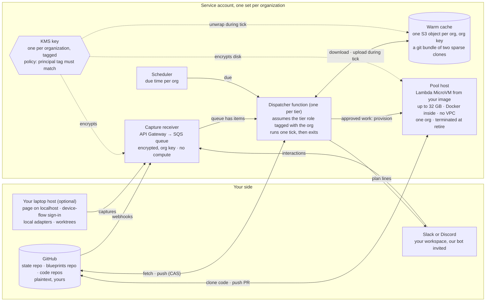

# Flywheel hosted physical design

One organization on the hosted tier, drawn as the machines that exist and what
each one holds. Self-managed hosts are the same binary on your own computer with
none of the right-hand side.

> **The promise, in one sentence.** Nothing of yours is ever in a process or on a
> disk that serves another organization. Your code exists only on a machine
> created for your work and destroyed when it ends. Everything we keep between
> ticks is encrypted at rest under a key that exists for your organization alone
> and is unwrapped only while your tick runs.

## What runs where

## The machines

| machine | what it is | what it holds | when it exists |
|---|---|---|---|
| Capture receiver | API Gateway integrated straight into one SQS queue per organization | Webhook and chat payloads, transient, encrypted with the organization key | Always, but it is a managed service, not a process of ours |
| Dispatcher function | One Lambda function per tier. Each invocation is one organization's tick: it assumes the tier role with a session tag naming that organization, and every key and cache object is tagged with its organization, so AWS allows the call only when the two tags match. It is the cloud agent: it fetches, runs one tick, pushes with compare-and-swap, delivers the plan to the page and the chat, wipes its scratch directory, and exits. It retains nothing between invocations | Nothing between runs. During a run: one organization's plaintext state in memory and scratch disk | Only while a tick runs. Woken by the queue, by the scheduler at the organization's due time, or by a page request |
| Warm cache | One object per organization in S3, encrypted under that organization's key, holding a git bundle of two sparse shallow clones. The tick downloads it to scratch disk and uploads it back. No VPC, no mount | The state repository and the blueprints repository restricted to the manifest, claims and the flywheel prefix. Never code, never raw capture material | Always, encrypted. Deleted and re-cloned when the organization has been idle |
| Scheduler | EventBridge Scheduler, one one-shot entry per organization written at the end of each tick from the machines' own timers; a daily sweep as the backstop | The next due time only | Only while something is due; an idle organization has no entry |
| Pool host | A Lambda MicroVM created from the organization's image when the plan approves work: 8 to 32 GB of memory, 4 to 16 vCPU, up to 32 GB of disk, no VPC needed, and Docker runs inside it so devcontainer features and Docker-in-Docker work. Fargate in a minimal VPC is the fallback for sessions past eight hours, without Docker inside. It enrols as a host, clones the code it needs, runs the session in a worktree, pushes the pull request, and is terminated | Your code and your raw capture material, on a disk encrypted under the organization key, for the length of the work. Triage sessions run here too, never in the dispatcher | Only while work runs. Terminated at retire, disk destroyed |
| KMS key | One customer-managed key per organization in the service account, tagged with the organization. Its policy allows a principal only when the principal's session tag equals the key's tag, so no count of roles limits it | Encrypts the queue, the cache, the pool disk, the logs | Always. On the enterprise tier the key is in your account and we hold a grant you can revoke |
| Chat bot | The service's Slack app and Discord app, installed into your workspace | The plan lines it sends and the interactions it receives. The one shared component, and it carries only plan text | Always, managed by the platforms |

## One tick, step by step

1. A GitHub webhook, a chat click, or the scheduler puts an item on your queue, or says you are due.
2. The dispatcher function starts and assumes the tier role tagged with your organization. Only a principal carrying your tag can use your key, so the cache object downloads and decrypts into scratch disk.
3. It fetches both shared lines from GitHub, applies the queued captures and responses, evaluates the machines, and pushes with compare-and-swap. If the push loses, it refetches and tries once more.
4. It delivers the plan: lines to your channel through the bot, the page for anyone signed in.
5. If approved work is waiting, it provisions a pool host from your image with your role and an enrolment token, and records it as a host.
6. It records when you are next due as a one-shot scheduler entry, and exits. Nothing of yours is running. The cache is ciphertext under your key.

## Where your data is, and who can read it

| data | where | who can read it |
|---|---|---|
| Source code | GitHub, your laptop, a pool host during work | You, and the pool host that exists for you. No shared machine, ever |
| State and manifest | GitHub in plaintext, your warm cache encrypted | You on GitHub. Your dispatcher role during a tick. No human path to the cache |
| Captures and signals | GitHub under the flywheel prefix, the queue briefly | Same as state |
| Raw capture material | Your laptop, or a bucket you own, or a pool host while triage runs | Never the dispatcher. Never a shared machine |
| Plan lines in chat | Your Slack or Discord | Your workspace, delivered by the shared bot |

## What an attacker gets

| if they steal | they get |
|---|---|
| A disk or snapshot from us | Ciphertext. The key is in KMS with a policy naming your role |
| One tick's tagged credential | That organization's state during that tick. Nobody else's, because every key and object checks the tag |
| A pool host | That organization's code for that job. It is terminated at retire |
| The shared bot token | The ability to post plan lines. No repository access, no key access |

The residual risk is a compromised dispatcher process while your tick runs, and
the function's sandbox is reused across organizations' ticks in turn, holding
nothing between them by construction. The enterprise tier gives a dedicated
function or your own account when policy needs process separation. The upgrades
that shrink it are cache eviction when idle, Nitro Enclaves with attestation for
the dispatcher, and a key in your own account that you can revoke.

## Your laptop while it is closed

A laptop is an intermittent host. Closed past its stale window it shows as away
with since-when, no attention line. Its leases stand, its sessions are neither
stalled nor lost, and their clocks pause. The cloud agent keeps ticking
everything else. A takeover is offered only when a decision or approved work is
waiting on that laptop, or after a day. When the lid opens the laptop fetches,
heartbeats, and is alive again with nothing to answer, and the rail shows what
happened while it was closed.

## Tiers

| tier | what you add | what exists on our side |
|---|---|---|
| 0 · your computer | Nothing. The binary on your laptop, device-flow sign-in | Nothing |
| 1 · cloud agent | Sign in to the hosted account, invite the bot, install the App on your GitHub organization | Receiver queue, a role and key, a cache object, a scheduler entry. No pool: your laptop still builds |
| 2 · pools | An image and a bound | Tier 1 plus pool hosts on demand |
| 3 · your account | Your AWS account and your key | Provisioning only. We hold names, health and billing |

## Scheduling

Each tick upserts one named one-shot EventBridge Scheduler entry per
organization, carrying the due time that tick computed, with
delete-after-completion. The name is the organization's, so an interim tick
replaces the entry with its own due time, later or earlier, and at most one entry
per organization ever exists. An entry that fires and finds nothing due, because
an interim tick already handled the work, is one idempotent tick: it fetches,
finds no work, and reschedules or deletes. That costs one invocation and nothing
else. The daily sweep is the backstop for an entry that was never written.

## Federation by OIDC

The enterprise variant is the one where nothing of the customer's lives in the
service account. The customer creates one IAM role in their own account whose
trust policy accepts the service's OIDC issuer with a subject naming their
organization. The dispatcher's tick assumes that role with a per-tick
web-identity token, so the service stores no credential of theirs. The key, the
cache object, the queue and the pool image all live in the customer's account,
and revoking access is deleting the role.

The page's sign-in federation is a separate thing and is already A.32: Frontegg
is the OIDC provider for the page, federating to the customer's own identity
provider.
