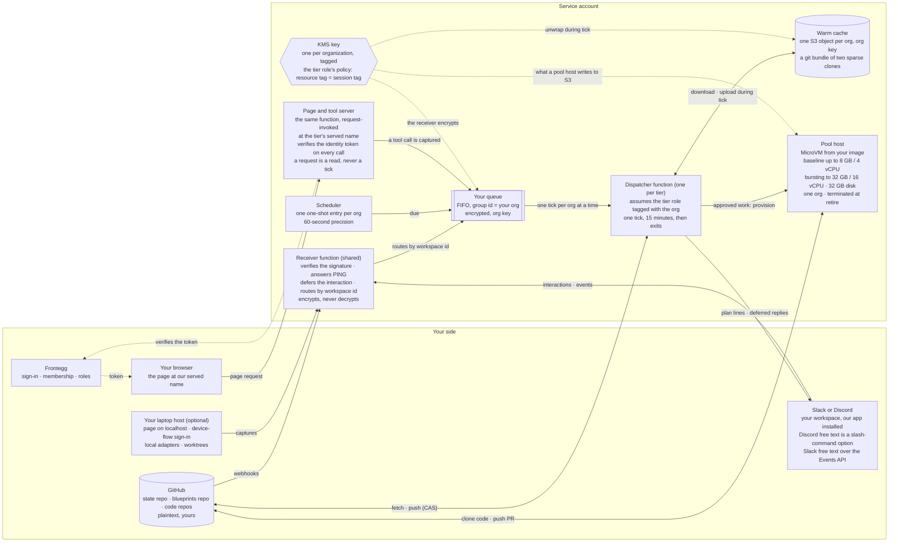

# Flywheel hosted physical design

One organization on the hosted tier, drawn as the machines that exist and what
each one holds. Self-managed hosts are the same binary on your own computer with
none of the right-hand side.

> **The promise, in one sentence.** Two components of ours see traffic from more
> than one organization, the receiver and the chat application, and each sees a
> payload once, in transit, and keeps nothing. Your code exists only on a machine
> created for your work and destroyed when it ends. Everything we keep between
> ticks is encrypted at rest under a key that exists for your organization alone
> and is unwrapped only while your tick runs.

## What runs where

## The machines

| machine | what it is | what it holds | when it exists |
|---|---|---|---|
| Receiver function | A stateless function in front of one SQS FIFO queue per organization. Our Slack app, Discord app and GitHub App each have exactly one inbound URL for every workspace, guild and installation, so the payload has to be demultiplexed by workspace id to your queue, and that is compute. It verifies Discord's Ed25519 signature, answers `PING` with `PONG`, defers the interaction inside three seconds, checks Slack's signed request and echoes `url_verification`, checks GitHub's HMAC, and enqueues. It holds an encrypt-side grant on your key and no grant that decrypts, and it reads no queue | An inbound payload once, in transit. Nothing at rest | Always. The second of the two shared components |
| Page and tool server | The same function, invoked per request, behind the tier's served name. The page is a static bundle at that name; the tool server is the binary's own tool catalogue, reached over HTTP with the Frontegg token by the page and over stdio or in-process, MCP-shaped, by sessions and by the interpreter. The agent is a client of the tools and never serves them. It verifies the token on every call and checks it for the permission the tool declares. A request is a read of the cache and the shared line; a write goes through a tool call, which is captured and ticked like any other | One organization's state for the length of one request | On request. Never a tick |
| Your queue | One SQS FIFO queue per organization, with the organization as the message group id. Every invoker enqueues here: the receiver, the scheduler, and a write from the page. The queue admits one tick of an organization at a time, so two ticks of yours never overlap | Queued captures and wakes, encrypted under your key. The caller's retry buffer and not state | Always |
| Dispatcher function | One Lambda function per tier. Each invocation is one organization's tick: it assumes the tier role with a session tag naming that organization, and the role's own policy allows a key or object only when the resource's tag equals the session's, so no key names a role. It is the cloud agent: it fetches, runs one tick, interprets each chat message with one bounded model call and triages the captures whose whole content is in the queue, pushes with compare-and-swap, delivers the plan to the page and the chat, wipes its scratch directory, and exits. Model access is the service's under the tagged role, metered into the plan, or a key you place. A tick has 15 minutes; when the budget is short it carries triage before it carries a reply | During a run: one organization's plaintext state in memory and scratch disk. Nothing between runs by construction: the scratch is wiped and the data key dropped before exit, and the sandbox is reused across organizations | Only while a tick runs. Woken only through your queue |
| Warm cache | One object per organization in S3, encrypted under that organization's key, holding a git bundle of two sparse shallow clones. The tick downloads it to scratch disk and uploads it back. No VPC, no mount | The state repository and the blueprints repository restricted to the manifest, claims and the flywheel prefix. Never code, never raw capture material | Always, encrypted. Deleted and re-cloned when the organization has been idle |
| Scheduler | EventBridge Scheduler, one one-shot entry per organization written at the end of each tick from the machines' own timers, create-or-update, deleted after it fires. Its target is your queue and never the function, so a due time is one more invoker that serializes with the rest. 60-second precision; a daily sweep as the backstop | The next due time only | Only while something is due; an idle organization has no entry. That entry is also the dispatcher's liveness: an invoked host is alive while its entry stands or its queue holds items |
| Pool host | A MicroVM created from the organization's image when the plan approves work: baseline up to 8 GB of memory and 4 vCPU, bursting to 32 GB and 16 vCPU above baseline and billed per second there, 32 GB of disk at the top size, no VPC needed, and a container runtime runs inside it so devcontainer features and Docker-in-Docker work. Fargate with an attached EBS volume in a minimal VPC is the fallback for sessions past eight hours and for an organization that must have its own key on the disk. Its image is built on a pool host or your own machine, never in the dispatcher, because building it reads your repositories' environment declarations. It enrols as a host, clones the code it needs, runs the session in a worktree, pushes the pull request, and is terminated | Your code and your raw capture material for the length of the work, on a disk the platform isolates per host and destroys at terminate under the platform's own encryption. Triage over raw material a capture points at runs here or on your laptop, never in the dispatcher; the dispatcher itself interprets chat and triages self-contained captures in-process | Only while work runs. Terminated at retire, disk destroyed |
| KMS key | One customer-managed key per organization in the service account, tagged with the organization. The tier role's own IAM policy allows the call only when the resource's organization tag equals the session's principal tag, so no key policy names a role and no count of roles limits it. The receiver may encrypt and never decrypt | Encrypts the queue, the cache, the logs, and what a pool host writes to S3. Not the pool host's own disk, which is under the platform's key | Always. On the enterprise tier the key, the cache and the queue are in your own account, reached by a role you create that trusts our OIDC issuer for your organization. We store no credential; deleting the role ends our access |
| Chat application | The service's Slack app and Discord app, installed into your workspace. Discord free text reaches it as the string option of a slash command, because plain channel replies arrive only over a gateway socket no function holds; Slack free text arrives over the Events API | The plan lines it sends and the interactions it receives. The first of the two shared components, and it carries only plan text | Always, managed by the platforms |

## One tick, step by step

1. A GitHub webhook, a chat interaction, a capture, or the scheduler's due time reaches the receiver or the scheduler, and lands as one message on your queue under your organization's group id. The receiver has already answered the caller inside its deadline, deferring the interaction where the platform asks for that.
2. The queue releases one message group at a time, so one tick of yours starts and no second one can. The dispatcher assumes the tier role tagged with your organization. The role's policy admits a key or object only when its tag equals the session's, so the cache object downloads and decrypts into scratch disk.
3. It fetches both shared lines from GitHub, applies the queued captures and responses, evaluates the machines, and pushes with compare-and-swap. If the push loses, it refetches and tries once more.
4. It delivers the plan: lines to your channel through the application, and the real reply to a deferred interaction inside the interaction token's window or as an ordinary message. The page is not delivered to; anyone signed in reads it on request.
5. If approved work is waiting, it provisions a pool host from your image with your role and an enrolment token, and records it as a host.
6. It records when you are next due as a one-shot scheduler entry targeting your queue, wipes its scratch, drops the data key, and exits within its 15 minutes. Nothing of yours is running. The cache is ciphertext under your key.

A page request is none of this. It is a read under your Frontegg token against the cache and the shared line, and the only writing it does is a tool call, which is captured and reaches the tick like everything else.

## Where your data is, and who can read it

| data | where | who can read it |
|---|---|---|
| Source code | GitHub, your laptop, a pool host during work | You, and the pool host that exists for you. No shared machine, ever |
| State and manifest | GitHub in plaintext, your warm cache encrypted | You on GitHub. Your dispatcher role during a tick, and the page-and-tool-server function under your token. No human path to the cache |
| Captures and signals | GitHub under the flywheel prefix, your queue briefly | Same as state, plus the receiver, which sees one payload in transit before it is queued |
| Inbound webhook and chat payloads | The receiver, in transit; then your queue, encrypted | The receiver sees every organization's, once, and keeps none |
| Raw capture material | Your laptop, or a bucket you own, or a pool host while triage runs | Never the dispatcher. Never a shared machine |
| Plan lines in chat | Your Slack or Discord | Your workspace, delivered by the shared application |

## What an attacker gets

| if they steal | they get |
|---|---|
| A disk or snapshot from us | Ciphertext. The key is in KMS and the tier role's policy admits it only under your tag |
| One tick's tagged credential | That organization's state during that tick. Nobody else's, because every key and object checks the tag |
| The receiver's role | Inbound payloads in transit, and the ability to enqueue on any organization's queue. It cannot decrypt a queue or a cache, and it reads nothing at rest |
| A pool host | That organization's code for that job. It is terminated at retire |
| The shared application's token | The ability to post plan lines. No repository access, no key access |
| The page-and-tool-server function without a token | Nothing. Every call is refused and recorded |

The residual risks are two. A compromised dispatcher process while your tick runs
holds that organization's plaintext state, and the function's sandbox is reused
across organizations' ticks in turn, holding nothing between them by construction
rather than by isolation. A compromised receiver sees inbound payloads from every
organization in the clear before they are queued, which is why it holds no
decrypting grant and no read on any queue. The enterprise tier gives a dispatcher
function of its own in the service account, or the whole design in your account,
when policy needs process separation. The upgrades that shrink the rest are cache
eviction when idle, Nitro Enclaves with attestation for the dispatcher, and moving
the key and the warm stores into your own account behind a role you can delete.

## Your laptop while it is closed

A laptop is an intermittent host. Closed past its stale window it shows as away
with since-when, no attention line. Its leases stand, its sessions are neither
stalled nor lost, and their clocks pause. The cloud agent keeps ticking
everything else. A takeover is offered only when a decision or approved work is
waiting on that laptop, or after a day. When the lid opens the laptop fetches,
heartbeats, and is alive again with nothing to answer, and the rail shows what
happened while it was closed.

The cloud agent is judged the other way round. It exists only during a tick, so
its last heartbeat is as old as its last tick, and an organization due in six
hours would read as stale on a five-minute window. Its liveness is its scheduler
entry instead: alive while an entry stands or the queue holds items, stale past
the due time it wrote plus the grace, and gone with no entry, no queued item and
no heartbeat.

## Tiers

| tier | what you add | what exists on our side |
|---|---|---|
| 0 · your computer | Nothing. The binary on your laptop, device-flow sign-in | Nothing |
| 1 · cloud agent | Sign in to the hosted account, invite the application, install the App on your GitHub organization | Your queue behind the shared receiver, a role and key, a cache object, a scheduler entry, the page and tool server at our served name. No pool: your laptop still builds |
| 2 · pools | An image and a bound | Tier 1 plus pool hosts on demand |
| 3 · your account | One IAM role in your AWS account trusting our OIDC issuer for your organization, registered as an identity provider there; your key, cache, queue and pool image live there | The same dispatcher, assuming your role with a per-tick token. Enterprise buys a dispatcher function of its own in our account. We store nothing of yours |

There is a fourth shape, and it is a design rather than a tier: the binary
provisioned into your own account, with nothing of ours running there. Its
control plane is three machines, not one — a **registry** of organization names,
tier, health and counters; a **deployer** that applies a stack through the role
you grant and stamps our binary's version; and **identity**, the Frontegg
environment holding the redirect entry for your host's served name. The chat
application in that shape is still ours, which is what keeps the plan lines
arriving from one bot. Until 268 says otherwise, that shape is not a rung on the
ladder.

## Scheduling

Each tick writes one named one-shot EventBridge Scheduler entry per
organization, carrying the due time that tick computed, with
delete-after-completion; there is no upsert call, so it is a create and an update
on conflict. The name is the organization's, so an interim tick replaces the
entry with its own due time, later or earlier, and at most one entry per
organization ever exists. Precision is 60 seconds. The entry's target is your
queue, not the dispatcher, so a due time serializes with every other invoker and
never starts a second concurrent tick. An entry that fires and finds nothing due,
because an interim tick already handled the work, is one idempotent tick: it
fetches, finds no work, and reschedules or deletes. That costs one invocation and
nothing else. The daily sweep is the backstop for an entry that was never
written.

## The upgrade: federation by OIDC

The default above is the tagged tier role over per-organization keys and objects
in the service account. The upgrade is the variant where nothing of yours lives
in the service account at all.

**What changes for you.** You create an IAM OIDC identity provider in your own
AWS account for our issuer, then one IAM role whose trust policy accepts that
provider with a subject naming your organization and allows `sts:TagSession`, so
that the token we mint can carry your organization as a principal tag. A
web-identity session takes its tags only from the token's tag claim, which is why
our issuer has to put your organization there and your trust policy has to allow
the tagging. Your key, your cache object, your queue and your pool image live in
your account. The only standing grants there are that role's trust and your key's
grant to that role. Deleting the role ends our access.

**What changes for us.** Nothing is stored. The dispatcher's tick assumes your
role with a per-tick web-identity token, so there is no credential of yours to
keep, rotate or leak, and every use of your key is logged in your account. The
wake is content-free: your queue raises an event carrying your organization's
name and nothing else, and the tick reads the queue itself under the assumed
role. No poller of ours holds a standing decrypting grant on your key, which is
what makes deleting the role close every path rather than most of them.

The page's sign-in federation is a separate thing and is already A.32: Frontegg
is the OIDC provider for the page, federating to the customer's own identity
provider.
