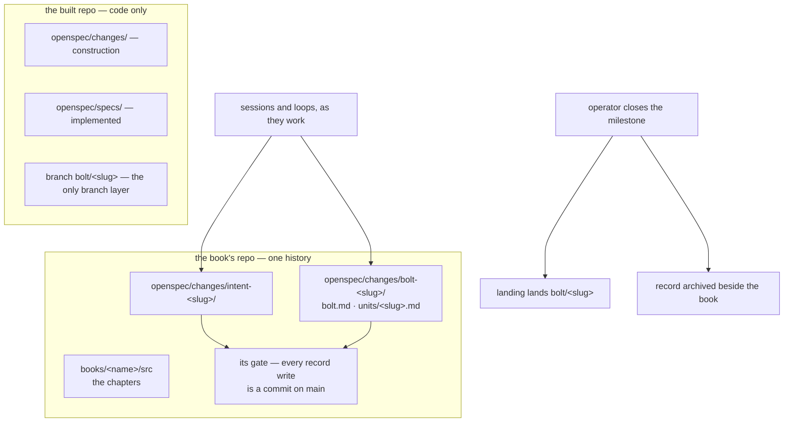

# Unit: a-systems-design-in-one-repo

System: flywheel

Open the repo that holds a system's book and you find everything that
produced it: the chapters, the intent's questions and decisions, and the
charter and unit documents of every bolt cut from them — one history, one
gate, readable live because the loops write as they work rather than
parking prose on a branch. The built repo holds only what it is for: its
construction changes and its implemented specs. Today the bolt's record
sits in the built repo instead, so a reader who wants to know why a
change exists has to cross repositories to find out.

Sequence: 1 of 2 · builds on: none
Type: `bolt-default` · Price: 2 changes · ~2 days

| # | change | delivers | chapters | after | why this bolt |
|---|--------|----------|----------|-------|---------------|
| 1 | `records-are-written-beside-the-book` | the loops write their records — `intent-<slug>/` and `bolt-<slug>/`, each named for its milestone — onto the book repo's main as the work happens, each write a commit through that repo's gate; no record branch exists, and a built repo's `openspec/` never holds one | `books/flywheel/src/lifecycles.md`, `books/flywheel/src/server-and-fleet.md`, `books/flywheel/src/design-loop.md` | — | the home, the name and the absence of a branch are one decision about where a record is written, and land as one change |
| 2 | `the-close-archives-the-record` | the operator's milestone close archives the record beside the book as an ordinary commit through its gate, alongside the landing it releases in the built repo | `books/flywheel/src/lifecycles.md`, `books/flywheel/src/server-and-fleet.md`, `books/flywheel/src/construction-loop.md` | 1 | the archive is a separate path with its own trigger and its own failure mode, and it can only archive a record written where task 1 puts it |

## Left out

- Relocating records that already exist — this settles where a record is
  born, written and archived; moving live ones is the operator's call
  once the shape holds.
- The `flywheel-intent` schema's artifact set, which an in-flight change
  in the built repo still owns.

Derived from: book 52fafa6 · specs 6430df8 · in flight: intent-flywheel in blueprints; messy-repo-onboarding, site-teaches-the-system, observer, add-flywheel-loops in the built repo
