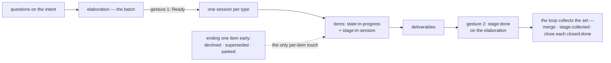

# Unit: ruling-a-design-batch-once

System: flywheel

The operator approves a batch of design work, reads what came back, and
says it is finished — twice, on the batch itself, from a phone if they
like. They never open its items to mark them one at a time. Today the
finish signal is written per item and each item's stages advance
independently, so a batch of six deliverables costs six gestures instead
of one, which is exactly the item-by-item decision the flywheel exists to
remove.

Sequence: 2 of 2 · builds on: a-systems-design-in-one-repo
Type: `bolt-default` · Price: 2 changes · ~2 days

| # | change | delivers | chapters | after | why this bolt |
|---|--------|----------|----------|-------|---------------|
| 1 | `the-batch-carries-the-finish-signal` | `stage:done` is the operator's ruling on the elaboration and is never written per item; on that one signal the loop collects the whole set — merges the session branches, sets `stage:collected`, closes each item `closed:done` — and its inbox filter reads elaborations at `stage:done` whose set is not yet collected | `books/flywheel/src/tracker-protocol.md`, `books/flywheel/src/lifecycles.md`, `books/flywheel/src/design-loop.md` | — | the label's home, the collect it triggers and the filter that finds it are one completion path and land together |
| 2 | `a-batch-charges-a-session-per-type` | an approved elaboration charges one design session per type present in it, rather than one session for the whole batch | `books/flywheel/src/design-loop.md` | — | charging is a different path from completion, with its own surface, and neither waits on the other |

## Left out

- Who batches which questions into an elaboration, which dispatch and the
  operator already do.
- Board Status staying batch-approval only, which the specs already hold.

Derived from: book 52fafa6 · specs 6430df8 · in flight: intent-flywheel in blueprints; messy-repo-onboarding, site-teaches-the-system, observer, add-flywheel-loops in the built repo
