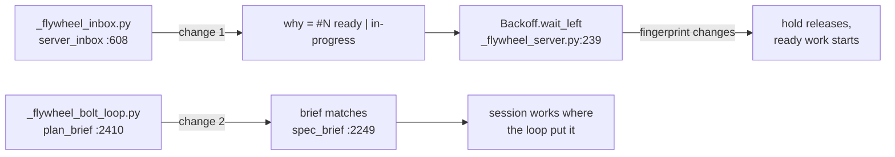

# Unit: loop-rules-hold

System: flywheel

Two rules the loop states and then breaks. Each is a single-expression
fix in a file the finding names by line, with the correct form already
written a few hundred lines away in a sibling. Approving this unit is
approving both changes.

Sequence: 1 of 1 · builds on: none
Type: `bolt-plan` · Price: 2 changes · ~0.5 days

| # | change | delivers | sources | after | why this bolt |
|---|--------|----------|---------|-------|---------------|
| 1 | job-reason-states | the `Job.why` fingerprint renders the state label, so a milestone held on an in-progress item releases when new ready work arrives | #372 · `bin/_flywheel_inbox.py:608` · the sibling fix at `:561-567` | — | a stale hold delays real work by up to `BACKOFF_MAX_S = 900` |
| 2 | plan-brief-no-worktree | `plan_brief` says "you are IN the worktree, never create one", matching `spec_brief` | #373 · `bin/_flywheel_bolt_loop.py:2410-2413` · the model at `:2249-2251` | — | the brief currently orders a session to do branch topology the loop owns |

**Verified against the tree, not the finding's summary** (`flywheel/main`
`e548adb5`):

- `Item.state` is the GitHub issue state — `state: str = "open"` at
  `_flywheel_inbox.py:182`, filled `state=raw.get("state", "open")` at
  `:258`, and `is_open` is `self.state == "open"` at `:190`. The reason
  line at `:608` reads `f"#{item.number} {item.state or ''}".strip()`,
  so `state:ready` and `state:in-progress` items both render
  `#N open`. Confirmed.
- `plan_brief` at `:2410-2413` does contain
  `f"Worktree: in \"{repo}\" run  wt switch --create build/{batch.slug}
  --base {bolt_branch} --no-cd  and work there."`, while `spec_brief`
  at `:2249-2251` reads "You are IN the build/… worktree, already cut
  from … by the loop — work here, and never create a branch or
  worktree." Confirmed, and change 2 is that sentence substituted,
  keeping the "Re-read from disk every neighbour your plan claims
  something about" line that follows.

Change 1 moves the tests that assert on `why` strings with it.

## Left out

- The unit-Team misroute (#371) — its cheap arm is a refusal check, but
  its other arm IS the per-unit granularity change `intent/loop-granularity`
  is currently ruling. Parked there rather than carded here.

Derived from: book e106f26 · specs 3b113d9 · in flight:
intent-flywheel, messy-repo-onboarding, operating-docs,
site-teaches-the-system, writeback-in-session
