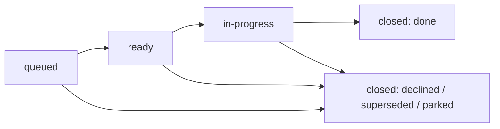
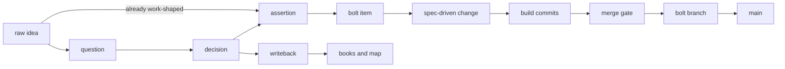
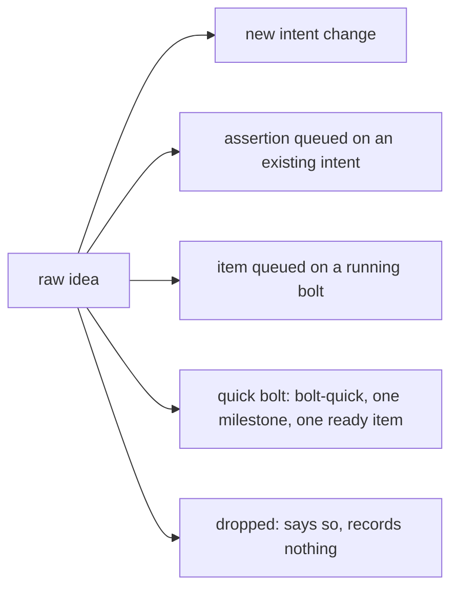
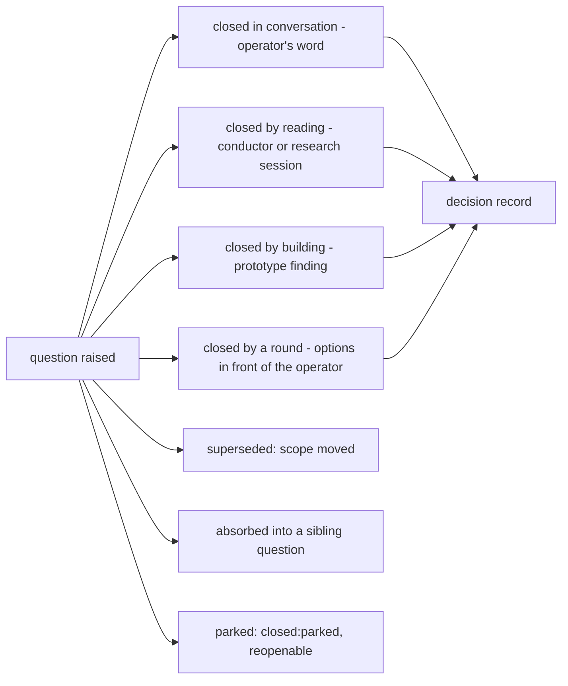
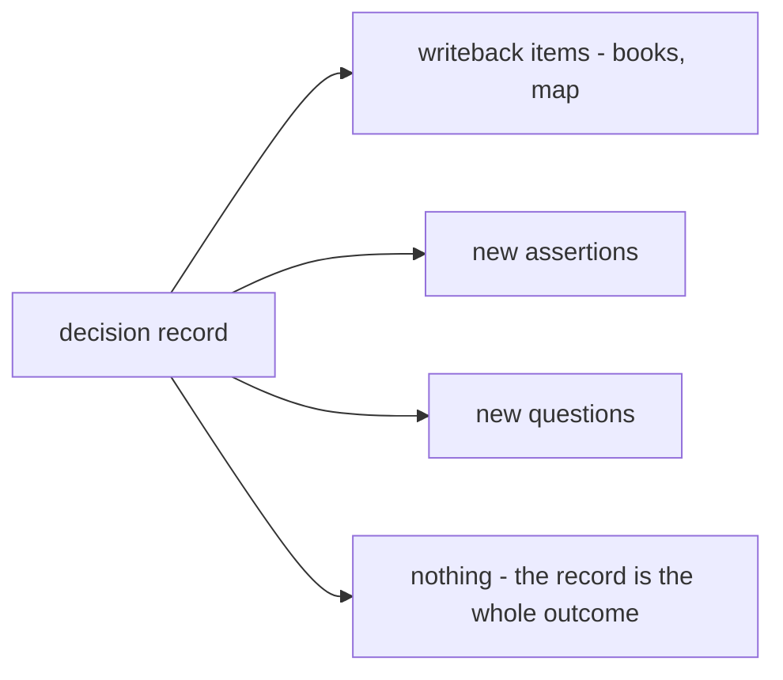
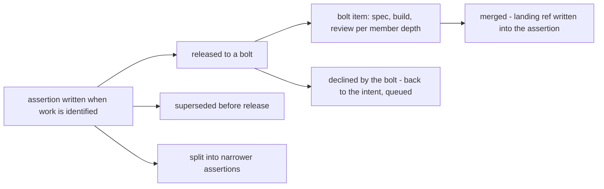
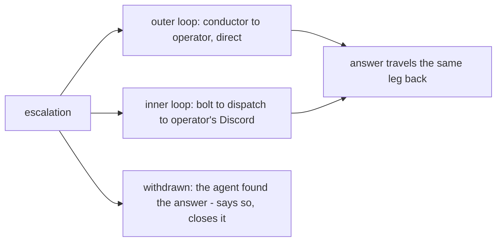

# Flywheel tuning — state moves to a tracker, sessions become vanilla agents

The operator's findings, 2026-08-10: sessions are too chatty, discovery is
routed instead of done, work orders are cryptic yet overstuffed, too many
sessions run Fable, and the loops fire sessions and bolts autonomously
where the operator wanted an explicit hand. This document is the design
that answers all of them, for one plannotator round.

## The diagnosis

Most of the loop's ceremony exists to make shared markdown files safe to
edit concurrently. `tasks.md` and `proposals.md` are mutable shared state
in git, so every actor that touches them needs a worktree, an exact write
scope, and a conductor to serialize the merges — and a large share of
sessions exist to carry that ceremony, not to do work. The two files that
need the defenses are the two that read worst: freeform pages, edited by
many agents, growing narration (one `tasks.md` reached 1,464 lines for 149
tasks) and diverging in structure between changes.

## The split principle

**Durable prose lives in git; mutable shared state lives in the tracker.**

| stays in git (files) | moves to the tracker (GitHub Issues) |
|---|---|
| `intent.md`, `bolt.md` | every work item, of both loops |
| `decisions/` — the record of what was weighed | item state and its transitions |
| `questions/` — the question's prose | which items block which |
| `assertions/` — the claim, the proposal | the queue and the ready set |
| `sessions/` — reports, drafts, prototype notes | narrative: findings, receipts, landing SHAs, as comments |

`tasks.md`, the `proposals.md` registry, and the `design.md` catalog
retire. Each was a hand-maintained view of state; the tracker is the
state, and every view of it is a query.

A file keeps only terminal facts: when an assertion's work merges, its
landing ref is written into the assertion at close. Live state — open,
released, building — is the linked issue's alone, so no file asserts a
state that can go stale.

## The tracker

GitHub Issues on `WilldanGroup/willdan-blueprints` — **one tracker for
both loops**, settled: the changes live here, one place answers every
query, and the release flow never spans repos.

**Milestones carry the long-lived containers; batches carry the
approvals.** The two layers do different jobs and both are GitHub objects:

- **A milestone is a change-sized container**, exactly two forms —
  `bolt/<slug>` for each bolt, `intent/<slug>` for everything an intent
  owns: questions, assertions, prototypes, writebacks, all
  distinguished by `type:*`. A milestone takes a due date and shows
  progress across everything in it, which is what the roadmap wants for
  a long-lived change.
- **A batch is a parent issue with its items as sub-issues, and its
  kind is what approving it authorizes** — AI-DLC vocabulary: a
  **unit** (label `unit`, AI-DLC's unit of work) releases construction
  — a handoff's assertions, or fresh work on a live bolt; an
  **elaboration** (label `elaboration`) authorizes design sessions on
  an intent. Batches group by **thread**, not by type — a prototype,
  the questions it answers, and the writeback of its findings are one
  approval even though they are three types; the conductor partitions
  the types into sessions at work time. Batches stay small by
  construction, so no sub-issue list grows long; the milestone is
  where the long list lives, with a progress bar instead of a tree.

The batch is also **where approval lands as a GitHub act**: the
conductor composes queued items under a proposed batch, and the
operator approves by
moving it to Ready on the board — on the platform, timestamped, doable from a
phone. The conductor sees the move and starts the batch. One approval
per batch, never per item, and the release stops being a word the
conductor has to transcribe.

**An item is an issue.** Its shape:

- **Title** — the work, imperatively, one line.
- **Body** — one to three sentences of goal, then pointers: the assertion
  or question file it serves. Nothing else; the claim and its evidence
  live in the pointed-at file.
- **Milestone** — the container that owns it, from birth. One item, one
  owner.
- **Parent** — the batch it joined, once batched. A queued item has a
  milestone and no parent yet.
- **Labels** — `type:*` (the session type that works it — a question
  borrows the type of the session that answers it — plus
  `type:assertion` for the released claim itself, whose construction
  stages live in its comments, never as items of their own),
  `state:<state>` (exactly one at a time),
  `repo:<built-repo>` on construction items. `state` is written out —
  a prefix nobody has to decode — and the batch marks whose item it is,
  so the labels carry no flywheel prefix.
- **Assignee** — the developer whose word settles the work: dispatch
  assigns it at triage, batches inherit it at composition, and escalations
  resolve their DM target from it. Ownership has no yaml line; the
  assignee is its one home.
- **Dependencies** — GitHub's native blocked-by relations, never inferred
  by an agent at run time. Whoever files an item declares its
  dependencies best-effort; the conductor owns them from then on and
  confirms them at release, because release is when order starts to
  matter. A session that discovers a dependency adds the relation and
  comments why.
- **Comments** — the narrative: what a session found, the bolt's receipt,
  the gate result, the landing SHA. Attributed and timestamped by the
  platform, append-only by construction. The prose that today accumulates
  above registry tables goes here.

State moves by `gh issue edit --add-label/--remove-label`; an item ends by
closing, with a `closed:<reason>` label — done, declined, superseded,
parked. Anyone may create an item or comment; the
`state:queued → state:ready` move is made only on the operator's word.

### Projects — the roadmap view, and the app that grants it

The Gantt-style picture the operator wants — bolt and intent
milestones on a timeline, each batch a bar inside its
milestone's span — is GitHub Projects' roadmap layout, with
**Start/Target** dates and the **Quarter** field carrying the schedule
(dates default aggressively — today at composition and boarding, a
milestone due the day it is created — overridden with a stated reason
when the work is bigger; no Iteration field, because the flywheel is
continuous delivery, not sprint cadence) and **Team**
carrying the flywheel host. Projects is a view, never a second store:
milestones, labels and the sub-issue tree hold every fact, so the design
degrades cleanly wherever Projects is not yet visible.

Access is settled: **an org-owned GitHub App**, `willdan-flywheel`, installed
on `WilldanGroup` with Issues read/write and organization Projects
read/write. (Measured 2026-08-11: the gh CLI token carries
`gist, read:org, repo, workflow` and Projects v2 queries fail with
`INSUFFICIENT_SCOPES`, so app access is required, not merely preferred.)
IT's setup steps are `github-app-setup.md` beside this document.

**The app token is for the tracker alone.** A helper in the plugin's
`bin/` mints short-lived installation tokens from the app key, and only
tracker commands run under it — `GH_TOKEN=$(flywheel-token) gh issue …`
— so every item, comment, and status change the machinery makes is
attributed to the app's bot identity, cleanly separated from human
writes. Everything else — clones, pushes, PRs, ordinary `gh` — stays on
the user's own keyring login, untouched. The operator's own tracker acts
(moving a batch to Ready, an annotation) are made as the operator, which is
exactly the attribution the approval needs.

**The key follows the fleet host, never the developers.** Only the
machinery mints tokens, and the machinery runs where the fleet runs —
one workstation today, the central server when the fleet moves there —
so the private key lives in exactly one place at a time. A developer's
own tracker acts ride their existing GitHub login and need no key. If a
second fleet host exists before the server does, the key sits in a
shared 1Password vault the token helper reads at mint time — access
granted and revoked by vault membership, rotated with GitHub's support
for two concurrently active keys. Hosts proliferating beyond that is
the trigger for a token-vending service under agentplot, a contingency
the central-server destination makes unlikely.

## The backlog — how work is released

Every item is born `state:queued`. The lifecycle:

- **Anyone queues.** A session that finds a bug, a bolt's testing agent, a
  design finding, dispatch after a meeting, the operator. Queuing is one
  `gh issue create` and creates no obligation — this is what makes
  discovery cheap instead of bureaucratic.
- **Only the operator releases, by moving a Backlog batch to Ready.**
  The conductor composes queued items under a Backlog batch; moving it
  to Ready is the approval — one per batch, never per item. Releasing a
  batch authorizes every session inside it: the conductor partitions the
  sub-issues by type — the hard boundary, since a session loads one
  type skill — then by relatedness within a type, prototypes riding
  alone, and charges the sessions in dependency order.
- **Handoff is bolt planning, born by a computable condition.** An
  assertion is settled and unbolted when its item is open on
  `intent/<slug>` — bolting IS the milestone move to `bolt/<slug>` —
  with no parent batch and no open blockers. Whenever such assertions
  exist at the queue, the conductor births one `type:handoff` item
  naming exactly that set (or extends the open unstarted one). The
  handoff session inside a released unit plans the bolt on the standard
  template — one section per bolt: bolt type, owner,
  repos, assertions, sequencing — runs one plannotator round with the
  operator, then moves the items. Assertions
  settle in waves, so handoffs recur; the operator can approve a plan
  while the intent still has open work, and the remaining work
  self-announces as the next handoff item.
- **The loop works the ready set to empty, then stops at the queue.**
  The apply instruction's "loop until no unblocked task is pending"
  becomes "loop until no released item is pending." A conductor standing
  at an empty ready set with a full queue is behaving correctly: it
  presents the queue and waits. This replaces the drive rule that
  manufactured twelve sessions in four days on kit-lift by firing one at
  every discovery.
- An item released but untouched can be pulled back to queued by the
  operator; nothing else demotes.
- **Writebacks queue like everything else and release as a batch.** They
  need no approval — books and map are the design loop's own scope — but
  they benefit from batching: writeback items sit on the intent's one
  milestone under `type:writeback`, join elaborations by thread like any other
  release, and the operator's move to Ready is a scheduling word, not a
  permission: it says *now*.

When the operator's own word arrives mid-stream — a meeting note, a
correction — whoever holds it edits the file or the item directly and
comments the change. The word is the authority; there is no drain cycle
for it.

## The actors — who runs what, on which model, on which machine

**Dispatch is a pure GitHub-and-relay actor with no loop.** It holds no
repo checkout and writes no file: every fact it needs is a tracker
query, every write is an item, comment, label, assignee, or milestone.
It reacts — a raw idea arrives, it triages into one of five routes and
settles idle; an escalation arrives, it relays to the item's assignee
and back. A checkout-free dispatch runs anywhere, which is what makes
the centralized-on-a-server destination clean.

**Conductors scaffold their own changes.** Dispatch creates only the
milestone and its originating items; a conductor's first act, when its
change does not exist, is creating `openspec/changes/<slug>/` from what
they say. The inbox is retired — a request to any change is a queued
item or a comment, and a parked conductor catches up by querying its
milestone at next start.

**The standing actors — dispatch and both conductor kinds — run
`opus[1m]`**, set on their fleet rows: long-lived, read-heavy,
reasoning-light. Fable stays where the session-type table puts it.

**Provisioning is a deterministic reconciler, not an agent.** Which
conductors should exist derives entirely from the tracker: a
milestone gets its conductor for whichever **job** it has — *ready*
(open ready/in-progress items, or a batch moved to Ready on the
board), *compose* (queued items with no open batch to carry them), or
*archive* (the operator closed the milestone on GitHub and the change
still sits in `openspec/changes/`) — and a settled conductor whose
milestone has no job is **stopped**: state lives on the tracker and in
git, so a later job rehydrates a fresh session from the records, and
no session is ever the memory. Placement is the board's **Team**
field — each host's reconciler starts conductors only for work
claiming its host name, unclaimed work falling to the default host —
so assignment reads: **assignee = whose word, Team = whose machine,
Ready = go**, three native gestures on one board. `flywheel
reconcile` is that pass: it converges the manifest's standing rows,
runs the three jobs, nudges settled conductors with a job and
dispatch on waiting `needs-operator` relays and unmilestoned items
awaiting triage — one-shot, on `--interval`, or from a webhook
later. `fleet.yaml` keeps
the standing rows plus placement config: `tracker:`,
`conductors_cwd:`, and a `teams:` map from Team-field values to
hosts.

## Entity flows — every path, including the dead ends

The system's entities, each walked birth to end. The dead ends are drawn
because they are where things rot silently today.

### The happy path, end to end

The question–decision detour exists for ideas that carry something
undecided. **An idea that arrives already work-shaped becomes an
assertion directly** — dispatch or the conductor writes the assertion
file and queues its item, and no question or decision record is
manufactured to justify it.

### Raw idea

Born from the operator, a meeting, or a finding routed out of a bolt.
Dispatch triages it once:

**The quick bolt replaces the untracked chore.** A small, fully defined
idea gets a `bolt-quick` on the operator's word at triage — dispatch
creates `bolt/<slug>` and its one born-ready item (the word at triage IS
the approval, so no batch exists to flip), puts the item on the board at
Status Ready — whatever carries the approval sits on the board — the
reconciler starts the conductor, and the work is tracked at the cost of
one issue rather than invisible. For work too small to warrant a spec-driven change in the
built repo, the conductor's work order says so and the build session's
plan mode is the spec surrogate — `bolt-no-spec` is a per-batch choice,
deliberately not a schema. Something that is genuinely one shell command
is still one shell command; dispatch runs it and says so.

### Question

Born from a session's discovery, a bolt finding, a review round, or the
operator. The prose lives in `questions/<slug>.md`; **its item is created
at birth** — a question without an item is untrackable — and the work
state lives on that item.

Closing in conversation is the cheapest door and is not a lesser closure.
A question never closes without its decision record; a parked question is
a closed item with `closed:parked`, visible in one query — today parking
has no state at all and a parked question is indistinguishable from a
neglected one.

### Decision

Born when a question closes, wherever the word was given. It fans out; its
consequences are queued items, not obligations on the writer:

A decision record is terminal in git: authoritative on its decision,
provisional on its measurements, one answer per record — unchanged.

### Assertion — the proposal

**The assertion is the proposal.** The separate proposal-writing session
retires; a bolt item points at the assertion file, and spec-writing works
from it and the decisions it cites. Proposal-writing survives only as the
exception a bolt conductor invokes when an assertion arrives genuinely
unmineable — and its first move is to send the assertion back, not to
paper over it.

### Session report

Born inside a session directory; delivered as a comment on the items it
worked, pointing at the files it wrote. Terminal — no catalog row to
maintain, since the item list is the catalog. A report states what was
found, the evidence as pointers, and what it asks — and is capped: a
comment, not a document. Reports that are genuinely documents (a design,
a triage) are files in the session directory the comment points at.

### Prototype finding

Unchanged in substance: the throwaway is built in the spike repo and dies;
`prototypes/<slug>.md` survives and feeds a decision. The commissioning
item gets the finding as its closing comment.

### Bolt

Born only on the operator's release. Its items are the released
assertions; construction runs on bolt branches and nested worktrees
exactly as today — worktrees earn their keep where files are edited. It
ends when its items are merged: fold-time cleanup is mechanical
(panes, worktrees and branches go as they finish), the conductor
reports and is stopped, and the operator **closes the milestone on
GitHub** — the archive signal; the reconciler then charges a fresh
conductor session to `openspec archive` the change and commit.

### Escalation

Born when an agent is blocked on an answer only the operator can give.
Its shape is fixed: one line of question, the options if there are any, a
pointer to evidence. Never a report.

The outer loop is high-touch by design, so an intent conductor reaches the
operator itself — plannotator, a lavish page, or an inline question — and
dispatch relays nothing for it. Dispatch's relay narrows to its actual
justification: the inner loop's bridge to a possibly-absent operator.

## The vanilla session contract

**Enforce with mechanisms; delete the prose rules they make redundant.**
The mechanisms: worktree isolation contains file edits, the merge gate
catches broken books and maps, pathspec commits keep siblings' work out,
the tracker makes state changes atomic and attributed. Given those, the
prohibition lists in the profiles and skills — "you never…", "if anything
comes up, stop and report" — come out. They are what trains sessions to
escalate instead of finish.

A session is a stock agent with a goal. Its work order, whole:

> You work `<change-id>`. Goal: <one or two sentences>. Items: #12 #14.
> The change's records are under `openspec/changes/<id>/`. File
> discoveries as queued items; comment each item when done.

Worktree, session directory, and model are launch mechanics, not work
order content — the launcher sets cwd and `--model`, and the directory
name follows convention. A session that edits no files (most research)
gets no worktree at all: it reads, comments its answer, done. No branch,
no merge, no teardown.

What survives of the rules, because a mechanism cannot yet carry it:

- commit by pathspec — shared indexes are real;
- destination voice and `books/CLAUDE.md` for writebacks — the gate
  checks builds, not voice;
- the andon cord, narrowed to genuine contradictions: the spec
  contradicts the decision it cites, the tree contradicts the spec.
  Finding adjacent work is not an andon — it is a queued item and, when
  it sits inside a released scope, just work: the release that authorized
  the batch authorized it.

## Session types and models

Handoff stays, slimmed: compose the release request from the assertion
files (paths, repos, bolt member, owner), deliver, bring back the receipt
as a comment. Proposal-writing becomes the exception path above. The
other types keep their skills, each cut to what the type is — the
tripwire sections come out.

Model defaults, from nine Fable types to three:

| default | types | why |
|---|---|---|
| fable | proposal-review, planning, interactive | adversarial reads and operator-facing decisions |
| opus[1m] | research, spec-writing, build, test, code-review, human-code-review | context-bound: large trees, long reads |
| opus | writeback, prototype, handoff | rule-following and mechanical composition |

By the time spec-writing runs, the reasoning happened — decisions closed,
the assertion checkable. Its risk is buildability, which is repo context,
not reasoning. The Fable guard sits at proposal-review, construction's one
routine Fable spend. Any design-heavy item overrides per work order; the
override mechanism exists today.

## What changes where

- **flywheel plugin** — profiles cut to identity + contract; the two loop
  skills lose the write-scope liturgy, the drive rule, and the duplicated
  incident narrations; type skills cut to what each type is; `herdr.md`
  keeps the invocations and gains the `gh` item idioms.
- **schemas** — `flywheel-intent` and the `bolt-*` family drop the
  `tasks` and registry artifacts; `apply.instruction` queries the tracker
  (the milestone's items filtered to `state:ready`, via `gh` JSON)
  and works the ready set. `apply.tracks` points at the tracker query
  instead of `tasks.md`.
- **blueprints** — `CLAUDE.md` flywheel section updated.
- **setup** — one idempotent `flywheel-setup` in the plugin's `bin/`,
  run once per org as `willdan-flywheel`: seeds the labels, creates the
  Project — copied from the hand-built template with its views — with
  its Team, Quarter and Start/Target fields and the Status
  options the board uses, and links the repo. Everything it
  touches is repo- or project-level. **Org-level customization —
  issue types included — is deliberately out**: it is org-global, it
  needs admin rights beyond the app's Issues and Projects permissions,
  and the `type:` labels already carry the taxonomy.
- **migration** — new intents and bolts start on the tracker. Live
  changes, kit-lift included, **migrate mid-flight** by script: one
  milestone per change, one issue per unchecked line, dependencies
  declared from the lines' blockers, released-but-unfinished batches
  reconstructed as units, and the retired files deleted in the same
  change.

## Settled, and what unblocks the build

The round of 2026-08-11 approved this design and settled: one tracker;
questions get items at birth; kit-lift migrates mid-flight; one
milestone per change with units and elaborations as the approval
batches; access through an
**org-owned GitHub App** used for the tracker alone.

The one external dependency is IT creating and installing `willdan-flywheel`
— steps in `github-app-setup.md` beside this document. Everything else
in "What changes where" can be built behind it, with the label seeding
and token helper landing first so the tracker is exercisable the day the
app exists.
