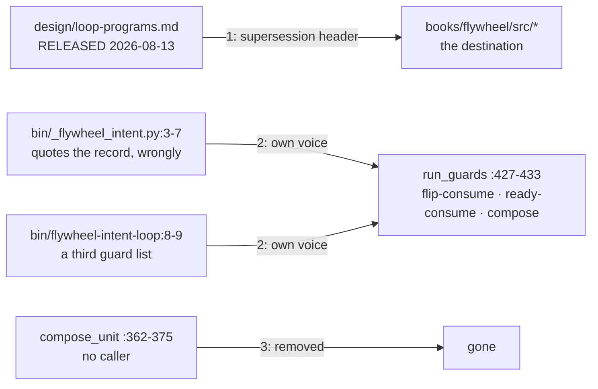

# Unit: loop-programs-retired

`design/loop-programs.md` was released to construction on 2026-08-13 and
the book has since absorbed it, but nothing on the file says so — so it
still reads as current, and two files in `bin/` quote it as if it were.
Neither quotation is accurate: the module's list is the live guard set
presented as the record's words, and the CLI's is a third list matching
neither. This unit puts a supersession header on the record, rewrites
both self-descriptions in the code's own voice, and removes the one
function in the module that no caller reaches.

Sequence: 1 of 1 · builds on: none
Type: `bolt-quick` · Price: 3 changes · ~0.5 days
System: flywheel

| # | change | delivers | sources | after | why this bolt |
|---|--------|----------|---------|-------|---------------|
| 1 | `loop-programs-superseded` | a supersession header on `design/loop-programs.md` naming the chapters that carry each part, so a reader goes to the book instead of the draft | `books/flywheel/CLAUDE.md` ("Sources"); `books/flywheel/src/design-loop.md`, `construction-loop.md`, `server-and-fleet.md`, `sessions.md`; `openspec/changes/intent-loop-granularity/sessions/2026-08-26-loop-programs-record-disposition/disposition.md` §2–3 | — | the record is the false premise every reader of this bolt's other two changes starts from |
| 2 | `intent-loop-self-description` | `bin/_flywheel_intent.py:3-7` and `bin/flywheel-intent-loop:8-9` describe the loop's live guards in their own voice, quoting no record | `_flywheel_intent.py:427-433` (`run_guards`); `openspec/changes/intent-loop-granularity/sessions/2026-08-25-loop-programs-as-built/finding.md` §4.2; disposition §4.1 | — | the two files are the loop's own account of itself, and it is wrong in three different ways at once |
| 3 | `compose-unit-removed` | `compose_unit` deleted from `bin/_flywheel_intent.py` | `_flywheel_intent.py:362-375`; `grep -rn compose_unit bin/ tests/` returns the definition alone; finding §4.8 | `intent-loop-self-description` | it is the unit-flavoured sibling of `apply_compose` and the first thing a granularity rewrite would reach for — dead, and shaped like the answer |

Change 3 waits on change 2 because both edit `bin/_flywheel_intent.py`;
independently they would collide at the merge-back for nothing.

## Left out

- **Anything that restates the loops' shape.** The book already states
  it — five unit types, the type as a unit's choice, Review as a stage,
  the merge gate as the serialization point. Nothing here rewrites a
  chapter, and the record is retired rather than brought current: a
  released decision is history, and history does not get edited to
  match today's code.
- **`flywheel approve`.** `books/flywheel/src/server-and-fleet.md` lists
  the verb and `bin/flywheel:1124-1125` does not have it. That is the
  book stating a destination the code has not reached — the planner's
  gap, and a unit of its own whenever the operator wants it, not a
  correction to make here.
- **Everything the granularity ruling touches.** Whether the loop's unit
  of drive is the milestone or the unit is open on
  `intent/loop-granularity`; #369, the Design Center report, is the
  operator's next surface. All three changes here are the same edit
  whichever way it is ruled.

Derived from: book `e106f26` · specs `404feefa` · in flight: `add-flywheel-loops`, `observer`
